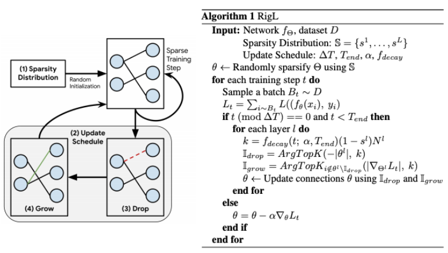
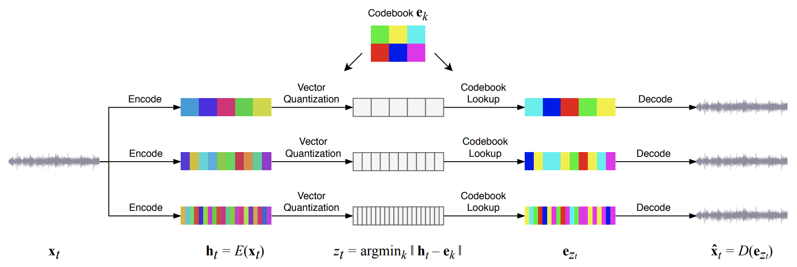
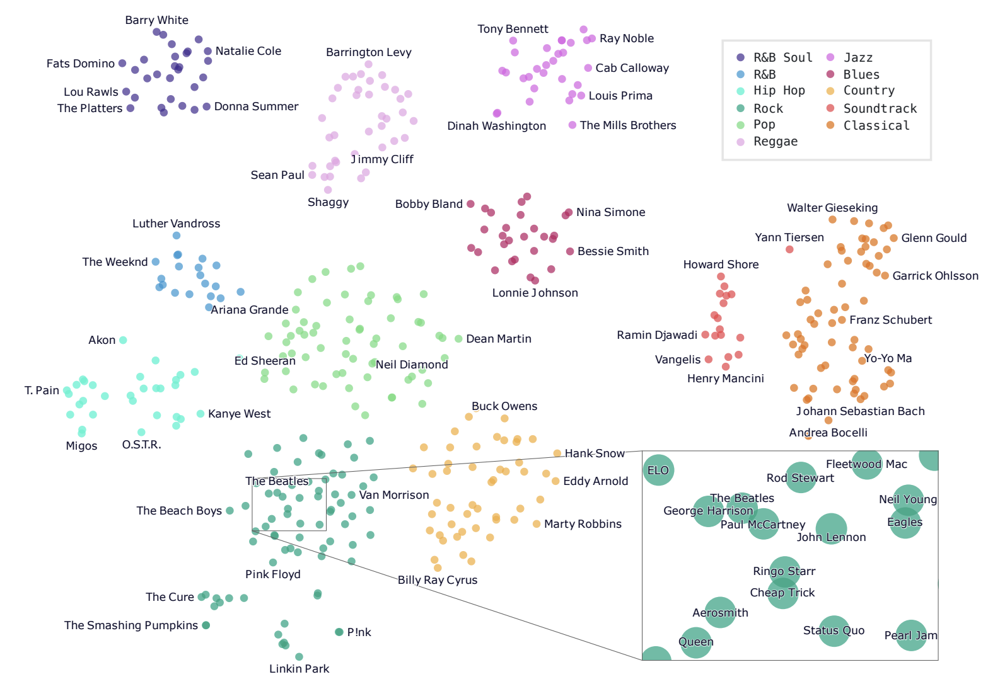

## Rigging the Lottery: Making All Tickets Winners
- Authors: Utku Evci, Trevor Gale, Jacob Menick, Pablo Samuel Castro, Erich Elsen
- Link: https://arxiv.org/abs/1911.11134
- Released in: November 2019
- Accepted to: ICML 2020

The **lottery ticket hypothesis** [1,2] claims that training neural networks is like a lottery. According to [1], network pruning is feasible because:
> Dense, randomly-initialized, feed-forward networks contain subnetworks ("winning tickets") that - when trained in isolation - reach test accuracy comparable to the original network in a similar number of iterations.

So, should we always start with a large network aiming to draw a winning ticket and drop losing tickets (unnecessary subnetworks) after the winner announcement (training & validation)? This paper answers no. The authors introduce a method to train sparse neural networks by iteratively dropping and growing connections with the model size fixed throughout training. The proposed training strategy is named **RigL**, as it "riggs the lottery ticket hypothesis." The algorithm of RigL is summarized as below:

RigL achieves higher test accuracy with fewer training FLOPs and parameter counts than pruning on various networks and datasets (e.g., ResNet-50/MobileNet on ImageNet and GRU on WikiText-103).

## PIFuHD: Multi-Level Pixel-Aligned Implicit Function for High-Resolution 3D Human Digitization
- Authors: Shunsuke Saito, Tomas Simon, Jason Saragih, Hanbyul Joo
- Link: https://arxiv.org/abs/2004.00452
- Released in: April 2020
- Accepted to: CVPR 2020

**PIFuHD** is an updated version of **PIFu** (**Pixel-aligned Implicit Function**) [4], a deep learning method to reconstruct 3D human shape from a single image. I chose this paper because  it's fun! Not only the result is remarkable (see the image below), but the authors provide a [Colab demo](https://colab.research.google.com/drive/11z58bl3meSzo6kFqkahMa35G5jmh2Wgt) that you can try with your own images instantly.

Many people have tried out this demo and uploaded their results at [#pifuhd](https://twitter.com/search?q=%23pifuhd). One of my favorites is the video of G7 leaders dancing to a song by Sakanaction.

<blockquote class="twitter-tweet">
もしG7の方々に 新宝島 を踊らせたら <a href="https://twitter.com/hashtag/%E3%82%B5%E3%82%AB%E3%83%8A%E3%82%AF%E3%82%B7%E3%83%A7%E3%83%B3?src=hash&amp;ref_src=twsrc%5Etfw">#サカナクション</a> <a href="https://twitter.com/hashtag/%E6%96%B0%E5%AE%9D%E5%B3%B6?src=hash&amp;ref_src=twsrc%5Etfw">#新宝島</a> <a href="https://twitter.com/hashtag/pifuhd?src=hash&amp;ref_src=twsrc%5Etfw">#pifuhd</a> <a href="https://t.co/TTn75rwlqw">pic.twitter.com/TTn75rwlqw</a>
&mdash; もうせ (@motulo) <a href="https://twitter.com/motulo/status/1277914023116320770?ref_src=twsrc%5Etfw">June 30, 2020</a></blockquote> 

For technical details, I'd like to recommend the excellent presentation video by the authors.

<iframe width="560" height="315" src="https://www.youtube.com/embed/uEDqCxvF5yc" frameborder="0" allow="accelerometer; autoplay; clipboard-write; encrypted-media; gyroscope; picture-in-picture" allowfullscreen></iframe>

 

## Jukebox: A Generative Model for Music
- Authors: Prafulla Dhariwal, Heewoo Jun, Christine Payne, Jong Wook Kim, Alec Radford, Ilya Sutskever
- Link: https://arxiv.org/abs/2005.00341
- Released in: May 2020
- Accepted to: None

Generating realistic images is not surprising any more, but generating realistic music is still a hard challenge due to its extremely long-range dependency. Specifically, a 4-minute song at CD quality (44 kHz) has more than 10 million timestamps with high-level semantics (c.f., intro, verse, chorus). OpenAI boldly tackled the generation of raw audio in a variety of genres, and their **Jukebox** succeeded in producing pretty impressive music! 

[Here](https://jukebox.openai.com) are the non cherry-picked 7,131 samples. They are conditioned on specific genres and artists, some of which are also conditioned on lyrics. For example, [this sample](https://jukebox.openai.com/?song=787730629) is a continuation of *I Just Call To Say I Love You* by Stevie Wonder. It sounds like a new song after 10 seconds, while reasonably maintaining the style of the singer and the song.

What is inside this magic? Inspired from **VQ-VAE-2** [5], the authors use hierarchical VQ-VAE to handle long-range dependency. As for the prior (or, the generator), they use **Sparse Transformer** [6], an efficent Transformer that succeeded in generating 64x64 sized images and raw audio waveforms, as already mentioned in [my earlier post](https://hippocampus-garden.com/xformers/#sparse-transformer-child-2019). 

<small>The details are explained with informative GIFs in
<a href="https://openai.com/blog/jukebox/">
the official blog post</a>.</small>

The appendix of the paper is also worth reading. The figure below is a t-SNE plot of (artist, genre) embeddings learned by Jukebox. I agree that ELO is similar to the Beatles😉

 

## Language Models are Few-Shot Learners
- Authors: Tom B. Brown, Benjamin Mann, Nick Ryder, Melanie Subbiah, Jared Kaplan, Prafulla Dhariwal, Arvind Neelakantan, Pranav Shyam, Girish Sastry, Amanda Askell, Sandhini Agarwal, Ariel Herbert-Voss, Gretchen Krueger, Tom Henighan, Rewon Child, Aditya Ramesh, Daniel M. Ziegler, Jeffrey Wu, Clemens Winter, Christopher Hesse, Mark Chen, Eric Sigler, Mateusz Litwin, Scott Gray, Benjamin Chess, Jack Clark, Christopher Berner, Sam McCandlish, Alec Radford, Ilya Sutskever, Dario Amodei
- Link: https://arxiv.org/abs/2005.14165
- Released in: May 2020
- Accepted to: NeurIPS 2020

**GPT-3**, the latest version of **GPT** [6,7], is a pre-trained language model that has as many as 175B parameters (10 times larger than [Turing-NLG]((https://www.microsoft.com/en-us/research/blog/turing-nlg-a-17-billion-parameter-language-model-by-microsoft/))!) and is trained with 300B tokens. The authors found that scaling up the model greatly improves the performance of few-shot learning without fine-tuning, which they call **in-context learning**. They compare the in-context learning and traditional fine-tuning in the figure below.

In short, in their *in-context* few-shot learning, the model sees the input containing task description, a few examples, and prompt only at inference time and predicts the answer. There is no training or fine-tuning. 
GPT-3 can deal with a variety of tasks such as translation, text generation, summarization, question answering, and even arithmetics. Sometimes it outperforms fine-tuned models.

More surprisingly, it is reported that GPT-3 can translate English to JSX code. Indeed, quantitative changes transform to qualitative changes.

<blockquote class="twitter-tweet">
This is mind blowing.  With GPT-3, I built a layout generator where you just describe any layout you want, and it generates the JSX code for you.  W H A T <a href="https://t.co/w8JkrZO4lk">pic.twitter.com/w8JkrZO4lk</a>
&mdash; Sharif Shameem (@sharifshameem) <a href="https://twitter.com/sharifshameem/status/1282676454690451457?ref_src=twsrc%5Etfw">July 13, 2020</a></blockquote> 
 

OpenAI releases the GPT-3 model as an API instead of pre-trained weights. If you wish to use it, join the [waitlist](https://beta.openai.com/) for the beta version.

## Bootstrap your own latent: A new approach to self-supervised Learning
- Authors: Jean-Bastien Grill, Florian Strub, Florent Altché, Corentin Tallec, Pierre H. Richemond, Elena Buchatskaya, Carl Doersch, Bernardo Avila Pires, Zhaohan Daniel Guo, Mohammad Gheshlaghi Azar, Bilal Piot, Koray Kavukcuoglu, Rémi Munos, Michal Valko
- Link: https://arxiv.org/abs/2006.07733
- Released in: June 2020
- Accepted to: NeurIPS 2020
  
## Implicit Neural Representations with Periodic Activation Functions
- Authors: Vincent Sitzmann, Julien N. P. Martel, Alexander W. Bergman, David B. Lindell, Gordon Wetzstein
- Link: https://arxiv.org/abs/2006.09661
- Released in: June 2020
- Accepted to: NeurIPS 2020

  
## Graph Structure of Neural Networks
- Authors: Jiaxuan You, Jure Leskovec, Kaiming He, Saining Xie
- Link: https://arxiv.org/abs/2007.06559
- Released in: July 2020
- Accepted to: ICML 2020

## Towards Faster and Stabilized GAN Training for High-fidelity Few-shot Image Synthesis
- Authors: Anonymous
- Link: https://openreview.net/forum?id=1Fqg133qRaI
- Released in: September 2020
- Accepted to: None
  
## An Image is Worth 16x16 Words: Transformers for Image Recognition at Scale
- Authors: Alexey Dosovitskiy, Lucas Beyer, Alexander Kolesnikov, Dirk Weissenborn, Xiaohua Zhai, Thomas Unterthiner, Mostafa Dehghani, Matthias Minderer, Georg Heigold, Sylvain Gelly, Jakob Uszkoreit, Neil Houlsby
- Link: https://arxiv.org/abs/2010.11929
- Released in: October 2020
- Accepted to: None
  
## Pre-training without Natural Images
- Authors: Hirokatsu Kataoka, Kazushige Okayasu, Asato Matsumoto, Eisuke Yamagata, Ryosuke Yamada, Nakamasa Inoue, Akio Nakamura, Yutaka Satoh
- Link: https://openaccess.thecvf.com/content/ACCV2020/html/Kataoka_Pre-training_without_Natural_Images_ACCV_2020_paper.html
- Released in: November 2020
- Accepted to: ACCV 2020
  

## References
[1] Jonathan Frankle, Michael Carbin. "[The Lottery Ticket Hypothesis: Finding Sparse, Trainable Neural Networks](https://arxiv.org/abs/1803.03635)". *ICLR*. 2019.  
[2] Madison May. "[Comparing Rewinding and Fine-tuning in Neural Network Pruning](https://arxiv.org/abs/2003.02389)". *ICLR*. 2020.   
[3] Shunsuke Saito, Zeng Huang, Ryota Natsume, Shigeo Morishima, Angjoo Kanazawa, Hao Li. "[PIFu: Pixel-Aligned Implicit Function for High-Resolution Clothed Human Digitization](https://arxiv.org/abs/1905.05172)". *ICCV*. 2019.  
[4] Ali Razavi, Aaron van den Oord, Oriol Vinyals. "[Generating Diverse High-Fidelity Images with VQ-VAE-2](https://arxiv.org/abs/1906.00446)". *NeurIPS*. 2019.  
[5] Rewon Child, Scott Gray, Alec Radford, Ilya Sutskever. "[Generating Long Sequences with Sparse Transformers](https://arxiv.org/abs/1904.10509)". 2019.  
[6] Alec Radford, Karthik Narasimhan, Tim Salimans, Ilya Sutskever. "[Improving Language Understanding by Generative Pre-Training](https://www.cs.ubc.ca/~amuham01/LING530/papers/radford2018improving.pdf)". 2018.  
[7] Alec Radford, Jeffrey Wu, Rewon Child, David Luan, Dario Amodei, Ilya Sutskever. "[Language Models are Unsupervised Multitask Learners](http://www.persagen.com/files/misc/radford2019language.pdf)". 2019.