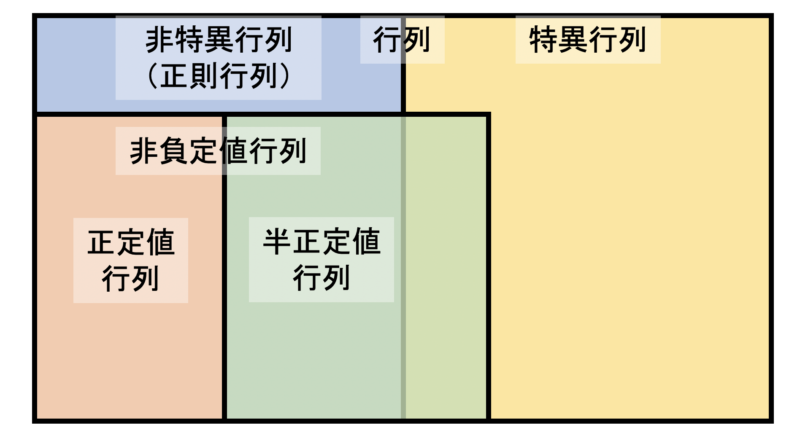

## 概要

## まとめ+α
一般的な線形代数の教科書ではあまり取り上げられない射影  
一方で、大学1年の数学で必ずと言っていいほど登場するJordan標準形は索引に名前すらないなど、大胆に削ぎ落とされている内容もあります。確かに、Jordan標準形は大学1年生以来まだ使ったことがありません…

以下では、他書からの補足や応用上の話も交えつつ各章の内容を簡単にまとめます。自分が後で復習するときに役立つように、という基準で内容を取捨選択しています。

### 第1章 行列
行列のスカラー倍や行列どうしの加減乗除といった基本的演算、および対称行列や三角行列といった用語を定義します。

### 第2章 部分行列と分割行列
ブロック対角行列などを定義するのに必要になる部分行列と分割行列を準備します。**主部分行列 (principal submatrix)** とその部分集合である**首座部分行列 (leading principal submatrix)** は忘れがちなので再掲します。  
- **主部分行列**: $n \times n$行列から第$i_1, \ldots, i_r$行と第$i_1, \ldots, i_r$列を削除することで得られる$(n-r) \times (n-r)$部分行列  
- **首座部分行列**: 主部分行列のうち、$\{ i_k ~|~ k=1,\ldots, r\} = \{ i ~|~ i=n-r+1,\ldots,n\}$であるもの。すなわち、$n \times n$行列から最後の$r$行と$r$列を削除することで得られる$(n-r) \times (n-r)$部分行列  
  
対称行列の主部分行列もまた対称行列であり、三角行列の主部分行列も三角行列です。
  
### 第3章 線形従属と線形独立
タイトルどおりの内容が4ページで書かれているだけです。

### 第4章 線形空間 ―― 行空間と列空間
**行（列）空間**、**基底**、**次元 (dimension)**、**階数 (rank)**、**非特異 (non-singular)** といった極めて重要な概念を導入します。  
ところで、行列がフルランクであることは「**正則 (regular)**」と呼ぶのが一般的だと思いますが、この本では「非特異 (non-singular)」という言葉を使います。否定形でわかりにくいところがありますが、統計学で使う「正則化 (regularization)」と区別するためでしょうか。

### 第5章 （正方）行列のトレース
正方行列に対して定義される**トレース**を導入します。行列$\textbf{A}$のトレース$\mathrm{tr}(\textbf{A})$は、$\textbf{A}$の対角成分の和として定義されます。  
行列の積のトレースには少し注意が必要なので、再掲します。2つの行列$\textbf{A} \in \mathbb{R}^{m\times n}$、$\textbf{B} \in \mathbb{R}^{n\times m}$を考えます。トレースの転置不変性を考慮すると、2つの行列の積に対しては、次のような順序の交換が可能です。
$$
\mathrm{tr}(\textbf{AB}) = \mathrm{tr}(\textbf{BA})
$$
両辺で行列のサイズが異なっていることに注意してください。  
次に、3つの行列$\textbf{A} \in \mathbb{R}^{m\times n}$、$\textbf{B} \in \mathbb{R}^{n\times p}$、$\textbf{C} \in \mathbb{R}^{p\times m}$を考えます。3つの行列の積$\textbf{ABC}$に対しては、$\textbf{AB}$と$\textbf{C}$の積あるいは$\textbf{A}$と$\textbf{BC}$の積とみなすことで、次のような順序の交換が可能です。
$$
\mathrm{tr}(\textbf{ABC}) = \mathrm{tr}(\textbf{CAB}) = \mathrm{tr}(\textbf{BCA})
$$
ただし、次のような順序の交換は*できません*。
$$
\mathrm{tr}(\textbf{ABC}) = \mathrm{tr}(\textbf{BAC})
$$
右辺は行列のサイズが合わないのでそもそも積が定義できないのですが、仮に$\textbf{A}$、$\textbf{B}$、$\textbf{C}$がすべて$n \times n$正方行列だったとしても、このような順序の交換はできません。

### 第6章 幾何学的考察
ベクトルまたは行列の**内積**や**ノルム**、**正規直交基底**といった重要な概念を導入し、代数と幾何の橋渡しをします。  
内積はノルムを誘導します。$m\times n$行列の線形空間$\mathcal{V}$の中の行列$\textbf{A}$のノルムは
$$
||\textbf{A}|| = (\textbf{A} \cdot \textbf{A})^{1/2}
$$
で定められますが、これは通常の内積の場合、
$$
||\textbf{A}|| = \bigl(\mathrm{tr}(\textbf{A}' \textbf{A})\bigr)^{1/2} = \Biggl(\sum_{i=1}^m \sum_{j=1}^na_{ij}^2 \Biggr)^{1/2}
$$
と**Frobeniusノルム**を誘導します。これらの概念は計量空間やノルム空間といった話題に関係してきますが、この本ではそこには立ち入りません。  
また、**Schwarzの不等式**（**三角不等式**の基礎となります）や**Gram-Schmidtの直交化**も扱います。さらに、Gram-Schmidtの直交化から、任意の行列$\textbf{A}$を直交行列$\textbf{Q}$と上三角行列$\textbf{R}$の積に分解する**QR分解**というアルゴリズムが導かれます。QR分解は、最小二乗法や固有値計算に用いられる重要なアルゴリズムです。

### 第7章 線形系 ―― 無矛盾性と両立性
次章で逆行列を導入する準備として、線形系$\textbf{AX}=\textbf{B}$に解が存在するための条件を考えます。

### 第8章 逆行列
前章で考えた線形系$\textbf{AX}=\textbf{B}$で、行列$\textbf{A}$が非特異なら、**逆行列**$\textbf{A}^{-1}$が存在して、$\textbf{X}=\textbf{A}^{-1}\textbf{B}$と実際に解を求めることができます。ここではその計算方法などについては論じず、分割行列の逆行列について多くのページを割いています。その中で出てくる**Schurの補元**は、後でも度々登場するので要確認です。

### 第9章 一般逆行列
逆行列を、線形系で係数行列が特異な（すなわち逆行列を持たない）場合に拡張します。$m\times n$行列$\textbf{A}$の**一般逆行列**とは、
$$
\textbf{AGA} = \textbf{A}
$$
を満たす$n\times m$行列$\textbf{G}$のことを言います。非特異行列の逆行列がただ1つに定まるのに対し、特異行列の一般逆行列は無数に存在しますが、特異行列$\textbf{A}$の任意の一般逆行列$\textbf{G}$に対して$\textbf{X} = \textbf{GB}$は線形系$\textbf{AX}=\textbf{B}$の解になります。また、どんな行列にも少なくとも1つの一般逆行列が存在します。以下では、行列$\textbf{A}$の一般逆行列を$\textbf{A}^-$と書きます。本の中では実際に小さな行列を使って具体例が示されています。

### 第10章 冪等行列
正方行列$\textbf{A}$が
$$
\textbf{A}^2 = \textbf{A}
$$
を満たすとき、$\textbf{A}$を**冪等行列**と呼びます。第12章で確認する通り、冪等行列は射影という幾何学的な操作と密接な関係を持っています。  
本章はいくつかの興味深い性質を導出して終わります。例えば、冪等行列$\textbf{A}$は
$$
\textbf{AAA} = \textbf{A}
$$
を満たすので、自身が一般逆行列となります。また、階数とトレースが一致します。
$$
\mathrm{rank} (\textbf{A} )= \mathrm{tr}(\textbf{A})
$$

### 第11章 線形系 ―― 解
第7章の続きです。逆行列などの必要な道具が揃ったので、今度は線形系の解の公式や解空間について論じます。  
線形系$\textbf{AX}=\textbf{B}$の解の集まりを**解集合**と呼びます。同次線形系$\textbf{AX}=\textbf{0}$の解集合は線形空間をなすので、**解空間**と呼びます。また、列ベクトル$\textbf{x}$に関する同次線形系$\textbf{Ax}=\textbf{0}$の解空間を行列$\textbf{A}$の**零空間 (null space)** と呼び、$\mathcal{N}(\textbf{A})$と表します。これを式で書くと、$\textbf{A} \in \mathbb{R}^{m \times n}$に対して、
$$
\mathcal{N}(\textbf{A}) = \{\textbf{x}\in \mathbb{R}^{n \times 1} ~|~ \textbf{Ax}=\textbf{0} \}
$$
となります。  
次に、線形系の解の一般系を考えます。同次線形系$\textbf{AX}=\textbf{0}$の一般解は、$\textbf{Y}$を適当な行列として、
$$
\textbf{X}^* = (\textbf{I}-\textbf{A}^-\textbf{A})\textbf{Y}
$$
で与えられます。非同次線形系の一般解は、対応する同時線形系の一般解$\textbf{Z}^*$と非同次線形系の特殊解$\textbf{X}_0$の和として与えられます。  
また、同次線形系$\textbf{Ax}=\textbf{0}$の解の個数$\mathrm{dim}(\mathcal{N}(\textbf{A}))$について、**階数・退化次数の定理 (rank-nullity theorem)** とも呼ばれる次の式が成り立ちます。
$$
\mathrm{dim}(\mathcal{N}(\textbf{A})) = n - \mathrm{rank} (\textbf{A} )
$$
なお、この本では線形変換について最後の第22章で簡単に取り上げるのみですが、線形変換$T:\mathcal{V} \rightarrow\mathcal{W}$に対しても同様の等式が成り立ちます。
$$
\mathrm{dim}( \mathrm{Ker}(\textbf{A}) ) = \mathrm{dim}(\mathcal{V}) - \mathrm{dim}( \mathrm{Im}(\textbf{A}) )
$$

### 第12章 射影と射影行列
第10章に関連して、射影を導入しその統計に関する側面について論じます。  
$\mathcal{U}$を線形空間$\mathcal{V}$の部分空間とします。任意の行列$\textbf{Y}\in \mathcal{V}$に対して、$(\textbf{Y}-\textbf{Z}) \perp \mathcal{U}$を満たす一意の**射影**$\textbf{Z}\in \mathcal{U}$が存在します。また、行列$\textbf{X}$の列が$\mathcal{U}$を張る場合、
$$
\textbf{P}_\textbf{X} = \textbf{X}(\textbf{X}'\textbf{X})^-\textbf{X}'
$$
を$\mathcal{U}$に対する**射影行列**と呼び、$\textbf{P}_\textbf{X}\textbf{Y}$は$\textbf{Y}$の$\mathcal{U}$への射影となります。  
射影は幾何的な意味を考えると理解しやすいです。本の中では2次元と3次元の場合の具体例が図とともに示されています。射影行列が冪等であることは簡単に示せますが、これも幾何的な意味を考えれば直感的に理解できると思います。  
射影は最小二乗問題とも関係があります。$\mathcal{U}$を線形空間$\mathcal{V}$の部分空間とし、$\textbf{Y}\in \mathcal{V}$とします。$\textbf{W}\in \mathcal{U}$に対して、$||\textbf{Y}-\textbf{W}||^2$は$\textbf{W}$が$\textbf{Y}$の$\mathcal{U}$への射影であるときに最小値をとります。このとき、$\textbf{W}\perp(\textbf{Y}-\textbf{W})$より、その最小値は、
$$
||\textbf{Y}-\textbf{W}||^2 = \textbf{Y}\cdot (\textbf{Y}-\textbf{W})
$$
です。

### 第13章 行列式
ここでようやく、正方行列に対して定義されるスカラー値である**行列式 (determinant)** が登場します。行列式の重要性や統計との関わりは言うまでもないでしょう。本章ではその定義、性質、余因子を使った計算方法などについて述べています。  
行列式は高校時代からの長い付き合いですが、厳密には要素どうしの正対/負対（あるいは転倒数）と順列を使って、ややこしい定義がなされます。ここでは定義を書き下すことは避けます。  
以下の性質は計算上重要です。
- 2つの列または行を交換すると、行列式の符号が反転します
- ある列または行を定数倍すると、行列式も定数倍されます
- 列（行）に他の列（行）の定数倍を加えても行列式は変化しません

また、$|\textbf{AB}|=|\textbf{A}||\textbf{B}|$から、次の事実が得られます。
- 直交行列の行列式の絶対値は1に等しい
- 逆行列の行列式は、元の行列の行列式の逆数に等しい

最後に、余因子という概念を導入します。$n \times n$行列$\textbf{A}=\{ a_{ij} \}$から要素$a_{ij}$を含む行と列、すなわち第$i$行と第$j$列を削除して得られる部分行列を$\textbf{A}_{ij}$とします。このとき、$a_{ij}$の**余因子 (cofactor)** を
$$
\alpha_{ij} = (-1)^{i+j}|\textbf{A}_{ij}|
$$
と定義します。すると、$\textbf{A}$の行列式は、$\textbf{A}$のある行または列の$n$個の要素について**余因子展開**が可能です。すなわち、任意の行に対して（$i=1,\ldots,n$）、
$$
|\textbf{A}| = \sum_{j=1}^n a_{ij}\alpha_{ij}
$$
です（列に対しても同様）。さらに、$n \times n$行列$\textbf{A}=\{ a_{ij} \}$に対して、対応する余因子からなる行列（**余因子行列**）の転置を**随伴行列 (adjoint matrix)** と呼びます。式で書くと、
$$
\mathrm{adj} (\textbf{A} ) = \{ \alpha_{ji} \}
$$
です。この定義より
$$
\textbf{A} ~\mathrm{adj} (\textbf{A} ) =  \mathrm{adj} (\textbf{A} )\textbf{A} = |\textbf{A}|\textbf{I}_n
$$
が導け、$\textbf{A}$が非特異なときに、行列式と随伴行列から逆行列を計算することができます。

### 第14章 線形形式，双線形形式，二次形式
本章では、行列の二次形式や正定値性、そして行列の分解について議論します。12の節からなる長い章なので、内容をかなり絞って書きます。  
$n \times n$行列$\textbf{A}$が任意の$\textbf{x}\in \mathbb{R}^n$に対して$\textbf{x}'\textbf{Ax} \geq0$を満たすとき、$\textbf{A}$が**非負定値 (nonnegative definite)** であると言います。特に、$\textbf{x}'\textbf{Ax} >0$を満たすとき、$\textbf{A}$が**正定値 (positive definite)** であると言います。非負定値であるが正定値でないとき、$\textbf{A}$が**半正定値 (positive semidefinite)** であると言います。  
基本的な性質を次にまとめます。
- 正定値行列の対角成分はすべて正であり、半正定値行列の対角成分はすべて非負です 
- （ここで固有値との関係を説明するのが自然だと思いますが、固有値はなぜか第21章まで出てきません。） 
- 任意の正定値行列は非特異です。ただし、*逆は成り立ちません*。  

さて、ここまでに登場した様々な行列の関係がわかりづらくなってきたので、ベン図にまとめてみました。半正定値行列が非特異行列と特異行列にまたがっているのがポイントです。なお、この本では行列は実数値のみからなるとします。

<small>\* 正定値性に関する用語は文献によって定義が異なるようなので注意が必要です。非負定値・正定値・半正定値を対称行列に限って定義する文献もあるそうです。また、この本で言うところの非負定値のことを「半正定値」と定義する文献もあるそうです。</small> 

また、ある条件を満たす正方行列$\textbf{A}$を、単位下三角行列$\textbf{L}$、対角行列$\textbf{D}$、単位上三角行列$\textbf{U}$の積に分解する**LDU分解**から、任意の対称正定値行列$\textbf{A}$を対角成分が正の上三角行列$\textbf{T}$を用いて
$$
\textbf{A} = \textbf{T}'\textbf{T}
$$
と一意に分解する**Cholesky分解**を導くことができます。LDU分解やCholesky分解は、逆行列の計算などに利用できます。  
対称行列$\textbf{A}$の正定値性および非負定値性に関しては、次の同値が成り立ちます。
- $\textbf{A}$のすべての主部分行列の行列式が非負 $\iff$ $\textbf{A}$は非負定値
- $\textbf{A}$のすべての首座部分行列の行列式が正 $\iff$ $\textbf{A}$は正定値

また、対称正定値行列$\textbf{A}$に関する**双線形形式**$\textbf{x}'\textbf{Ay}$は内積の公理を満たします。これは、内積の演算の内部に、$\textbf{A}$のCholesky分解で得られる行列$\textbf{T}$による線形変換を含めることに他なりません。このように内積を定義したとき、射影行列も伴って次のように変わります。
$$
\textbf{P}_{\textbf{X},\textbf{A}} = \textbf{X}(\textbf{X}'\textbf{AX})^-\textbf{X}'\textbf{A}
$$

### 第15章 行列の微分
上巻の最後は、統計学でしばしば登場する行列の微分を扱います。具体的には、微分の定式化から、各種スカラー/ベクトル/行列の微分、鎖律、いくつかの積分を含みます。  
重要な結果はたくさんあるのですが、そのうち最も基本的なものだけを記号の定義なしで書くと、

$$
\frac{\partial (\textbf{x}'\textbf{A})}{\partial \textbf{x}} = \frac{\partial (\textbf{A}'\textbf{x})}{\partial \textbf{x}} = \textbf{A}
$$

$$
\frac{\partial (\textbf{x}'\textbf{Ax})}{\partial \textbf{x}} =  (\textbf{A}+\textbf{A}')\textbf{x}
$$

$$
\frac{\partial (\textbf{AB})}{\partial \textbf{x}} = \frac{\partial \textbf{A}}{\partial \textbf{x}} \textbf{B} + \textbf{A}\frac{\partial \textbf{B}}{\partial \textbf{x}} 
$$

$$
\frac{\partial (\textbf{A}^{-1})}{\partial \textbf{x}} = - \textbf{A}^{-1}\frac{\partial \textbf{A}}{\partial \textbf{x}} \textbf{A}^{-1}
$$

などがあります。$\mathrm{tr}(\textbf{AX})$や$\mathrm{det}(\textbf{X})$などの行列$\textbf{X}$の関数をその行列自身$\textbf{X}$で微分する際は、$\textbf{X}$に制約があるか否か（例えば対称行列など）によって結果が変わるので注意が必要です。

### 第16章
### 第17章
### 第18章
### 第19章
### 第20章
### 第21章
### 第22章

## 誤植が疑われる箇所
- **p55**: 補助定理4.5.10の1つ目の同値の右辺が「$\mathcal{C}(\textbf{B}) \subset \mathcal{C}(\textbf{E})$」となっていますが、正しくは「$\mathcal{C}(\textbf{A}) \subset \mathcal{C}(\textbf{E})$」だと思われます
- **p164**: 定理11.2.1の証明の後半「よって、$\textbf{Y}=\textbf{X}^*$に対して」とありますが、「$\textbf{Y}=\textbf{X}^*$」ではなく単に「$\textbf{Y}$」だと思われます
- **p229**: 式(5.3)の最左辺は$\sum_{j=1}^n a_{ij}\alpha_{i'j}$、すなわち総和の添字が$i$ではなく$j$だと思われます
- **p230**: 式(5.4)の左から2番目の辺の第1項は、正しくは$a_{1j}\alpha_{1j'}$だと思われます
- **p274**: 定理14.5.9の証明で、「系14.4.7」と参照されているところは「系14.5.7」の誤りだと思われます
- **p284**: 式(5.20)の説明で「（対角）行列$\textbf{D}$の非対角要素」とありますが、正しくは「（対角）行列$\textbf{D}$の非ゼロ対角要素」だと思われます
- **p307**: 準ノルムの説明で、「量$(\textbf{A}\cdot \textbf{B})^{1/2}$」とありますが、正しくは「量$(\textbf{A}\cdot \textbf{A})^{1/2}$」だと思われます」
- **p313**: 「projection of $\textbf{y}$ on $\mathcal{U}$with respect to $\textbf{W}$」とありますが、$\mathcal{U}$の後ろのスペースが抜けています
- **p366**: 式(8.3)の右辺は、正しくは$[\mathrm{adj}(\textbf{X})]'$だと思われます