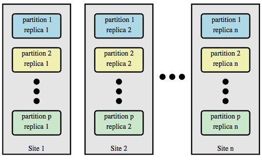

## はじめに

『データ指向アプリケーションデザイン』（Martin Kleppmann　著、斉藤 太郎　監訳、玉川 竜司　訳、O’Reilly Japan、2019年）を読んだので、まとめと感想を書きます。

<iframe sandbox="allow-popups allow-scripts allow-modals allow-forms allow-same-origin" style="width:120px;height:240px;" marginwidth="0" marginheight="0" scrolling="no" frameborder="0" src="//rcm-fe.amazon-adsystem.com/e/cm?lt1=_blank&bc1=000000&IS2=1&bg1=FFFFFF&fc1=000000&lc1=0000FF&t=hippocampus09-22&language=ja_JP&o=9&p=8&l=as4&m=amazon&f=ifr&ref=as_ss_li_til&asins=4873118700&linkId=9c1d7bb09097c6ff19ab53dd2332e3bf"></iframe>

本書は

データ指向アプリケーションデザインとは、

## 総評

具体的な名前が多数登場する（本記事では省略しがち）

## 内容のまとめ

- 1-4章：データ指向アプリケーションの設計を支える基本的な概念を紹介します
- 5-9章：1台のマシンに保存されているデータから、スケーラビリティや耐障害性、レイテンシのため複数のマシンに分散配置されているデータに視点を移します

### 1章 信頼性、スケーラビリティ、メンテナンス性に優れたアプリケーション

今日の多くのアプリケーションは、**演算指向**ではなく**データ指向**であると言えます。すなわち、制約条件がCPUではなくデータ（量、複雑さ、変化する速度）となることがほとんどです。こういったアプリケーションでは、**データベース**、**キャッシュ**、**検索インデックス**、**ストリーム処理**、**バッチ処理**などの機能が必要になります。これらの機能を抽象化するツールまたはツール群（**データシステム**）は数多くありますが、アプリケーション開発においてそれらの仕組みや性質について知っておくことは重要です。

まず、本書の全体を通して必要となる基本的な概念である、**信頼性**、**スケーラビリティ**、**メンテナンス性**を導入します。

信頼性とは、何か問題が生じたとしても正しく動作し続けることです。ここでいう問題には、以下のような種類があります。

- ハードウェア障害：ディスクのクラッシュ、停電、ネットワークの切断など。こういった事象は多数のマシンが関わる大規模なシステムでは日常的に発生し、対策として冗長化が行われます。
- ソフトウェアのエラー：単なるバグ、プロセスの暴走、依存先サービスの障害など。これらを完全に解決する方法はなく、テストやモニタリングなどを徹底することで対策することしかできません。
- ヒューマンエラー：設定ミスなど。障害の最大の原因とも言われています。対策としては優れたインターフェイスやサンドボックス環境の用意などがあります。

スケーラビリティとは、負荷の増大に対してシステムが対応できる能力のことです。能力を測る指標には**スループット**と**レスポンスタイム**などがあり、99.9パーセンタイルなどの統計量が使われます。

スケーラビリティについて議論するためにはまず、負荷が何に依存しているかを知ることが大事です。Twitterを例に考えてみましょう。負荷は、タイムラインの読み込みとツイートの書き込みのどちらに強く依存しているのでしょうか？その度合いは、ユーザのフォロー数やフォロワー数によってどのように変わるのでしょうか？これらの要素がどうなっているかによって、最適なシステム設計が変わってきます。

なお、パフォーマンスを上げる一般的な方法としては、**スケールアップ**（**垂直スケーリング**；マシンを強力なものにする）と**スケールアウト**（**水平スケーリング**；マシンの数を増やす）があります。

メンテナンス性とは、運用時のコストの低さのことです。これは、システムの単純性や変更容易性によって達成されます。

### 2章 データモデルとクエリ言語

次に、アプリケーションにおいてデータを表現する存在である**データモデル**について見ていきます。主なデータモデルとしては、**リレーショナルモデル**、**ドキュメントモデル**、**グラフモデル**があります。

リレーショナルモデルは、データをリレーション（表のこと）で表現します。それぞれのリレーションはタプル（行のこと）の集合です。リレーショナルデータベース（relational database; **RDB**）は、1960年代にビジネスデータの処理（**トランザクション処理**や**バッチ処理**）を起源として発展しました。その後、汎用性の高さからユースケースが拡大し、今でも現役で使われています。

2010年代になると、さらなるスケーラビリティや柔軟性を志向する**NoSQL**が登場しました。そのうちのドキュメントモデルという類型はJSONのような形式でデータを表現します。ドキュメントモデルには、オブジェクト指向言語における**インピーダンスミスマッチ**（オブジェクトとデータの間の変換処理）が小さいという利点がある一方、ドキュメント間の関係を表現しづらいという欠点があります。多くのデータベースでリレーショナルとドキュメントのハイブリッドモデルを採用する動きがあります。

データ間で多対多の関係が一般的な場合には、グラフモデルが適しています。例えば、Webグラフを表現するならば、Webページを頂点、ページ間のリンクを辺で表すことができます。Neo4jはグラフデータベースの代表例です。

データを操作するクエリ言語には、SQLのように**宣言的**なものと、IMSやCODASYLのように**命令的**なものがあります。宣言的言語では操作方法ではなく操作完了後の理想状態を指定するので、システム側で計算処理の最適化ができます（例：BigQuery）。

### 3章 ストレージと抽出

データベースを外から見てきたので、次はデータベースの内側を見ていきます。この内部処理は通常抽象化されていますが、様々なストレージエンジンの中から適切なものを選ぶ際に理解しておく必要があります。特に、トランザクション用のエンジンと分析用のエンジンでは性質が大きく異なります。

データベースのナイーブな実装例として、書き込み時には最終行への追記だけを行い（上書きはしない）、読み取り時には先頭から末尾まで順に探索するというものを考えてみましょう。この実装だと書き込みは定数時間で実行できますが、読み取りにはレコード数に比例する時間がかかってしまいます。読み取りを高速化するデータ構造として一般的に**インデックス**が用いられますが、ここには書き込みの速度を低下させるというトレードオフが存在します。

インデックスには様々なバリエーションがあります。

**ハッシュインデックス**は名前の通り、ログ（追記だけを行うレコードの並び）をハッシュテーブルで管理します。全てのキーがRAMに収まっている必要がありますが、読み書きともに高速に実行できます。値の実体はディスクからロードするため、RAMに乗せなくても構いません。ログがあるサイズに達したらそのファイルを閉じて**コンパクション**（重複キーから最新の値のみを残す処理）を行い、以降は新しいファイルに書き込むようにすることで、ディスク領域を使い切ることを回避できます。このとき、小さいセグメント同士をマージすることもできます。あるキーとその値を削除するためには、**墓石**（**tombstone**）と呼ばれる特別なレコードを追加します。追記ではなく更新をした方が効率がいいように思えるかもしれませんが、追記のシーケンシャルな書き込みは更新のランダムな書き込みより高速であること、クラッシュ時のリカバリと並行処理が単純に扱えることといった利点があります。ハッシュインデックスの制約は、全てのキーをメモリに収める必要があることと範囲検索ができないことです。ハッシュインデックスを用いたデータベースの代表例にBitcaskがあります。

<!-- TODO: 正しくまとめられているかわからない -->
**ソート済み文字列テーブル**（**sorted string table**; **SSTable**）は、キーを事前にソートしておくことによって範囲検索ができるようにしたものです。こうすると、メモリに全てのキーを乗せる必要がなくなるという利点もあります。セグメントごとに1つのキーをメモリに乗せておけばどのセグメントを読むべきかがわかり、1つのセグメントであれば高速にスキャンできるからです。キーを任意の順序で書き込み、ソートされた順序で読み取るためのデータ構造として、インメモリのBツリー（red-blackツリーやAVLツリー）を用います。このインメモリのBツリーは**memtable**とも呼ばれます。SSTableとmemtableを組み合わせたデータ構造が**LSMツリー**（**log-structured merged-tree**）です。LSMツリーは、Apache Cassandra、LevelDB、RocksDB、HBase、Bigtableなど様々な分散データベースで利用されています。また、全文検索に用いられるインデックスエンジンであるLuceneの単語辞書としても利用されています。

**Bツリー**（**balanced tree**）は、データベースを一度に読み書きできる固定サイズのブロック（ページ）に分割します。現在もっとも一般的なインデックスです。"balanced"というのは、N個のキーを均等な深さO(log N)を持つ木で保存するという意味です。Bツリーの書き込みは、最終行への追記ではなく該当ブロックの上書きで行います。この部分の信頼性を高めるために、**write-aheadログ**（**WAL**）という追記のみのログファイルを用意します。

LSMツリーとBツリーとを比較すると、前者は書き込みが速く、後者は読み取りが速いです。また、最近はMemcachedやVoltDBやRedisなどの**インメモリデータベース**も発展してきています。インメモリデータベースを使うと、書き込みを高速化できます（読み取りはキャッシュによって既に高速化されています）。

データベース上で行う処理には、ユーザが利用する**トランザクション処理**（online transaction processing; **OLTP**）と、社内のアナリストが利用する**分析処理**（online analytic processing; **OLAP**）があります。前者は低負荷だが大量に発生する一方、後者は高負荷だが発生頻度は低いです。SQLはこのうちの両方に対応できますが、データベースは用途によって分離したほうが都合の良いことが多いです。分析処理に特化したデータベースは**データウェアハウス**として発展しました。データウェアハウスはしばしば、経時的に発生するイベントからなる**ファクトテーブル**と、各列の属性からなる**ディメンションテーブル**によって構成されます。この構成を**スタースキーマ**と呼びます。カラムをいくつかのカテゴリに分割したものを**スノーフレークスキーマ**と呼びます。

また、分析においては列ごとに統計量を計算するため、列指向ストレージのほうが効率が良くなります。

### 4章 エンコーディングと進化

アプリケーションを変更するとき、ほとんどの場合でデータとコードの変更を伴います。そうすると、一時的に新旧のデータと新旧のコードが共存することになります。後方互換性と前方互換性を保つにはどうすればいいでしょうか。特に、新しいコードによって書かれたデータを古いコードで読む（前方互換性が必要）には、未知の変更に対策しなければなりません。次は、このような観点に注目しながら、データをエンコードする様々なフォーマットを見ていきます。

データをインメモリの表現からバイト列に変換することをエンコーディングと呼びます。ネットワーク経由でデータを送信する場合はエンコーディングが必要です。しかし、多くのプログラミング言語には言語固有のエンコーディングフォーマットが用意されていますが、これを使うと他の言語で読みにくくなってしまいます。他にも、前方互換性やパフォーマンスに懸念があることが多いので、特定の言語の組み込みエンコーディングを使うのは望ましくありません。

JSONやXML、CSVはテキストフォーマットなので人間には読みやすいですが、数値のエンコーディングに曖昧さがあります。また、CSVにはスキーマの概念がありません。

Apache ThriftやProtocol Buffers、Avroは、スキーマを前提とすることで効率よくバイナリエンコーディングできるフォーマットです。スキーマはドキュメンテーションやコード生成に役立ちますが、バイナリのままだと人間には読めないという欠点があります。

これらのエンコーディングを用いてデータをあるプロセスから別のプロセスに渡す（データフロー）には、いくつかの方法があります。

- データベースを経由する
- サービス（RESTやRPC）を経由する（参考：マイクロサービスアーキテクチャ）
- 非同期のメッセージパッシング（例：Apache Kafka。詳しくは11章）

### 5章 レプリケーション

**レプリケーション**とは、ネットワークで接続された複数のマシンに同じデータのコピーを保持しておくことです。レプリケーションによって、

- （ユーザから地理的に近い場所でデータを保持することで）レイテンシを下げる
- スループットを上げる
- 可用性を高める

ことができます。なお、ここではデータは各マシンに全体が収まる程度のサイズだとします（パーティショニングが必要な場合については6章で検討します）。データが変化しないのであればレプリケーションは容易ですが、変化する場合は同期に関する問題が発生します。

データベースのコピーを保持する各ノードを**レプリカ**と呼びます。変更が全てのレプリカに行き渡ることを保証するために、次に紹介する3つのレプリケーションアルゴリズムのうちいずれかが用いられます。

**シングルリーダーレプリケーション**では、1つのリーダー（leader）と複数のフォロワーを設定します。データに書き込みが入ったら、まずリーダーがローカルストレージに書き込みを行い、変更データを他のフォロワーに送信します。各フォロワーは変更データをローカルストレージに反映させます。読み取り時にはリーダーまたはフォロワーから読み取ります。新しくフォロワーを追加する場合は、リーダーのスナップショットをコピーした後、最新の変更を反映させます。リーダーに障害が起きた場合は、最も追従しているレプリカをリーダーに昇格させます。障害時には問題がいろいろと起こり得るので、手動で対処する場合もあります。シングルリーダーには、リーダーに書き込みの負荷が集中することでボトルネックになりやすいという問題があります。

**マルチリーダーレプリケーション**は、リーダーを複数建てることで、シングルリーダーのボトルネックを解消します。一方で、書き込みの衝突という複雑な問題が発生するため、この方法は基本的には推奨されません。マルチリーダーが妥当な構成となる状況は、地理的に分散したデータセンターのそれぞれにリーダを置く場合やオフラインでも動作させたいアプリケーション、リアルタイムな共同編集ツールなどです。Google Docsが良い例です。全ての編集者のデバイスがリーダーとして動作します。自身の変更内容は自身のブラウザにはすぐに反映されますが、共同作業者には非同期で連携されます。衝突の解決には、後勝ち（last writes wins; LWW）や何らかの方法によるマージ（文字列の連結など）、ユーザに判断させるなどの方法があり得ます。

**リーダーレスレプリケーション**では、全てのレプリカで書き込みを受け付けます。読み取り時には複数のレプリカに並列でリクエストを送信し、バージョン番号にしたがって結果をマージします。

**結果整合性**（**eventual consistency**）が保証されていたとしても、レプリケーションラグ（レプリカの遅延度合い）が問題になることはあります。例えば、自分が行った変更が自分ですぐに確認できること（read-after-write一貫性またはread-your-writes一貫性）
、一度読めたものが消えないようにすること（モノトニックな読み取り）、読み取れるようになる順序が書き込みの順序と一致すること（一貫性のあるプレフィックス読み取り）などです。

### 6章 パーティショニング

さらに大規模なデータになると、レプリケーションだけではなく、**パーティショニング**が必要になります。パーティショニングはレプリケーションとは異なり、同じノードの中で大規模なデータを分割するために行われます。パーティションは、MongoDBやElasticsearchやSolrでは**シャード**、Bigtableでは**タブレット**、HBaseでは**リージョン**、RiakやCassandraでは**vnode**と呼ばれています。

<small>引用：
<a href="http://muratbuffalo.blogspot.com/2015/04/paper-summary-taxonomy-of-partitioned.html">
Paper summary: A Taxonomy of Partitioned Replicated Cloud-based Database Systems</a>.</small>

パーティショニングが均等になっていないと、一部のパーティションにデータやクエリが集中する**スキュー**（**skew**）が発生し、負荷分散の効果が大きく損なわれます。不均等な高負荷がかかっているパーティションを**ホットスポット**と呼びます。単純にキーの範囲でパーティショニングをすると、範囲に対するクエリは効率的に処理できますが、スキューが起きやすくなります。MD5のようなキーのハッシュに基づくパーティショニングは、範囲に対するクエリは非効率になりますが、スキューは防ぐことができます。それでも、数十万のフォロワーを持つユーザによって1レコードへの読み取りが集中するような場合はクエリが同じパーティションに集中してしまいます。このようなケースには多くのデータシステムが対応していないので、アプリケーション側での対策が必要です。また、時間が経つにつれてパーティション間のバランスが崩れていくので、随時リバランシングを行う必要があります。

検索サーバの重要な機能にセカンダリインデックスがありますが、この場合は状況がもっと複雑になります。せカンダリインデックスは、各パーティションの内部でローカルに作成する方法と、パーティションをまたいでグローバルに作成する方法があります。前者だと書き込み先が1つのパーティションで済み、後者だと読み取り先が1つのパーティションで済みます。
