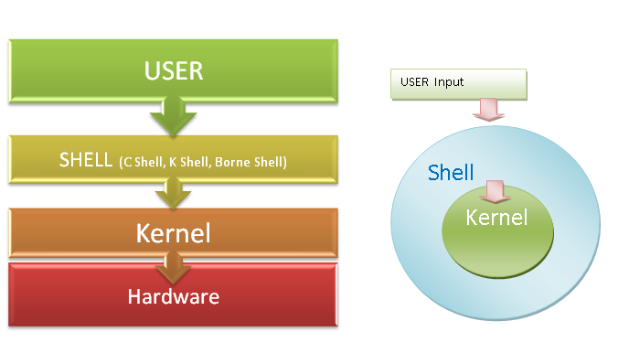

## はじめに
『[新しいLinuxの教科書](https://amzn.to/3Ibze3b)』（三宅英明, 大角祐介 著，SBクリエイティブ，2015年）を読んだので，まとめと感想を書きます．

本書は，**CLI** (**command line interface**)からLinuxを使うことに焦点を当てたLinuxの入門書です．ネットワークやアプリケーション開発といったテーマは扱っておらず，平たく言うと「Linuxの基本的な操作をCLIからできるようになること」「シェルスクリプトを読み書きできるようになること」を目的とした教科書のようです．

著者の[三宅氏](https://mollifier.hatenablog.com/entry/2015/06/05/224905)と[大角氏](https://ozuma.hatenablog.jp/entry/20150605/1433516238)は，それぞれ自身のブログでその魅力を語っています．

## まとめ+α
全体的な所感として，各章が短くまとまっていて読みやすかったです．込み入った実装もないので，移動時間やビルド待ちなどちょっとした合間で読むのにもおすすめです．

私は大角氏のブログで「おすすめする読者」として挙げられていた
> 今までなんとなく自己流でLinuxを学んでいたので，一度体系的に基礎を固めたい

に完全に当てはまっていたので，非常に勉強になりました．Linuxのコマンドはマニュアルやドキュメントを見ればわかるといえばわかるのですが，やはり都度調べるよりも教科書を通読したほうが理解が深まりますね．本書を読んでいて，「Linuxを触り始めた修士1年の頃に読んでいれば，あの作業をもっと効率良くできたな」と思うことが多々ありました．同じように「なんとなくLinuxを学んできた」という方には非常におすすめできる一冊です．

### Chapter 01　Linuxを使ってみよう
Linuxに入門する第一歩として，**仮想マシン** (**VM**; **virtual machine**)にLinuxをインストールする方法を説明します．本書はRed Hat系のCentOSを推奨していますが，Debian系のUbuntuなど，他のディストリビューションを使用しても問題ないとしています．また，CLIからログイン，ログアウト，シャットダウンを行う方法も説明します．

### Chapter 02　シェルって何だろう？
**カーネル**と**シェル**，またターミナル（エミュレータ）の違いについて説明します．また，sh，bash，zshといった人気の高いシェルの紹介もします．



<div style="text-align: center;"><small><a href="https://medium.com/@varunkumar_53845/sh-vs-bash-a-summary-50f92a719e0d">sh vs bash : A summary | by Varun Kumar | Medium</a>より</small></div>
<br/>

### Chapter 03　シェルの便利な機能
シェルで効率よくコマンドを入力するためのカーソル移動，履歴検索，補完などの機能を紹介します．

### Chapter 04　ファイルとディレクトリ
`/bin`や`/home`といったルート直下にあるディレクトリを簡単に紹介し，次に`ls`，`cd`，`pwd`といったおなじみのコマンドとそのオプションを紹介します．

### Chapter 05　ファイル操作の基本
以下のような基本的なコマンド群を紹介します．

- `mkdir`
- `touch`
- `rm`
- `rmdir`
- `cat`
- `less`
- `cp`
- `mv`
- `ln`

ほとんどがよく使うコマンドだと思いますが，私にとっては一読の価値がありました．例えば，`cat`は"concatenate"の略で，複数ファイルが渡されると連結して表示できる，ということは本書で初めて知りました．

### Chapter 06　探す，調べる
ファイルを探す`find`コマンドや，コマンドの使い方を調べる`--help`オプションと`man`コマンドなどを紹介します．

### Chapter 07　テキストエディタ
ほとんどのLinuxディストリビューションに標準でインストールされているテキストエディタである，**Vim**の使い方を紹介します．

### Chapter 08　bashの設定
シェルを便利に使いこなすための様々なカスタマイズ機能を紹介します．具体的には，特定のコマンドにエイリアスを張る`alias`コマンド，組み込みコマンドから参照できる**シェル変数**，外部コマンドからも**環境変数**といった概念を説明します．また，これらの設定を書き込む`~/.bash_profile`や`~/.bashrc`（非ログインシェルでも読み込まれる）という隠しファイルについても説明します．

### Chapter 09　ファイルパーミッションとスーパーユーザ
ファイルのパーミッション（`ls -l`で確認できる，"rwxr-xr-x"のような9文字の記号で表されるもの）を紹介します．この記号は3文字ずつで区切られており，1つめがファイルのオーナー，2つめが所属するグループ，3つめがそれ以外のユーザに対する権限をそれぞれ表しています．"r"は読み取り，"w"は書き込み，"x"は実行権限と対応します．

権限の変更には`chmod`コマンドを使います．このコマンドにはシンボルモードと数値モードという2種類の指定方法があります．シンボルモードでは，オーナーを"u"，グループを"g"，ユーザを"o"，それらをまとめて"a"と表し，オーナーに書き込み権限を与えることを`chmod u+w <filename>`のように表します．数値モードでは，"r"に4，"w"に2，"x"に1という数字を割り当て，権限をその和として表します．例えば，権限を"rwxr-xr-x"にしたい場合は，`chmod 755 <filename>`とします．

また，管理者権限で実行する`sudo`コマンドも紹介します．

### Chapter 10　プロセスとジョブ
実行中のプロセスを表示する`ps`コマンド，ジョブを表示する`jobs`コマンド，それらを停止する`kill`コマンドを紹介します．

### Chapter 11　標準入出力とパイプライン
**標準入力** (**stdin**)，**標準出力** (**stdout**)，**標準エラー出力** (**stderr**)といった概念と，"<"や">"による**リダイレクト**の方法を解説します．また，標準出力を次のコマンドの標準入力につなぐ**パイプライン**（"|"）の方法も説明します．

### Chapter 12　テキスト処理
`wc`や`sort`などのテキスト処理のコマンドを紹介します．これらのコマンドは，前章で導入したリダイレクトやパイプラインと組み合わせると，より強力です．例えば，今いるディレクトリの中身をファイルサイズの降順で表示するコマンド

```shell
$ ls -l ./ | sort -rn -k 5
```

などは，使う機会が多いのではないでしょうか．

### Chapter 13　正規表現
`grep`コマンドと正規表現を組み合わせて，入力から必要な行を抜き出す方法を紹介します．

### Chapter 14　高度なテキスト処理
より発展的なテキスト処理のコマンドとして`sed`と`awk`を紹介します．`sed`はStream Editorの略で，テキストを編集するための命令を引数として与えることで，編集を実行するコマンドです．`awk`もテキストの編集を行うコマンドですが，`sed`よりも高度な処理が可能です．

### Chapter 15　シェルスクリプトを書こう
ここまでで登場したコマンドを組み合わせて，シェルスクリプトを書き始めます．シェルスクリプトの3つの実行方法

1. `./hoge.sh`
2. `bash hoge.sh`
3. `source ./hoge.sh`

の違いについて議論しています．

### Chapter 16　シェルスクリプトの基礎知識
より高度なシェルスクリプトを書くのに必要になる変数定義，クォ―ティング，位置パラメータ，制御文，関数定義といった内容を概説しています．

### Chapter 17　シェルスクリプトを活用しよう
3つの演習を通して，シェルスクリプトをどうやって活用すべきかについて理解を深めることを目指します．

### Chapter 18　アーカイブと圧縮
まず，**アーカイブ**（複数のファイルを1つのファイルにまとめること）と**圧縮**（ファイルサイズを小さくすること）を区別してから，それぞれを実現する`tar`コマンドと`gzip`および`bzip2`コマンドを説明します．アーカイブは`tar cf` (create file)で，展開は`tar xf` (extract file)で行います．慣例的にオプション先頭の"-"は付けません．`gzip`は`tar`コマンドに組み込まれており，`tar czf`や`tar xzf`のように`-z`オプションをつけることで.tar.gzファイルを直接作成・展開することができます．同様に，`-j`オプションで.tar.bz2ファイルを，`-J`オプションで.tar.xzファイルを扱うことができます．

### Chapter 19　バージョン管理システム
Gitの基本的な使い方を紹介します．

### Chapter 20　ソフトウェアパッケージ
パッケージのインストール・アンインストールの方法を説明します．CentOSなどのRed Hat系では`yum`コマンド，UbuntuなどのDebian系では`apt`コマンドを使います．