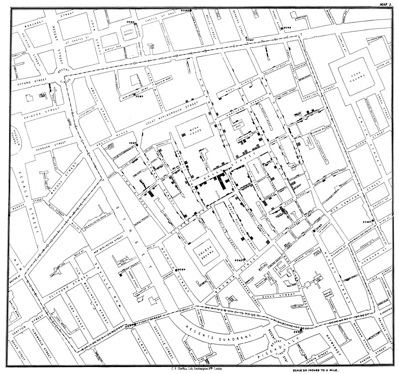

コロナ禍は人々の生活に大きな影響を及ぼしていますが、その中で興味深い変化のひとつに、[本の売上が前年から増加した](https://www3.nhk.or.jp/news/html/20210126/k10012832941000.html)というものがあります。私も、自宅で過ごす時間を読書に充てた人間のひとりです。初めての緊急事態宣言から1年が経ったわけですが、ここで僭越ながら、この1年で読んだ「新型コロナウイルス関連書籍」を紹介してみたいと思います。「コロナ関連」とはいっても、不確実な情報を敢えて書籍で摂取したくはなかったので、2020年以前に出版されたものを選んで読みました（『ゲノム編集とはなにか』を除く）。良い新刊をご存知の方は、コメントなどで教えていただけると嬉しいです（新刊でなくても歓迎です）。ジャンルとしては、パンデミックを扱った小説と生物学の一般書が主です。

先にことわっておくと、私は読書家を名乗れるほどたくさんの本を読んでいるわけでは全くありません。最近は書店や図書館に「コロナ特集」コーナーが設置されていることが多いですし、オンラインでも[集英社](https://www.shueisha-int.co.jp/coronablue)や[朝日新聞](https://book.asahi.com/article/13275030)などの素敵な書籍紹介があるわけですが、この手の選書はどうしても人文系に寄ってしまうきらいがあるので、「もっと自然科学に寄せた選書があってもいいな」と思い、この個人的な書籍紹介を書きました。いつも通り、自分が後で見返すためのメモでもあります。本記事はあくまで書籍紹介であり、医療情報の提供や政策提言を行う意図はまったくないということも宣言しておきます。

## ペスト
『[ペスト](https://amzn.to/49Olh72)』（Albert Camus 著、宮崎嶺雄 訳、新潮社、1969年）は、『[異邦人](https://amzn.to/49NAntG)』や『[シーシュポスの神話](https://amzn.to/49QVtHH)』で知られるCamusが、パンデミックという不条理の中で懸命に生きる人々を描いた群像劇です。原著は1947年に出版されました。

フランスの統治下にあったアルジェリアのオランでペストが大流行し、都市封鎖となります。オランでペストが流行するというのは架空の設定だそうですが、読み進めれば今回の災厄との共通点が容易に見いだされる通り、ここで描かれているのは「リアリズムに徹した不条理」だと解することができます。登場人物の医師や神父、新聞記者、犯罪者らが各々の信条をぶつけ合うシーンからは、生や倫理、神といったテーマについてのカミュの思想を垣間見ることができました。

上述のコロナ特集でも必ずと言っていいほど取り上げられる名作です。未読の方はこの機会に読んでみてはいかがでしょうか。コロナ禍での注目を受け、今月、岩波文庫から新訳版が出るそうです。

テキストを斜め読みした限りでは、[NHKの『100分 de 名著』](https://www.nhk.or.jp/meicho/famousbook/77_camus/index.html)も思想的な背景を知るのに良かったです。番組は4月15日に再放送があるそうです。

『[ロビンソン・クルーソー](https://amzn.to/49J7j6v)』で有名なDaniel Defoeも、ロンドンを舞台にして[同名の作品](https://amzn.to/3TbMZW4)を書いています（未読）。ペストが人間にとっていかに恐ろしい存在であったかが想像できますね。

## 白の闇
『[白の闇](https://amzn.to/3SPKib7)』（José Saramago 著、雨沢泰 訳、河出書房新社、2020年）は、空気感染で人を失明させる正体不明の感染症が突如大流行するという設定のディストピア小説です。原著は1995年に出版されました。

舞台は感染者たちを収容する廃病院で、政府から見放されたその施設では感染者が増えるに従ってモラルが崩壊していき……というホラーな展開です。『ペスト』とは一転して非現実的な設定ですが、その分、読者を没入させるようなおもしろさがありました。

Saramagoはポルトガルの作家で、1998年にノーベル文学賞を受賞しています。未邦訳ですが、2004年には『Ensaio sobre a Lucidez』（見えることについて）という姉妹作を書いているそうです。また、本作は2008年に『ブラインドネス』として映画化されています（想像するだけでおぞましいシーンが多かったので、映画を観たい気持ちにはなれませんが）。

## 感染地図
1854年（コレラ菌が発見される30年前）、コレラの大流行がロンドンのソーホー地区を襲いました。市民が次々と下痢を起こし、数時間後に死んでいくという過酷な状況でしたが、当時の医学は未発達で、その原因は街に漂う排泄物などからの瘴気（悪臭）だという考えが支配的でした。実際、瘴気が溜まりやすい低地で死者が多いというような疑似相関があったりしたそうです。

しかし、著名な麻酔科医であったJohn Snowは、瘴気説に納得できませんでした。自らの足で街を調査して回った結果、コレラは空気ではなく水によって媒介されるのではないかという仮説を持つようになりました。当初はこの仮説を周囲に話しても取り合ってもらえませんでしたが、地域で人脈のあったHenry Whitehead副牧師による調査協力を得て、なんとか当局を説得、問題の井戸を使用停止とするに至りました。その後、死者の住居と井戸の位置をプロットした「感染地図」を作成しました。さらに最寄りの井戸の[**ボロノイ境界**](https://ja.wikipedia.org/wiki/%E3%83%9C%E3%83%AD%E3%83%8E%E3%82%A4%E5%9B%B3)を描き、医学界を説得しました。これが「疫学」の興りだと言われているそうです。

<small>ソーホーの感染地図。中心にある「PUMP」が問題となった井戸で、周辺の死者が特に多い。</small>
 

当時の話をドキュメンタリー的に描いた本が『[感染地図　歴史を変えた未知の病原体](https://amzn.to/3SUz7hk)』（Steven Johnson 著、矢野真千子 訳、河出書房新社、2017年）です。

ちなみに、現代のデータサイエンスは疫学と深い関わりを持っていますが、本書はそのような視点で読んでもおもしろかったです。当時はコレラ菌の存在すら知られていませんでしたが、John Snowは通説に惑わされることなく、データを注意深く観察し、ときには自らデータを集めて仮説の検証を行いました。ダメ押しとなる証拠には二重盲検法の結果を用意し、プレゼンテーションには（当時一般的ではなかったであろう）ボロノイ図を用いました。また、ボロノイ領域から外れた例についても細かな分析をしていますが、その種明かしはここではしないでおきます。

## 生物と無生物のあいだ
自分がウイルスやワクチンについてほとんど知らないことに気づき、生物学の一般書を何冊か読みました（本当は大学で教養レベルの授業は受けたはずなのですが、記憶がありません）。『[生物と無生物のあいだ](https://amzn.to/42P9OSD)』（福岡伸一、講談社、2007年）は、生物学者として第一線で活躍する著者が、DNAの発見とそこから急激に発達した細胞・分子生物学のトピック（「PCR検査」で一躍有名になった[PCR](https://www.chem-station.com/chemglossary/biochem/2007/10/_polymerase_chain_reaction_pcr.html)など）を平易な言葉で解説しつつ、その裏側にあったエピソードや筆者自身の体験を豊かな筆致で綴った科学エッセイです。

あまりにもおもしろかったので、続けて『[世界は分けてもわからない](https://amzn.to/3TaNsHL)』も読みました。薦めてくれた弟に感謝。

### 追記（2021年8月29日）
最近書店に行ったところ、誇大な売り文句の帯が付いた怪しげな本が並んでいました。

## ウイルスは生きている
「ウイルスは生物なのか？」というのは高校で生物を習うと誰もが抱く疑問だと思いますが、『[ウイルスは生きている](https://amzn.to/3T9ePSO)』（中屋敷均、講談社、2016年）は、この疑問に正面から答えます。長さ1μmに及び脂質膜を持つパンドラウイルスや、代謝をしない細菌といった例を取り上げながら、「ウイルスは生きている」という主張につなげていきます。

コロナ禍でウイルスは人間社会にとっての脅威だという認識が広く共有されましたが、その様々な側面、例えば水平方向の遺伝子の交換を学んでみると、ウイルスも生態系を構成する一員なのだという理解を得ることができました。余談ですが、本書で紹介されていた、[1918年に全世界で約5000万人の死者を出したインフルエンザ（スペイン風邪）ウイルスを、アラスカの永久凍土に埋葬されていた死体から再現するという研究](https://wired.jp/2005/10/07/1918%E5%B9%B4%E3%81%AE%E3%80%8C%E3%82%B9%E3%83%9A%E3%82%A4%E3%83%B3%E9%A2%A8%E9%82%AA%E3%80%8D%E3%82%A6%E3%82%A4%E3%83%AB%E3%82%B9%E3%82%92%E5%86%8D%E7%8F%BE/)がとても印象に残っています。

## ゲノム編集とはなにか
ここまで読んだところで、遺伝子工学についても興味が湧いてきました。具体的には、現代のゲノム編集技術が対ウイルス戦争においてできることは何だろう？、といった疑問です。2012年に開発されたCRISPR-Cas9はゲノム編集を可能にし、遺伝子工学のあり方を従来の遺伝子組み換えから一変させました。『[ゲノム編集とはなにか](https://amzn.to/48w2nRB)』（山本卓、講談社、2020年）は、ゲノム編集技術そのものや応用研究の近年の動向について私のような門外漢が知るのに良い書籍でした。

奇しくも、この本が出版された2020年のノーベル化学賞は、CRISPR-Cas9を開発したJennifer DoudnaとEmmanuel Charpentierが受賞しました。そのDoudnaが自ら執筆した『[CRISPR 究極の遺伝子編集技術の発見](https://amzn.to/3OUXdYg)』は、革新的な技術の発見に至った経緯、その応用可能性、そして潜在的なリスクに対する警鐘を、第一人者の視点で語っています。

## 利己的な遺伝子
『[利己的な遺伝子](https://amzn.to/3TaNzTH)』（Richard Dawkins 著、日髙敏隆、岸 由二、羽田節子、垂水雄二 訳、紀伊國屋書店、2018年）は言わずとしれた名著であるにも関わらず、読まずにここまで来てしまったのですが、一念発起して読みました。こちらの原著初版発行は1976年です。

自然界で多数報告されている動物の利他的な行動は従来、群淘汰説（淘汰は生物種に対して働く）で説明されてきましたが、生物がそのようなマクロ的な視点に従って行動できるのかというと怪しいところがあります。これに対して動物行動学者のDawkinsは、遺伝子淘汰説（淘汰は遺伝子に対して働く）による簡潔な説明を与えました。つまり、生存競争というゲームにおけるエージェントは、個体でも生物種でもなく遺伝子であるというわけです。この本では遺伝子淘汰説の妥当性を、雌雄・親子・きょうだいといった利害対立の起こる各種ケースについて、様々な生物種からの具体例と進化論、そしてゲーム理論的な考察を通して確認します。

この本を読んで、人間もそれ以外の生物も、そしてウイルスも、生存戦略の差こそあれ、みな遺伝子の乗り物であって、未曾有の災厄とも言われるコロナ禍も遺伝子を保存・複製するための絶え間ない戦いの一部なのだという感想を持つに至りました。

## はたらく細胞
『[はたらく細胞](https://amzn.to/48CJWL6)』（清水茜、講談社、2015年）は、赤血球や白血球、血小板といった人間の生命活動に不可欠な細胞たちを擬人化し、その働く様子を描いた漫画です。私は細胞やホルモンの名前以下細々とした事項に拒否反応を覚えて生物学に挫折した過去があるので、擬人化してイラストで概要をつかめるのはありがたいです。科学的な正確さには定評があり、小学生から大人まで幅広い層に読まれているらしいです。1巻では花粉症やインフルエンザに対する細胞たちの働きぶりが描かれています。

コロナ禍を受けてなのかはわかりませんが、今年の1月に『[はたらく細胞 ウイルス&細菌図鑑](https://amzn.to/3wquX9v)』という図鑑も出版されたそうです。

## 銃・病原菌・鉄
感染症にまつわる本を列挙していて、大学1年生のときに読んだ『[銃・病原菌・鉄](https://amzn.to/49qfc13)』（Jared Diamond 著、倉骨彰 訳、草思社、2012年）を思い出しました。趣旨としては、歴史的に見て西洋文明が他の文明よりも圧倒的に発達したのは（人種的なものではなく）地理的な要因によるというもので、当時は「こんな見方があるのか」と目から鱗が落ちました。国内の各種メディアでも絶賛の嵐だったと記憶しています。

しかし、今になって考えてみると、いかに「知の巨人」とはいえ、たった一人で人類史という壮大なテーマを語ろうというのは謙虚さに欠けるのではないかと思ってしまいました。詳細は覚えていませんし、この分野について知識があるわけでもないので、具体的な批判（例えば[Wikipedia](https://en.wikipedia.org/wiki/Guns,_Germs,_and_Steel#Criticism)）はできないのですが、この手の領域では恣意的に文献を選べば任意の主張ができてしまうので、十分な知識がないと正当な評価ができないと思ってやや懐疑的になっているところです。

ちなみに、原著の出版は1997年でした。ピューリッツァー賞を獲るような本でも、邦訳が出るのには随分と時間がかかるものなのですね。
