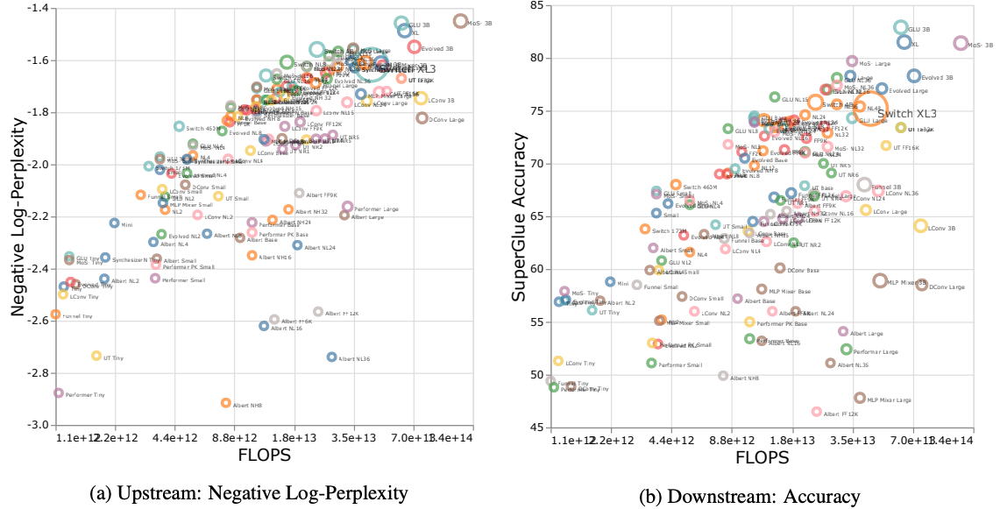

## Research Papers

### Block-NeRF: Scalable Large Scene Neural View Synthesis
- Authors: Matthew Tancik, Vincent Casser, Xinchen Yan, Sabeek Pradhan, Ben Mildenhall, Pratul P. Srinivasan, Jonathan T. Barron, Henrik Kretzschmar
- Paper: https://arxiv.org/abs/2202.05263
- Project page: https://waymo.com/research/block-nerf/
- Venue: CVPR 2022

Since **NeRF** (**neural radiance field**) was introduced in 2020, many derivative studies have been done to extend its capacity. In CVPR 2022, we saw more than 50 NeRF papers (here is [a curated list](https://dellaert.github.io/NeRF22/)).

**Block-NeRF** is a prominent one among such works. While typical NeRF variants are trained to render a single object, this method is able to render city-scale scenes. In the demo presented below, it renders the Alamo Square neighborhood of San Francisco.

<iframe width="560" height="315" src="https://www.youtube.com/embed/6lGMCAzBzOQ" title="YouTube video player" frameborder="0" allow="accelerometer; autoplay; clipboard-write; encrypted-media; gyroscope; picture-in-picture; web-share" allowfullscreen></iframe>

Rendering large scenes is a challenging task due to the varying conditions under which input photos are taken, such as different lighting, weather, and moving objects. Block-NeRF divides and conquers this problem. It splits the entire scene to multiple sub-scenes, each of which are assigned a separate Block-NeRF model. To render a scene, the models are filtered by the visibility from the viewpoint and then the model outputs are combined based on the distance from the viewpoint. This approach is preferred because it is easy to expand the scene and update a particular sub-scene.

### Scaling Laws vs Model Architectures: How does Inductive Bias Influence Scaling?
- Authors: Yi Tay, Mostafa Dehghani, Samira Abnar, Hyung Won Chung, William Fedus, Jinfeng Rao, Sharan Narang, Vinh Q. Tran, Dani Yogatama, Donald Metzler
- Paper: https://arxiv.org/abs/2207.10551

The scaling property of Transformer models have drawn a lot of attention, motivating researchers to create larger and larger language models. In another line of research, many alternative architectures have been proposed to improve the compute efficiency of the Transformer, which was born in 2017.

Now it's natural to ask whether these models scale or not. This paper aims to answer this question by comparing different model architectures (from Transformer variants to CNNs) on an upstream (language modeling) and downstream (SuperGLUE) task. This figure is a good summary of the results:

Well, it's hard to get what is happening in this figure. The takeaways here are:
- Upstream score do not correlate well with downstream score
- The optimal architecture can fluctuate at different scales
  - Models such as ALBERT and MLP-Mixer scales even negatively
  - On average, the vanilla Transformer has the best scaling behaviour

### Cold Diffusion
### Multi-game Decision Transformer
### Adam can converge
### Whisper

## Applications
### Stable Diffusion
### ChatGPT & YOU.com

## Concluding Remarks

## References 
