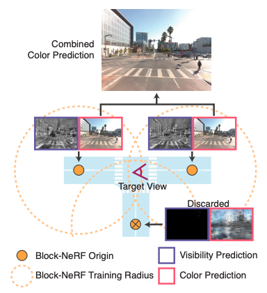
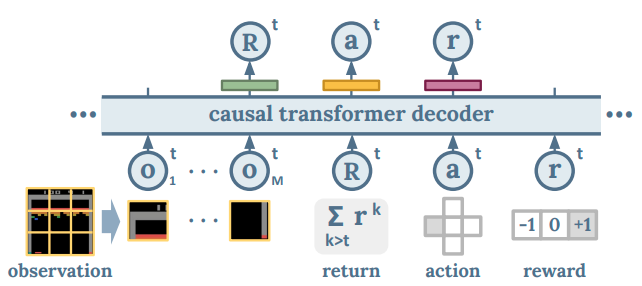
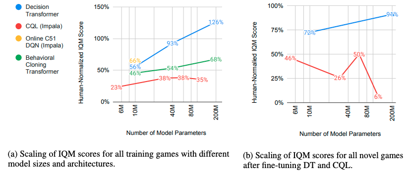
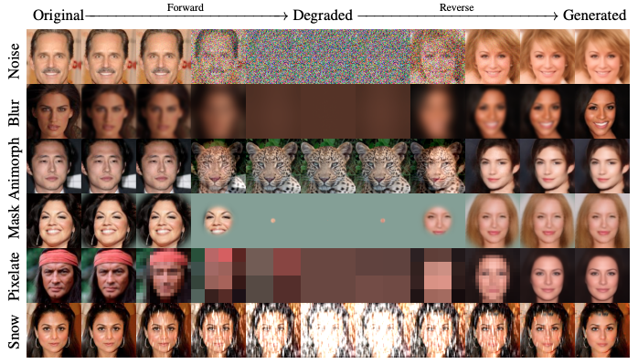
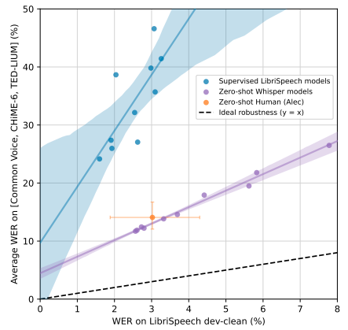

Reflecting on the past year, it's clear that 2022 brought significant advancements in the field of deep learning. In this year-in-review post, I'll take a look back at some of the most important developments in deep learning, highlighting representative research papers and application projects. If you're interested, you can also check out [my review of the previous year, 2021](https://hippocampus-garden.com/research_2021).

## Research Papers
In this section, I've selected five papers that I found particularly interesting and impactful.

### Block-NeRF: Scalable Large Scene Neural View Synthesis
- Authors: Matthew Tancik, Vincent Casser, Xinchen Yan, Sabeek Pradhan, Ben Mildenhall, Pratul P. Srinivasan, Jonathan T. Barron, Henrik Kretzschmar
- Paper: https://arxiv.org/abs/2202.05263
- Project page: https://waymo.com/research/block-nerf/
- Venue: CVPR 2022

Since **NeRF** (**neural radiance field**) was introduced in 2020, there has been a lot of derivative work to extend its capabilities. In CVPR 2022, we saw more than 50 NeRF papers (here is [a curated list](https://dellaert.github.io/NeRF22/)).

**Block-NeRF** stands out among such works. While typical NeRF variants are trained to render a single object, this method is capable of rendering city-scale scenes. The demo presented below renders the Alamo Square neighborhood of San Francisco.

<iframe width="560" height="315" src="https://www.youtube.com/embed/6lGMCAzBzOQ" title="YouTube video player" frameborder="0" allow="accelerometer; autoplay; clipboard-write; encrypted-media; gyroscope; picture-in-picture; web-share" allowfullscreen></iframe>

Rendering large scenes is a challenging task due to the varying conditions under which input photos are taken, such as lighting, weather, and moving objects. Block-NeRF divides and conquers this problem. It splits the entire scene into multiple sub-scenes, each of which is assigned a separate Block-NeRF model. To render a scene, the models are filtered by the visibility from the viewpoint, and then the model outputs are combined based on the distance from the viewpoint. This approach is preferred because it is easy to expand the scene and update specific sub-scenes.

### Multi-Game Decision Transformers
- Authors: Kuang-Huei Lee, Ofir Nachum, Mengjiao Yang, Lisa Lee, Daniel Freeman, Winnie Xu, Sergio Guadarrama, Ian Fischer, Eric Jang, Henryk Michalewski, Igor Mordatch
- Paper: https://arxiv.org/abs/2205.15241
- Project page: https://sites.google.com/view/multi-game-transformers
- Code: https://github.com/google-research/google-research/tree/master/multi_game_dt
- Blog: https://ai.googleblog.com/2022/07/training-generalist-agents-with-multi.html
- Venue: NeurIPS 2022

Last year, **Decision Transformer** (**DT**) emerged as a powerful baseline for **offline reinforcement learning** (**offline RL**). Is it possible to create a generalist agent with DT in the same way that pretrained Transformers generalize to a variety of natural language tasks?

To answer this question, researchers trained DT in a multi-game setting, where 41 games out of the Atari suite are used for offline training and 5 other games are held out for evaluating performance on unseen tasks. The offline training data include non-expert experience as well as expert experience. The interface of the DT used in this study is illustrated in the figure below: 

Without fine-tuning, the pretrained multi-game agent exceeds human-level performance for the 41 games seen during training, although it is not as good as the specialist agents trained on individual games. However, multi-game DT beats all the other generalist agents. So, *it is possible to create a generalist agent with DT*.

Moreover, the scaling behavior known in the natural language tasks, for the first time, is confirmed to hold in offline RL. In novel games, the conventional method called CQL scales negatively with respect to the model size but DT does positively. This is an important step towards the development of foundation models for reinforcement learning.

### Scaling Laws vs Model Architectures: How does Inductive Bias Influence Scaling?
- Authors: Yi Tay, Mostafa Dehghani, Samira Abnar, Hyung Won Chung, William Fedus, Jinfeng Rao, Sharan Narang, Vinh Q. Tran, Dani Yogatama, Donald Metzler
- Paper: https://arxiv.org/abs/2207.10551

In recent years, the scaling capabilities of Transformer models have caught the attention of many researchers, leading to the development of larger and larger language models. In another line of research, many alternative architectures have been proposed in an attempt to improve the computing efficiency of the Transformer, which was first introduced in 2017.

Now it's natural to ask whether these alternative architectures scale or not. This paper aims to answer this question by comparing different model architectures, including Transformer variants and CNNs, on both upstream (language modeling) and downstream (SuperGLUE) tasks.

The results of the study are summarized in the above figure, which can be a bit difficult to interpret. The key takeaways from the study include:
- Upstream scores do not correlate well with downstream scores
- The optimal architecture can vary depending on the scale of the model
  - Models such as ALBERT and MLP-Mixer scales even negatively
  - *On average, the vanilla Transformer demonstrates the best scaling behavior*

### Cold Diffusion: Inverting Arbitrary Image Transforms Without Noise
- Authors: Arpit Bansal, Eitan Borgnia, Hong-Min Chu, Jie S. Li, Hamid Kazemi, Furong Huang, Micah Goldblum, Jonas Geiping, Tom Goldstein
- Paper: https://arxiv.org/abs/2208.09392
- Code: https://github.com/arpitbansal297/Cold-Diffusion-Models

**Diffusion models** are thought to be grounded in theories such as Langevin dynamics and variational inference, largely due to the mathematical tractability of the Gaussian noise. However, this paper poses a question to this understanding: is Gaussian noise truly necessary for diffusion models?

In experiments, the authors observe that diffusion models actually work with alternative choices of noise, even when the noise is deterministic (e.g., blur, masking, etc.). This finding opens the door for the development of new generative models that are not constrained by the traditional requirement of Gaussian noise.

### Robust Speech Recognition via Large-Scale Weak Supervision
- Authors: Alec Radford, Jong Wook Kim, Tao Xu, Greg Brockman, Christine McLeavey, Ilya Sutskever
- Paper: https://arxiv.org/abs/2212.04356
- Code: https://github.com/openai/whisper
- Blog: https://openai.com/blog/whisper/

Vision and languages are not the only modalities that enjoy the benefit of large Transformer models and web-scale data. Recently, these techniques were applied to **automatic speech recognition** (**ASR**). **Whisper** (web-scale supervised pretraining for speech recognition) is a large Transformer trained on an unprecedented amount of transcribed speech data. This allows for improved transcription in multiple languages and even translation to English, with increased robustness compared to previous models.

Robustness is a crucial aspect of ASR performance, as it determines the model's ability to generalize across different datasets. As shown in the figure below, previous ASR models trained on a single dataset (LibriSpeech) show poor performance on other datasets (Common Voice, etc). Humans do not behave like this. Whisper, however, closed this gap.

Whisper's exceptional performance can be attributed to two key factors that differentiate it from previous models. The first is the sheer amount of training data it consumed. Whisper was trained on 680,000 hours of transcribed audio data collected from the internet. This is more than 10 times larger than the previous supervised models and provides a more comprehensive representation of the diversity of speech patterns. However, collecting such a large amount of data is not trivial because many transcripts on the internet have been generated by the existing ASR systems. To avoid contamination from "transcript-ese", the researchers developed many heuristics to clean the training data.

The second factor is the pretraining scheme. Whisper was trained on multiple speech processing tasks: multilingual speech recognition, speech translation to English, spoken language identification, and voice activity detection. This approach allows Whisper to inherently possess capabilities in speech translation and language identification.

## Applications
In this section, I've selected five novel AI applications.

### Stable Diffusion & DreamStudio
In 2022, we saw many surprisingly successful text-to-image models: [DALL･E 2](https://openai.com/dall-e-2/), [midjourney](https://midjourney.com/), [Stable Diffusion](https://github.com/CompVis/stable-diffusion), [Imagen](https://imagen.research.google/), [Parti](https://parti.research.google/), and [Muse](https://muse-model.github.io/), just to name a few. Among them, **Stable Diffusion** is exceptional as it is fully open-source and runs faster than other alternatives. [Stability AI](https://stability.ai/), a generative AI startup, adopted Stable Diffusion to create its managed text-to-image service [DreamStudio](https://beta.dreamstudio.ai/dream).

In just one year, AI-generated pictures have become ubiquitous. For example, the eyecatch picture of this post was generated by Stable Diffusion.

### ChatGPT
If there were an "AI Company of the Year" award, it would likely go to OpenAI. In 2022, the company amazed the world three times by releasing DALL･E 2, Whisper, and [**ChatGPT**](https://chat.openai.com/chat). 

ChatGPT is a variant of GPT-3.5 with a key difference in its **alignment**. Unlike its predecessor, ChatGPT was trained to align with human values through a process known as **reinforcement learning from human feedback** (**RLHF**). But nothing more is disclosed for now. What did they do as "RLHF" exactly? How is it possible to handle tons of requests so fast? I hope this information will be public soon.

This entire post was written with the help of ChatGPT.

### YouChat
It is reported that [Microsoft and OpenAI are collaborating to integrate ChatGPT into Bing](https://www.theinformation.com/articles/microsoft-and-openai-working-on-chatgpt-powered-bing-in-challenge-to-google), potentially challenging Google's predominant position in search engines. However, you can already get a sense of this future technology at [YOU.com](https://you.com/), which supports YouChat. When you type a question into the search bar, the chatbot provides an answer by summarizing relevant web pages with references. This allows us to check if the answer is grounded in any evidence and if the evidence is reliable or not. This is a good solution to the hallucination issue of language models.

### Gran Turismo Sophy
Sony developed an RL agent, named [Gran Turismo Sophy](https://www.gran-turismo.com/us/gran-turismo-sophy/), for its car racing game. GT Sophy was able to outrace even champion drivers.

<iframe width="560" height="315" src="https://www.youtube.com/embed/_CrCpIIZeCc" title="YouTube video player" frameborder="0" allow="accelerometer; autoplay; clipboard-write; encrypted-media; gyroscope; picture-in-picture; web-share" allowfullscreen></iframe>

The technology behind GT Sophy is based on a combination of a realistic simulator, an RL algorithm, distributed and asynchronous training, and high-performance computing. This is detailed in [a paper published in Nature](https://www.nature.com/articles/s41586-021-04357-7).

## Concluding Remarks
Thanks for reading this year-in-review post. I hope you enjoyed reflecting what happened in deep learning in 2022. I'm excited to see what 2023 will bring to the field.