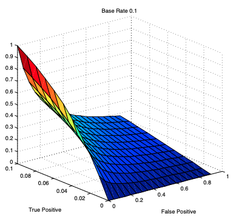

## Recap: Definitions
Before diving into the main part, let's recap some definitions quickly. A **confusion matrix** represents the counts of **true positives**, **false positives**, **false negatives**, and **true negatives**.

|                    | Actual Positive | Actual Negative |
| :----------------: | :-------------: | :-------------: |
| Predicted Positive |       TP        |       FP        |
| Predicted Negative |       FN        |       TN        |

**Precision** and **recall** are defined as below.

$$
\begin{aligned}
\mathrm{Precision} &= \frac{\mathrm{TP}}{\mathrm{TP} + \mathrm{FP}}\\
\mathrm{Recall} &= \frac{\mathrm{TP}}{\mathrm{TP} + \mathrm{FN}}
\end{aligned}
$$

**F1 score** is the harmonic mean of precision and recall:

$$
\begin{aligned}
\mathrm{F1} &= 2\frac{\mathrm{Precision} \cdot \mathrm{Recall}}{\mathrm{Precision} + \mathrm{Recall}}\\
& = \frac{2 \mathrm{TP}}{2 \mathrm{TP} + \mathrm{FP} + \mathrm{FN}}.
\end{aligned}
$$

If you want to consider recall $\beta$ times more important than precision, you could use a generalized version:

$$
\begin{aligned}
F_{\beta} &= (1+\beta^2)\frac{\mathrm{Precision} \cdot \mathrm{Recall}}{\beta^2 \mathrm{Precision} + \mathrm{Recall}}\\
 &= \frac{(1+\beta^2)\mathrm{TP}}{(1+\beta^2)\mathrm{TP} + \mathrm{FP}+ \beta^2\mathrm{FN}},
\end{aligned}
$$

which we don't discuss in this post.

Just like other metrics such as accuracy, precision, and recall, F1 score is also sensitive to the choice of the threshold.

Actually, in [a recent Kaggle competition](https://www.kaggle.com/c/shopee-product-matching/), one of key points is the postprocessing

## Theory: Optimal Threshold for Maximizing F1 Score

**Lemma 1**. *By denoting the base rate by $b=p(t=1)$, and hence $1-b=p(t=0)$,  the entries of the confusion matrix are:*
$$
\begin{aligned}
  \mathrm{TP}= b\int_{s:D(s)=1}p(s \mid t=1) \mathrm{d}s,\\
  \mathrm{FN}= b\int_{s:D(s)=0}p(s \mid t=1) \mathrm{d}s,\\
  \mathrm{FP}= (1-b)\int_{s:D(s)=1}p(s \mid t=0) \mathrm{d}s,\\
  \mathrm{TN}= (1-b)\int_{s:D(s)=0}p(s \mid t=0) \mathrm{d}s.
\end{aligned}
$$

*Proof*. $\mathrm{TP}$ is defined as:

$$
\mathrm{TP} = \int_{s:D(s)=1} p(t=1\mid s)p(s) \mathrm{d}s.
$$

From the **Bayes' rule**, we have

$$
\begin{aligned}
p(t=1\mid s) &= \frac{p(s\mid t=1)p(t=1)}{p(s)} \\
  p(t=1\mid s)p(s) &= bp(s\mid t=1).
\end{aligned}
$$

Combining the above two equations, we get

$$
\mathrm{TP}= b\int_{s:D(s)=1}p(s \mid t=1) \mathrm{d}s.
$$

Similar arguments hold for the other three entries. $\blacksquare$

Now we can derive the optimal decision rule that a classifier should follow.

**Theorem 1**.
*To maximize F1, a classifier should predict a sample with score $s$ as positive if and only if:*
$$
\frac{bp(s\mid t=1)}{(1-b)p(s\mid t=0)} \geq J
$$

*where $J\coloneqq\mathrm{TP}/(\mathrm{TP} + \mathrm{FP} + \mathrm{FN})$ is the Jaccard index of the optimal classifier.*

*Proof*. Suppose that the decision rule $D(\cdot)$ has been fixed for all the region but a paticular region $\Delta$ around a point $s$. We want to identify $D(\Delta)$ so that we can decide whether a sample with score $s$ is positive or negative. For brevity, let's write:

$$
\begin{aligned}
  P_1(\Delta) &= \int_{\Delta}p(s\mid t=1) \mathrm{d}s,\\
  P_0(\Delta) &= \int_{\Delta}p(s\mid t=0) \mathrm{d}s.
\end{aligned}
$$ 

Let's say our current decision rule $D: [ 0,1 ]\backslash\Delta \rightarrow \{0,1\}$ achieves the F1 score:

$$
F = \frac{2 \mathrm{TP}}{2 \mathrm{TP} + \mathrm{FP} + \mathrm{FN}}.
$$

If we predict the region $\Delta$ as positive, that is $D(\Delta)=1$, our new F1 score is:

$$
F' = \frac{2 \mathrm{TP} + 2bP_1(\Delta)}{2 \mathrm{TP}+bP_1(\Delta) + \mathrm{FP}+(1-b)P_0(\Delta) + \mathrm{FN}}.
$$

On the other hand, if we predict the region $\Delta$ as negative, that is $D(\Delta)=0$, our new F1 score is:

$$
F'' = \frac{2 \mathrm{TP}}{2 \mathrm{TP} + \mathrm{FP} + \mathrm{FN}+bP_0(\Delta)}.
$$

Therefore, we should predict the region $\Delta$ as positive if and only if:

$$
\begin{aligned}
  F' &\geq F''\\
  bP_1(\Delta)\bigr(bP_1(\Delta) + \mathrm{TP} + \mathrm{FP} + \mathrm{FN} \bigl) &\geq \mathrm{TP}(1-b)P_0(\Delta).
\end{aligned}
$$

By approximating $P_1(\Delta)^2 \simeq0$, we have:

$$
\frac{bP_1(\Delta)}{(1-b)P_0(\Delta)} \geq \frac{\mathrm{TP}}{ \mathrm{TP} + \mathrm{FP} + \mathrm{FN}}
$$

Taking the limit $\Delta \rightarrow0$ results in the claimed theorem. $\blacksquare$

In a special case, where the model outputs calibrated probabilities (e.g., logistic regression), that is $p(t=1 \mid s)=s$ and $p(t=0 \mid s)=1-s$, the following corollary holds.

**Corollary 1**.
*To maximize F1, a classifier should predict a sample with predicted probability $s$ as positive if and only if:*
$$
s \geq \frac{F}{2}
$$

*where $F\coloneqq2\mathrm{TP}/(2\mathrm{TP} + \mathrm{FP} + \mathrm{FN})$ is the F1 score of the optimal classifier.*

*Proof*. 
From the Bayes' rule and the definition of calibration, 
$$
\begin{aligned}
  sp(s) = bp(s\mid t=1),\\
  (1-s)p(s) = bp(s\mid t=0).
\end{aligned}
$$

Incorporating the the above two equations in Theorem 1 gives:

$$
\begin{aligned}
  \frac{s}{1-s} &\geq \frac{\mathrm{TP}}{ \mathrm{TP} + \mathrm{FP} + \mathrm{FN}}\\
s&\geq \frac{\mathrm{TP}}{ 2\mathrm{TP} + \mathrm{FP} + \mathrm{FN}} = \frac{F}{2}~\blacksquare
\end{aligned}
$$

This section was borrowed from [1] with some modifications. For more details, please read the original paper. It discusses the F1 score more deeply with intriguing figures like below.

## Experiment
事後確率で決める

## References
[1] Zachary C. LiptonCharles ElkanBalakrishnan Naryanaswamy. "[Optimal Thresholding of Classifiers to Maximize F1 Measure](https://link.springer.com/chapter/10.1007/978-3-662-44851-9_15)". In *ECML PKDD*. 2014.