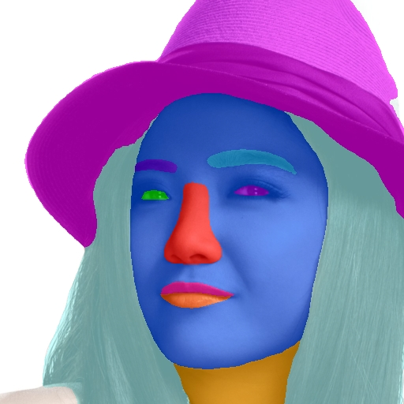
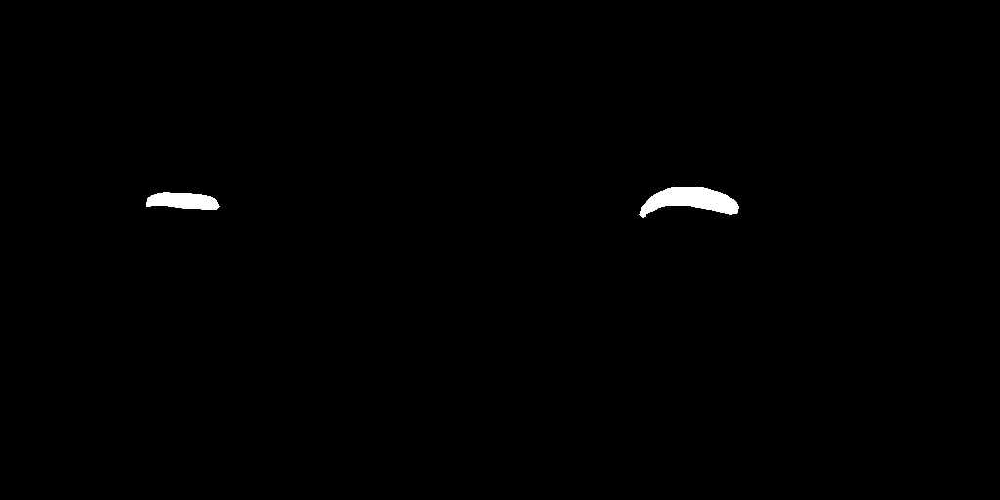
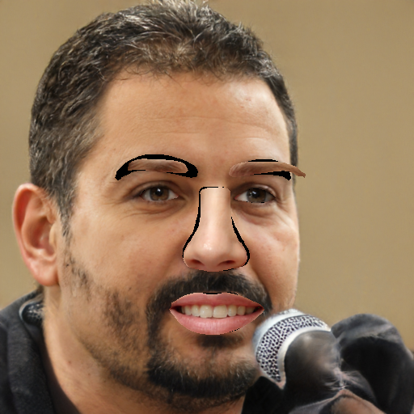
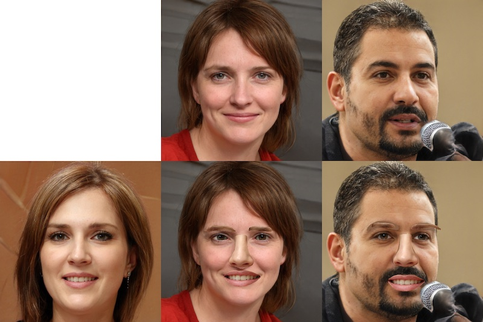

Face swapping is now one of the most popular features of Snapchat and SNOW. In this post, I'd like to share a naive solution for face swapping, using a pre-trained face parsing model and some OpenCV functions.

I'm going to implement face swapping as follows:
1. Parse the face into 19 classes.
2. Swap every part of the face with the counterpart.
3. Fill holes with local average colors.

The code is available at: https://github.com/shionhonda/face-swap.

## Face Parsing
For face parsing, I used [the pre-trained BiSeNet](https://github.com/zllrunning/face-parsing.PyTorch) because it's  accurate and easy to use. This model parses a given face into 19 classes such as left eyebrow, upper lip, and neck.



For this case, I selected 8 classes: left eyebrow, right eyebrow, left eye, right eye, nose, upper lip, mouth, and lower lip. These were used to generate 6 types of masks:
- left eyebrow mask
- right eyebrow mask
- left eye mask
- right eye mask
- nose mask
- mouth mask (including lips)

## Face swapping
Next, I swapped for each pair of parts. Since each part is in a different position in each picture, they are needed to be aligned. For example, the two right eyebrow masks below have slightly different positions.



This difference should be adjusted for the fine result, so I computed the shift in centroids with **OpenCV**'s `moments` function.

```python
def calc_shift(m0, m1):
    mu = cv2.moments(m0, True)
    x0, y0 = int(mu["m01"]/mu["m00"]), int(mu["m10"]/mu["m00"])

    mu = cv2.moments(m1, True)
    x1, y1 = int(mu["m01"]/mu["m00"]), int(mu["m10"]/mu["m00"])
    return (x0-x1, y0-y1)
```

Then I implemented the swapping part like:

```python
def swap_parts(i0, i1, m0, m1, labels):
    m0 = create_mask(m0, labels)
    m1 = create_mask(m1, labels)
    i,j = calc_shift(m0, m1)
    l = i0.shape[0]
    h0 = i0 * m0.reshape((l,l,1)) # forground
    y = np.zeros((l,l,3))
    
    # cancel the shift in centroids
    if i>=0 and j>= 0:
        y[:l-i, :l-j] += h0[i:, j:]
    elif i>=0 and j<0:
        y[:l-i, -j:] += h0[i:, :l+j]
    elif i<0 and j>=0:
        y[-i:, :l-j] += h0[:l+i, j:]
    else:
        y[-i:, -j:] += h0[:l+i, :l+j]

    h1 = i1 * (1-m1).reshape((l,l,1)) # background
    y += h1 * (y==0)

    return y
```

However, this left some holes (specifically, `m1 \ m0`, using the notation of set operation) in the generated image.



Note: Throughout this experiment, I used randomly-sampled photos from https://thispersondoesnotexist.com/.

## Fill in the Holes
As a naive approach, I used the average color of the boundary region to fill in the holes. In computer vision, this boundary region is called **morphological gradient**, and it is computed by OpenCV's `morphologyEx` function.


```python
def swap_parts(i0, i1, m0, m1, labels):
    ...

    h1 = i1 * (1-m1).reshape((l,l,1)) # background
    b = cv2.morphologyEx(m1.astype('uint8'), cv2.MORPH_GRADIENT, np.ones((5,5)).astype('uint8') ) # boundary region
    c = (np.sum(i1*b.reshape((l,l,1)), axis=(0,1)) / np.sum(b)).astype(int) # average color of the coundary
    # fill color in the hole
    h1 += c * m1.reshape((l,l,1)) 
    y += h1 * (y==0)

    return y
```

Finally, I got the following result.



I have to admit that the result looks weird, but it means that this app is safe as it can't be used for DeepFake😇

## References
[1] [OpenCV: Image Moments](https://docs.opencv.org/3.4/d0/d49/tutorial_moments.html)  
[2] [モルフォロジー変換 — OpenCV-Python Tutorials 1 documentation](http://labs.eecs.tottori-u.ac.jp/sd/Member/oyamada/OpenCV/html/py_tutorials/py_imgproc/py_morphological_ops/py_morphological_ops.html)  
[3] Changqian Yu, Jingbo Wang, Chao Peng, Changxin Gao, Gang Yu, Nong Sang. "[BiSeNet: Bilateral Segmentation Network for Real-time Semantic Segmentation](https://arxiv.org/abs/1808.00897)". *ECCV*. 2018.