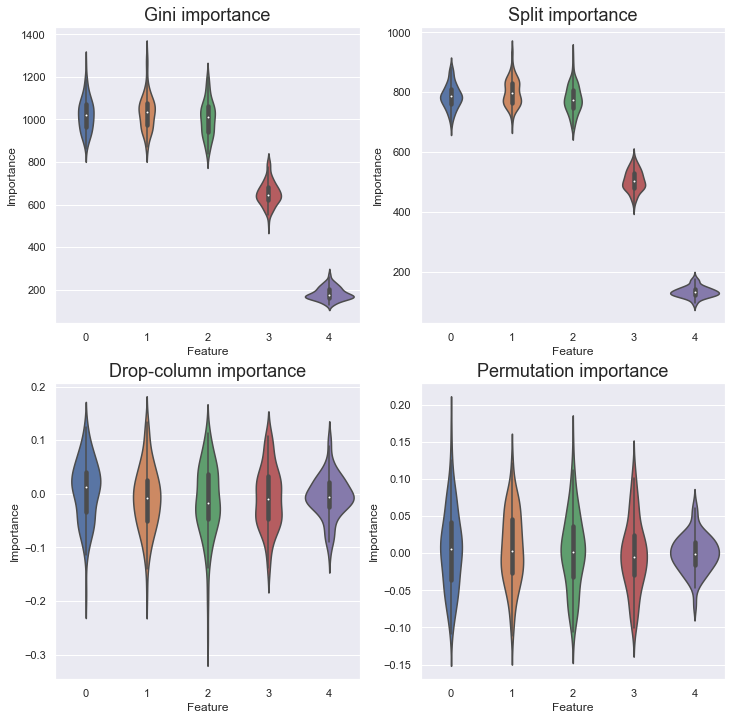

## Popular Measures of Feature Importance
Here I summarize the popular measures of feature importance: **Gini importance**, **split importance**, **drop-column importance**, and **permutation importance**.

| Feature importance | Applicable Models | Needs OOB samples | Needs re-training |
| :----------------: | :---------------: | :---------------: | :---------------: |
|        Gini        | Tree-based model  |        No         |        No         |
|       Split        | Tree-based model  |        No         |        No         |
|    Drop-column     |     Any model     |        Yes        |        Yes        |
|    Permutation     |     Any model     |        Yes        |        No         |
 

- Gini importance: In tree-based models, each node split the data from its parent node on the feature that gives the greatest improvement in **Gini impurity**. Gini importance is defined as the sum of the impurity improvement of the nodes using the given feature.

## Random Target
$$
Y \sim N(0,1) \perp X_1,X_2,X_3,X_4,X_5
$$

### Control

### Cardinality

### Duplication

### Colinearity

## Synthetic Target

$$
\begin{aligned}
Y = \frac{X_1+X_2+X_3+X_4+X_5+ \epsilon }{\sqrt{6}} \sim N(0,1) \\
\mathrm{where}~ \epsilon \sim N(0,1)
\end{aligned}

$$

### Control
### Cardinality
### Duplication
### Colinearity
### Cardinality

## Other Measures of Feature Importance
Null importance, SHAP

## Concluding Remarks
In this post, I reproduced the main results of the deep double descent paper [2] and shared some findings and questions. I conducted additional experiments with flooding, a new regularization technique that is said to induce the double descent phenomenon.

Though I successfully reproduced major results, some open questions arouse. Is double descent so sensitive to some configurations? Does double descent really lead to better generalization (lower test error)? I appreciate your comments and feedbacks!

## References
[1] Mikhail Belkin, Daniel Hsu, Siyuan Ma, Soumik Mandal. [Reconciling modern machine learning practice and the bias-variance trade-off](https://arxiv.org/abs/1812.11118). *PNAS*. 2019.  