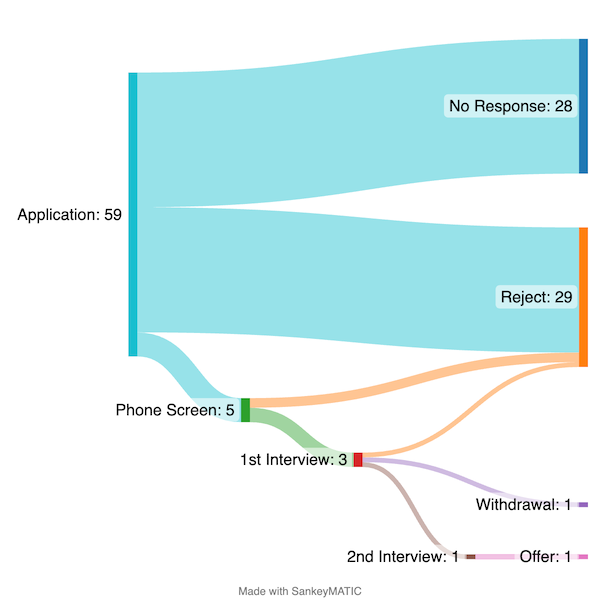

フランスのスタートアップでソフトウェアエンジニアとして働くことになったので、そのときの体験と面接対策について書きます。

自分の個人的経験について公に語るのは気が引けるものですが、私自身、海外就活をする上で、先達が書いた同様の体験記[^1][^2][^3][^4]を大いに参考にしました。しかし、日本からフランスでの仕事を探したという事例はまだまだ希少なので、フランスでエンジニアとして働くことに関心のある方に向けて少しでも情報提供をできればと思い、筆を取りました。また、今後は家探しやフランス語のことなど、パリでの生活事情についても書いていければと思っています。

さて、本編に入る前にお断りですが、「海外就活」と一口に言っても、国やその人の国籍、職種、スキル、準備期間、そのときの市況などによって適切なやり方は大きく変わってきます。本記事に含まれる内容は、他のケースに一般化できるものもあれば、できないものもあると思います。本記事では自分の事情を含めて可能な限り詳しく書くので、あくまで一個人の体験談として参考にしていただければ幸いです。

## 背景情報

上記の通り、前提として背景情報が重要であるため、まずは自分の身の上について書きます。

### 自己紹介

日本生まれ、日本育ちの日本人です。東京大学大学院情報理工学系研究科で修士号を取得したのち、2020年からリクルートで機械学習エンジニアとして3年半ほど働きました。

海外で暮らしたり外資系企業で働いたりしたことはなく、英語は流暢には話せません。一応、IELTS 7.0というスコア（CEFR C1相当）を持っていますが、リーディングで引き上げたスコアなので、会話には今でも不安があります。具体的に言うと、就活準備を始めた段階では、「自分の詳しい分野（研究テーマなど）については話せるが、それ以外の話題は聞いて理解するので精一杯」という状態でした（今はもう少し上達しました）。

フランス語は大学の第二外国語でやった程度です（CEFRで言うとA1くらい）。少なくともパリでは、フランス語ができなくても仕事を見つけることが可能です。しかし、生活ではやはり苦労するので、どこかでフランス語を習得する必要はあると思います。

機械学習エンジニアとして一定の専門性を持っていますが、何かで世界レベルに秀でているということはありません。ここは選考（特に最初の書類選考）の通過率に影響する要素で、何か特別にアピールできるものがある方は比較的有利に選考を進められるのではないかと思います（残念ながら私は違いました）。

詳しい経歴は[LinkedIn](https://www.linkedin.com/in/shionhonda/)を見てください。

### なぜパリに？

数ある都市の中からパリを移住先に選んだ理由は、端的に述べると家族との調整の結果です。

私は元々「どこか他の国で働いてみたい」という漠然とした憧れを持っていました。これは何か原体験や明確なキャリアプランがあったりするわけではなく、純粋な好奇心から来るものでした。

妻の方はもっと具体的な海外指向を持っていて、フランス語圏で暮らしたこともありました。経緯は省略しますが、その後、妻がパリの大学院から合格通知をもらい、私としても「パリなら仕事がありそう」ということでパリへの移住を決意し、英語で働けるエンジニアの仕事を探すことにしました。

## オファーまでの流れ

就活は全て日本からオンラインで行いました。最終面接では現地への招待をいただき、私としても実際にいろいろ見た上で判断したいところがありましたが、仕事の都合が付かず断念しました。

オファーまでのタイムラインは以下の通りでした。

- 2022年1月: 広義の準備（英会話、LeetCodeなど）
- 2023年1月: 情報収集・面接対策
- 2023年2月: 応募開始
- 2023年5月: オファー

オファーまでの3ヶ月間はかなり忙しく、可処分時間のほとんどを応募・面接・面接対策などに割きました。この時期は大手企業が大量レイオフをしたり、シリコンバレー銀行が倒産したりという、就活には最悪のタイミングでした。通常の市況であれば、もっとスムーズに仕事を見つけられたのではないかと思います。

以降では情報収集と選考について書きます。

### 情報収集

実際の応募をする前に、1ヶ月ほどかけて情報収集をしました。これは、応募する企業群とその志望順位を決めたり、面接対策の方法を考えたりするためです。

まずはLinkedInの居住地をパリに変更し、機械学習エンジニアとデータサイエンティストの求人を眺めてみました。結果、以下のようなことがわかりました。

- 求人の半分ほどでフランス語能力が必要（残りの半分は英語のみ要求）
- スタートアップの求人が非常に多い
- Big Tech（MetaやGoogle、Amazonなど）や老舗大企業（AXAやSanofiなど）の求人もある
- ビザスポンサーについては、明確にする／しないと書いているものと、特に言及のないものがある。言及なしが多い

応募したい企業を洗い出したところで、対策方針策定のために選考の流れをGlassdoorで調べました。結果、ほとんどの企業で行動面接と技術試験（コーディング面接や宿題形式のコーディング課題）があることがわかりました。この面接形式はアメリカのテック企業で一般的に採用されるものですが、フランスのスタートアップでもこれに準じる会社が多いようです。実際に行った対策については「[面接対策](#面接対策)」で詳しく書きます。

ところで、土地勘のない地域で職探しをすると、「いい会社」を判別するのにも苦労しました。当地では勢いのあるスタートアップでも、日本で暮らす私にはその他大勢と区別が付かないからです。そこで、[French Techに選ばれた企業群](https://lafrenchtech.com/fr/la-france-aide-les-startup/french-tech-120-2/)や[ベンチャーキャピタルがまとめている資料](https://alexandre.substack.com/p/the-state-of-the-french-tech-ecosystem)を眺めて土地勘を付けました。

### 応募からオファーまで

先に選考結果を述べます。最終的に合計59社に応募し、1社からオファーをもらいました。下の図は、[mrimjn氏](https://twitter.com/mrimjn/status/1668973575523512320)にならってSankeyダイアグラムにまとめたものです。

応募は、下記のいずれかから行いました（数の多い順）。

- LinkedIn
- 個別企業の求人サイト
- [Welcome to the Jungle](https://www.welcometothejungle.com/)（フランスのスタートアップがよく使っている）
- [Wellfound](https://wellfound.com/)（グローバルのスタートアップがよく使っている）
- リファラル
- リクルーター

LinkedIn経由の応募には、LinkedInのプロフィールだけで応募できる「Easy Apply」機能経由で応募したものも20件ほど含まれます。Easy Applyは数回のクリックで応募できるので便利ですが、その分、一つの求人に集まる応募数が増えるので、通過率は非常に悪いです。打席を増やす目的には使えますが、志望度の高い企業では使わない方が良いでしょう。

最初は、練習を兼ねて志望度の低い企業群に応募しました。しかし、始めてから2ヶ月くらいはなかなか良い返事がもらえず、かなり焦りました。この2023年2-3月はちょうどレイオフやシリコンバレー銀行の破綻の話があった頃だったので、市況の悪さも原因として多分にあったのだと思います。

精神的に参ることもありましたが、地道にレジュメの磨き込みや面接対策をしつつ、志望度の高い企業群にも応募をしていきました。しかし、このときには元々志望度が高かったBig Techの求人がほとんどなくなっていたため、応募の絶対数を増やすために職務要件を満たす他職種（ソフトウェアエンジニアやデータエンジニア）やグローバルリモートの求人にも応募するようにしました。

市況が改善したのか、4月頃から徐々に面接に呼ばれるようになりました。また、リクルーターからも少しずつ連絡が来るようになりました（およそ9割がフランス語ですが）。そして、奇しくもソフトウェアエンジニアとして受けていた会社から最初のオファーをもらい、仕事内容や待遇に納得できたので、その会社で即決しました。他で選考を受けていた会社は、オファーが出たとしてもそれ以上の待遇になることはないだろうと判断したので、途中で辞退を申し出ました。

よく言われることですが、就活には運要素があり、諦めずに場数をこなすことも重要だということを身をもって学びました。

また、就労ビザはパスポートタラン（passeport talent）と呼ばれる種類のものをスポンサーしてもらうことになりました。これは3年以上の高等教育修了または5年以上の就業経験を条件として申請できるビザです。詳しくは[Business Franceの資料](https://www.welcometofrance.com/app/uploads/2019/10/DB_Business_Livret-2_japonais_2017.pdf)などを参照してください。

### リファラルについて

リファラルを使うと面接に進める可能性が上がるので、積極的に使うことをお勧めします。私も数名からお世話になりました。私の場合はフランスとの接点が少なかったので、知人の知人に繋いでもらうようなことをお願いしたり、[La French Tech Tokyo](https://lafrenchtech.com/fr/communaute/tokyo/)のイベントに参加したりしました。

## 面接対策

「[情報収集](#情報収集)」の項でも触れましたが、多くのテック企業では選考過程が以下のような審査によって構成されています。

- 書類審査
- 人事担当者によるスクリーニング面接
- コーディング面接
- システム設計面接
- 行動面接

それぞれの面接がどういったものなのかについては、前原氏の体験記[^4]が大変わかりやすいので、こちらをご参照ください。フランスでも（おそらく他の多くの国でも）この形式を踏襲している企業が多く、コーディングテストが宿題形式だったり、システム設計面接がなかったりといった差異こそあれ、対策の方向性は基本的には変わらないという認識で問題ありません。そして、これらの面接に対する対策方法は近年急速に体系化が進んでいるので、調べればいくらでも情報が出てきます[^5]。ここでは、自分が行った対策を紹介するに留めたいと思います。

まず、対策の内容は大きく5つ：

- レジュメ
- 英語
- コーディング面接
- システム設計面接
- 行動面接

に分けることができます。この中で、英語とコーディング練習は多くの方にとって時間をかけるべき部分だと思うので、十分前もって準備しておくのが良いでしょう。私はこの2つについて、「広義の準備」ということで面接の1年以上前から対策を始めていました。レジュメと行動面接の対策はさほど時間がかからないので、後回しでも問題ないでしょう。また、システム設計面接は、Big Tech以外だと出題頻度が高くないので、優先順位を下げる判断をしても良いと思います。ただし、個人的には面接を別にしても勉強しておもしろい内容だったので、馴染みのない方はには一通り学んでみることをお勧めしたいです。

以降では、5つの対策の内容を書いていきます。

### レジュメ

レジュメは、[Reddit](https://www.reddit.com/r/EngineeringResumes/wiki/index/)で共有されているフォーマットを元にして書きました。従来はネイティブチェックが必須とされていましたが、私はChatGPTで英文校正を行いました。その後、複数の知人にレビューを依頼し、1行要約を入れる、アピール内容を変えるなどの改善を施しました。

レジュメは自動スクリーニングにかけられることが多いと言われているので、機械可読性も重要です。[Resume Worded](https://resumeworded.com/)というサービスを使うと、レジュメの機械可読性スコアと改善点がわかります。私はResume Wordedで87点になるまで細かい表現などを修正しました。

スタートアップ向けのレジュメのアドバイスとしては、[Chip Huyen氏のブログ記事](https://huyenchip.com/2023/01/24/what-we-look-for-in-a-candidate.html)も参考になりました。この記事でも書いてある通り、レジュメの内容を求人票ごとに合わせることが重要だとされているので、私も応募先に合わせてアピールポイントを入れ替えるなどの若干のカスタマイズを施しました。カバーレターは不要と言われていますが、私はなるべく付けるようにしました。これらの工夫が採否に影響したかどうかはわかりません。

### 英語

英語はコミュニケーションの基礎になるので、リスニングとスピーキングに絞って入念に対策しました。

リスニング対策にはNetflixやYouTubeを活用しました。動画は全て英語音声、必要に応じて英語字幕付きで見るようにしました。1年ほどかけて合計200時間以上は視聴したと思います。これとは別に、The Economistを購読して、家事の最中などにポッドキャストを聞くようにしました。

これらのリスニング対策を通して、私は自分の英語力が日本の教科書や大学入試に「過学習」していることを痛感しました。過学習と言っているのは、英語教材で出てくるような「きれいな英語」は聞き取れるものの、映画や実際の会話で出てくる「生の英語」になると聞き取り精度が格段に落ちてしまう状況のことです。この原因には発音の違いと語彙の違いの両方がありました。現在はインターネットを通じて「生の英語」に触れることが容易にできるので、これを活用して自分の聞き取りと語彙を矯正していきました。といっても、実際にやったのはNetflixやYouTubeで好きなコンテンツを視聴することだけだったので、全く苦ではありませんでした。ちなみに、YouTubeには[Exponent](https://www.youtube.com/@tryexponent/)や[ByteByteGo](https://www.youtube.com/@ByteByteGo)などの面接対策の動画もあるので、英語と一石二鳥で勉強することもできます。

スピーキング対策には、オンライン英会話とAI英会話を利用しました。オンライン英会話は、Cambly（[紹介用リンク](https://www.cambly.com/invite/FANAS8QQ?st=081823&sc=4)）で週あたり30分のレッスンを3-4ヶ月続けました。事前予約なしで空いた時間にできる点が良かったです。AI英会話は、[Speak](https://www.speak.com/)を2ヶ月ほど使いました。相手に気を遣うことなく練習できるのが良かったのですが、価格の高さと上級者向けコンテンツの少なさに不満を感じて離脱してしまいました。

### コーディング面接

コーディング面接の対策は、データ構造とアルゴリズムの知識習得と、面接官とコミュニケーションを取りながら問題を解く練習の二本立てです。

前者に自信がある方は後者のみ対策すれば良いと思いますが、私は自信がなかったので、[LeetCode](https://leetcode.com)のEasyからMediumの計245問を1年ほどかけて解きました。最初に「[Explore](https://leetcode.com/explore/learn/)」から二分木や再帰などの頻出トピックを選んで解き、仕上げとして「[60 questions to solve](https://leetcode.com/list/xo2bgr0r/)」を解きました。

コーディング「面接」では、後者の「面接官とのコミュニケーション」も重要です。ここでは「コードを書き始める前に、大まかな方針について面接官と議論して合意に至る」「コードを書く時は黙って書くのではなく、何をしようとしているのか説明しながら書く」といった、LeetCodeとは異なる挙動を期待されているので、モックインタビューなどで練習して勘所を掴んでおくべきです。私は[Pramp](https://www.pramp.com/)というプラットフォーム上で、同じく就活中の人たちとピア形式のモックインタビューを10回ほど実施しました。ピア形式なので面接官役をすることもありましたが、面接官の視点を学ぶことも面接対策において有用だと感じました。

Prampは、事前に申告した自分の習熟度に合わせて同じくらいのレベルの人とマッチングしてくれるので、コーディングや英語に自信がなくても、気軽に参加することができます。私も最初の参加まで数ヶ月躊躇してしまい、LeetCodeと英会話ばかりやっていましたが、参加してみて全くの杞憂であったことがわかりました。これも求人に応募するときと同じく、遠慮せずに挑戦することが重要だと思います。ちなみに、Prampでは面接官としてピアから高評価をもらうとクレジットが付与されるので、うまく振る舞うと無料で使い続けることができます。

### システム設計面接

システム設計面接の対策も、知識習得と面接練習の二本立てで行いました。

知識習得は『[データ指向アプリケーションデザイン](https://www.oreilly.co.jp/books/9784873118703/)』[^6]、[ByteByteGo](https://bytebytego.com/courses/system-design-interview/foreword)[^7]、[The System Design Primer](https://github.com/donnemartin/system-design-primer)で行いました。

面接練習には、コーディング面接と同様に[Pramp](https://www.pramp.com/)を使いました。システム設計の方は参加者が少ないのか、私は全くの初心者なのにBig Techのシニアエンジニアとマッチして、いろいろ教えてもらうことができました。

### 行動面接

行動面接は、想定問答集の作成と面接練習の二本立てで行いました。

行動面接で聞かれる質問は相場が大体決まっています。したがって、最も重要な対策は、想定問答集を作って、質問が来たときに自分の経験から適切なエピソードを選んで話せるように準備をしておくことです。準備をしておかないと、経験に基づいた良い回答をすることができなかったり、言いたいことを英語でうまく伝えられなかったりという事態に陥りやすくなります。LeetCodeには[Rock the Behavioral Interview](https://leetcode.com/explore/interview/card/leapai/)というコースがあり、行動面接でよく聞かれる質問集と、答え方の方針が書いてあります。私はこれを参考に、自分の経験に基づいた回答集を作成しました。そして、質問が来たら何も見ずに回答できるようにスピーチ練習のようなことをしました。

実際の面接に近い形式での練習もしておきたかったので、これまた[Pramp](https://www.pramp.com/)で面接練習をしました。

## おわりに

本記事では、私がここ1年半ほどをかけて取り組んできたフランスでのエンジニア就活について書きました。就活準備から実際の選考まで、心が折れそうになることは何度もありましたが、その分オファーをもらったときはとても嬉しかったです。フランス生活でも大変なことは多々あると想像しますが、粘り強く生きていこうと思います。

本記事がどなたかの参考になれば幸いです。

[^1]: [フランス・パリにソフトウェアエンジニアとして転職した話｜redryerye](https://note.com/redryerye/n/ne986531a907c)
[^2]: [エンジニア向け海外就職ガイド by Port](https://port-jp.notion.site/port-jp/by-Port-b77968d52eec49cab781f4c06c73cb13)
[^3]: [英国在住、とあるソフトウェアエンジニアによる転職活動の備忘録 2021｜Ken Wagatsuma](https://note.com/kenwagatsuma/n/n027dfb4b5cfc)
[^4]: [Facebook London に入社することになりました](https://cyclic-burst-709.notion.site/Facebook-London-13743da603ce4632bd9f96672faa0d74)
[^5]: 最近は[InterviewCat](https://interviewcat.dev/)という日本語の教材も出ているようです。リリースが就活終了後だったので私は購入していませんが、無料部分を一読した限り、非常に網羅的な情報源のように見えます。ただ、英語で面接を受ける予定なら、参考文献に挙げられている英語の元資料にあたった方が良いのではないかと個人的には思います。
[^6]: 以前このブログで[書評記事](https://hippocampus-garden.com/book_review_kleppmann/)を書いたので、ご興味があればこちらもお読みください。
[^7]: [3月に日本語訳が書籍として出版されています。](https://www.socym.co.jp/book/1406)
