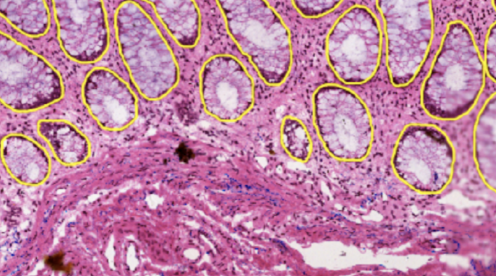

The Kaggle competition "HuBMAP + HPA - Hacking the Human Body", which is about organ segmentation, ended on September 30. More than 1,000 teams joined the competition, and I came in 176th (top 15%). 

What made it different from many other medical image competitions was its twist in how to split the dataset; the distributions of train, public test, and private test sets were all different. In this post, I describe the problem setting and summarize the top solutions and my experience for those who didn't participate.

## Problem Setting
The task is to segment the organ region from a given tissue section images. The dataset includes five types of organs, and the organ type can be used as additional information along with pixel size, tissue thickness, and the data source. There are two data sources: HuBMAP and HPA. They are drastically different from each other. Shooting conditions, staining protocols, and organ distribution are all different. You can get a sense of it from the figure below.

<small>Image taken from
<a href="https://wt-blog.medium.com/hubmap-hpa-hacking-the-human-body-6e58523961ed">
a post by Winstars Technology LLC</a>.</small>

The twist is in how to split the dataset. The train set consists of HPA data only. The public test set is a mixture of HPA and HuBMAP. And the private test set consists of HubMAP data only. The competition was a Code Competition, meaning that you have no access to the test data. So, here is the challenge: *generalize to HuBMAP data by seeing HPA data only*.

The evaluation metric is **Dice coefficient**, which is defined as below:

$$
\mathrm{D} := \frac{2 | X \cup Y |}{ |X| + |Y|}
$$

where $X$ is the set of predicted pixels, $Y$ is the ground truth, and $|\cdot|$ computes the size of the operand. 

For more detail, please refer to [the official description](https://www.kaggle.com/competitions/hubmap-organ-segmentation/overview/description).

## Solutions
Here is a summary of the top-5 public solutions.

heavy augmentation
TTA
Large models
Large images
external datasets
pseudo labels

### 1st Place
[Opusen](https://www.kaggle.com/competitions/hubmap-organ-segmentation/discussion/356201) won the 1st place by looking at the labels carefully. The key to the victory was the hand-labeling of lung images. They noticed that the noisy labels in lung images lead to unstable results, which motivated them to re-label those images manually.

I'd like to mention their normalization technique as well. They wanted to trained SegFormers (MiT) at the resolution of 1024x1024, but the VRAM of Google Colaboratory was not enough. They solved this problem by using **group normalization** with the batch size of 1 instead of batch normalization, which somehow improved the score at the same time.

### 2nd Place
[Victor Durnov](https://www.kaggle.com/competitions/hubmap-organ-segmentation/discussion/354857) used various large models:
- EfficientNet B7
- EfficientNetV2 L
- ConvNeXt L
- CoaT-Lite Medium

### 3rd Place
[Human Torus Team](https://www.kaggle.com/competitions/hubmap-organ-segmentation/discussion/354683)'s approach is similar to others, but I'd like to highlight two points here. First, they use CutMix for data augmentation. Second, at inference time, they use images in full scale. When the image is too large to fit in the memory, they adopted a "sliding window" strategy and averaged the output.

### 4th Place
[Rock](https://www.kaggle.com/competitions/hubmap-organ-segmentation/discussion/354851) didn't use external data nor pseudo labels. Instead, they utilized stain (color) normalization.

### 7th Place
Tile and whole
Kaggle Notebook only  

## My Experience
heavy augmentation
TTA
Mediam models
Large (as possible) images

Otsu binarization