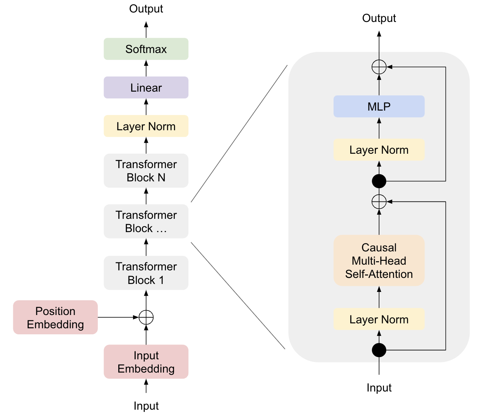
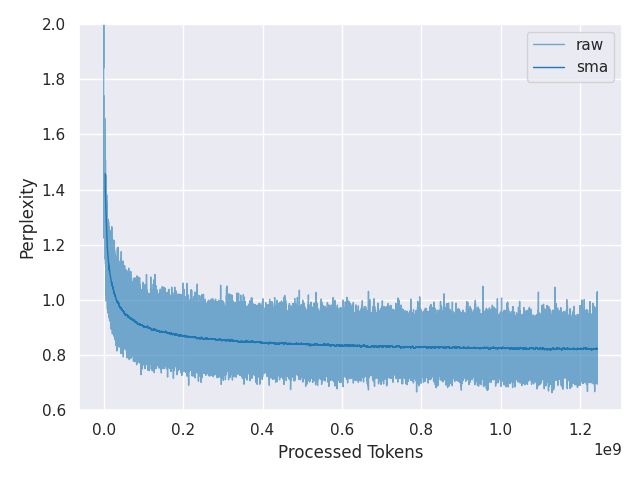

> What I cannot create, I do not understand. – Richard Feynman

**Large language models** (**LLMs**) have become so popular that it is now very easy to just use them. Thanks to the [Transformers library](https://huggingface.co/docs/transformers/main/index), you can effortlessly select your preferred pre-trained models and generate text with just a few lines of code. But if you are a cooking lover or a DIYer, you might want to creat your own LLM by yourself. Crafting one yourself is the best way to grasp a better understanding of technology, and of course, it is fun.

In this blog post, I share my recipe to train my own LLM (GPT), which is actually not-so-large because the number of parameters is around 51 million (less than half of GPT-2 Small). You can train this model using a single V100 GPU in under a day. When you finished reading this post, you'll be able to craft a homemade LLM!

My recipe comprises three crucial steps:

1. Implementing the model architecture (in pure PyTorch)
2. Choosing the optimal model size
3. Training the model

Let's delve into each of these steps, one by one.

## Implementing the Model Architecture

Among many public GPT implementations relying solely on PyTorch, what I love the best is [Andrej Karpathy's nanoGPT](https://github.com/karpathy/nanoGPT). Its 300-line `model.py` is written simple and easy, and moreover, the codebase can actually reproduce the OpenAI's GPT-2 Small results [^1]. Thus, I decided to construct [my `model.py` based on this repository](generative_ai/models/model.py). The figure below offers an overview of the model architecture:

## Choosing the Optimal Model Size

The model architecture defined above is agnostic to the model size (the number of parameters), allowing you to choose whatever model size your want. Given a fixed computing budget, howerver, there exists an optimal pair of model size $N$ and the number of tokens $D$ that yields the smallest loss $L$. According to the study "[Training Compute-Optimal Large Language Models](https://arxiv.org/abs/2203.15556)" (better known as **Chinchilla**), the relationship among them can be described as the following equation:

$$
L(N,D)=E+\frac{A}{N^\alpha}+\frac{B}{D^\beta}
$$

where $E$, $A$, $B$, $\alpha$, $\beta$ are constants estimated empirically.

So, you should choose the optimal model size based on your computing budget. To do that, [Tomek Korbak's great blog post](https://tomekkorbak.com/2022/10/10/compute-optimal-gpt2/) is a good read, which I followed to plot the **IsoFLOP curve** presented below.

Here, each curve on the graph represents the relationship between $N$ (x-axis) and $L$ (y-axis) given a fixed computing budget. Once you determine the computing budget (a specific curve), you can find the optimal model size that minimizes the loss, and hence the dataset size.

In my scenario, I chose the point $N$=50M and $D$=1.1B, which was estimated to require 320 PFLOPs of compute.

## Training the Model

Before launching the training process, I looked for a dataset containing 1.1B tokens. After a search at [Hugging Face Dataset](https://huggingface.co/datasets), I found the [BookCorpus](https://huggingface.co/datasets/bookcorpus) dataset. This dataset is a collection of 74 million clean English senteces, which, when tokenized, amounted to 1.1B tokens.

Then I trained the **byte-pair encoding** (**BPE**) tokenizer using [Tokenizers library](https://huggingface.co/docs/tokenizers/index). If you are not familiar with tokenization, [the document of Tokenizers](https://huggingface.co/docs/tokenizers/pipeline) will be a good starting point.

Finally, I initialized my GPT with 8 layers, 8 heads, and 512 embedding dimensions (= 51M parameters) and trained it on NVIDIA V100 GPU. Note, you should generally stick to newer GPUs such as A100 and maybe H100 as long as they are available. Unfortunately, I just couldn't use A100 GPU because Google Cloud was running out of its A100 servers at the time of my experiment.

The training curve is presented below:

The final perplexity was 0.83. But how good is that? To find out, let's have it generate some sentences!

When I fed the prompt "life is about" into the initial model, it generated a random sequence of sub-words:

> life is about hospitals stained whirlinggravity santvet ransacked accumulation  

But when I gave it to the final model, it generated sentences like this:

> life is about romance , and love and adrenaline , at the same time .

Hmm, that might be true, or not. At least it is gramatically acceptable. A huge improvement from the inital state!

## Conclusion

In this post, I've shared my recipe for training a 50M-parameter GPT with a single GPU in one day. While it may not generate as sophisticated sentences as larger LMs available at Hugging Face, it will offer a delightful homemade charm. Enjoy DIY!🛠️

[^1]: For radical minimalists, there is an even more minimal model named [picoGPT](https://github.com/jaymody/picoGPT).
