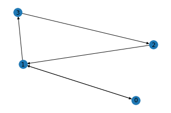

In [this earlier post](https://hippocampus-garden.com/citation_network_analysis/), I used Google's PageRank to analyze a citation network, but I skipped explaining what it is. Here I'd like to take a closer look into the theory, algorithm, and experimental results of PageRank.

## Web as a Directed Graph
It's natural to see the web as a directed graph, where nodes are pages and edges are hyperlinks. Let's say there are only 4 pages on the web and take the following web graph for example.

Each column of the **adjacency matrix** represents the out edges of each node, and in this example the matrix is:

$$
A = \begin{pmatrix} 
0 & 1 & 0 & 0 \\ 
1 & 0 & 1 & 0 \\
0 & 0 & 0 & 1\\
0 & 1 & 0 & 0 
\end{pmatrix}.
$$

The **degree matrix** is:

$$
D 
= \mathrm{diag}(\{ \sum_{j} A_{ij} ~|~ \forall i \in \mathcal{V} \})
= \begin{pmatrix} 
1 & 0 & 0 & 0 \\ 
0 & 2 & 0 & 0 \\
0 & 0 & 1 & 0\\
0 & 0 & 0 & 1 
\end{pmatrix},
$$

where $\mathcal{V}$ is the set of nodes. This matrix represents the number of out-going edges from each node. Let's normalize the adjacency matrix $A$ by the degree of each node, resulting in the **transition matrix** $M$ that represents the transition probability at each node. 

$$
M 
= D^{-1}A
= \begin{pmatrix} 
0 & 1/2 & 0 & 0 \\ 
1 & 0 & 1 & 0 \\
0 & 0 & 0 & 1\\
0 & 1/2 & 0 & 0 
\end{pmatrix}.
$$

Each column of $M$ satisfies the probability axioms (for every column, all the elements are non-negative and the sum equals to 1). In other words, $M$ is **column-stochastic**.

## Random Surfer
Consider a random surfer who explore the web just by clicking the hyperlinks on the current page uniformly at random. For example, if the random surfer is viewing the page 2, the next page will be the page 0 or 3 at a 50-50 chance.  

How often does this random surfer reach each page? Let $v$ be the probability distribution over the 4 pages and initialized as the uniform distribution. We can get to the answer by multiplying the column-stocastic transition matrix $M$ from the left iteratively.

|Iteration|Page 0|Page 1|Page 2|Page 3|  
|:-:|:-:|:-:|:-:|:-:|  
|00|0.250|0.250|0.250|0.250|  
|01|0.125|0.500|0.250|0.125|  
|02|0.250|0.375|0.125|0.250|  
|03|0.188|0.375|0.250|0.188|  
|04|0.188|0.438|0.188|0.188|  
|05|0.219|0.375|0.188|0.219|  
|06|0.188|0.406|0.219|0.188|  
|07|0.203|0.406|0.188|0.203|  
|08|0.203|0.391|0.203|0.203|  
|09|0.195|0.406|0.203|0.195|  
|10|0.203|0.398|0.195|0.203|  
|11|0.199|0.398|0.203|0.199|  
|12|0.199|0.402|0.199|0.199|  
|13|0.201|0.398|0.199|0.201|  
|14|0.199|0.400|0.201|0.199|  
|15|0.200|0.400|0.199|0.200|  
|16|0.200|0.399|0.200|0.200|  
|17|0.200|0.400|0.200|0.200|  
|18|0.200|0.400|0.200|0.200|  
|19|0.200|0.400|0.200|0.200|  

## Formulation

## Linear Algebra Point of View

## Implementation

## Experiments

## Concluding Remarks

## References
[1] Brin, Sergey, and Lawrence Page. "[Reprint of: The anatomy of a large-scale hypertextual web search engine](https://www.sciencedirect.com/science/article/abs/pii/S1389128612003611)." *Computer networks* 56.18 (2012): 3825-3833.  