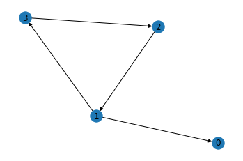
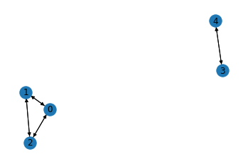
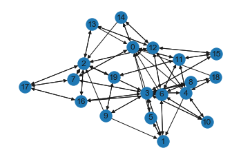
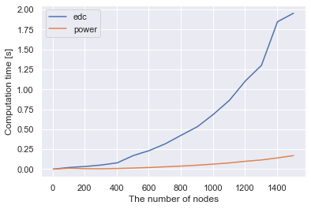
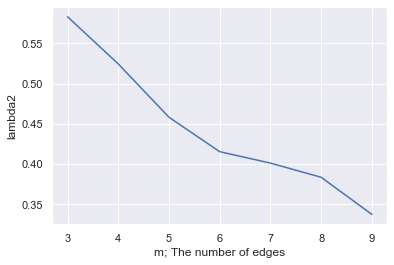

In [this previous post](https://hippocampus-garden.com/citation_network_analysis/), I used Google's PageRank to analyze a citation network, but I skipped explaining what it is. Here I'd like to take a closer look into the theory, algorithm, and experimental results of PageRank.

## Web as a Directed Graph
It's natural to see the web as a directed graph, where nodes are pages and edges are hyperlinks. Let's say there are only 4 pages on the web and take the following webgraph for example.


Each column of the **adjacency matrix** represents the out-going edges of each node, and in this example the matrix is:

$$
A = \begin{pmatrix} 
0 & 1 & 0 & 0 \\ 
1 & 0 & 1 & 0 \\
0 & 0 & 0 & 1\\
0 & 1 & 0 & 0 
\end{pmatrix}.
$$

The **degree matrix** is:

$$
D 
= \mathrm{diag}(\{ \sum_{j} A_{ij} ~|~ \forall i \in \mathcal{V} \})
= \begin{pmatrix} 
1 & 0 & 0 & 0 \\ 
0 & 2 & 0 & 0 \\
0 & 0 & 1 & 0\\
0 & 0 & 0 & 1 
\end{pmatrix},
$$

where $\mathcal{V}$ is the set of nodes. This matrix represents the number of out-going edges from each node. Let's normalize the adjacency matrix $A$ by the degree of each node, resulting in the **transition matrix** $M$ that represents the transition probability at each node. 

$$
M 
= AD^{-1}
= \begin{pmatrix} 
0 & 1/2 & 0 & 0 \\ 
1 & 0 & 1 & 0 \\
0 & 0 & 0 & 1\\
0 & 1/2 & 0 & 0 
\end{pmatrix}.
$$

Each column of $M$ satisfies the probability axioms (for every column, all the elements are non-negative and the sum equals 1). In other words, $M$ is **column stochastic**.

## Random Surfer
Consider a random surfer who explores the web just by clicking on the hyperlinks on the current page uniformly at random. For example, if the random surfer is viewing the page 2, the next page will be the page 0 or 3 at a 50-50 chance.  

How often does this random surfer reach each page? Let $v$ be the probability distribution over the 4 pages and initialized as the uniform distribution. We can get to the answer by multiplying the column stochastic transition matrix $M$ from the left iteratively. Let's calculate the **Markov chain**!

$$
v_{k+1} = Mv_k
$$

|Iteration|Page 0|Page 1|Page 2|Page 3|  
|:-:|:-:|:-:|:-:|:-:|  
|00|0.25|0.25|0.25|0.25|  
|01|0.12|0.50|0.25|0.12|  
|02|0.25|0.38|0.12|0.25|  
|03|0.19|0.38|0.25|0.19|  
|04|0.19|0.44|0.19|0.19|  
|05|0.22|0.38|0.19|0.22|  
|06|0.19|0.41|0.22|0.19|  
|07|0.20|0.41|0.19|0.20|  
|08|0.20|0.39|0.20|0.20|  
|09|0.20|0.41|0.20|0.20|  
|10|0.20|0.40|0.20|0.20|  
|11|0.20|0.40|0.20|0.20|   

Finally, we get to the answer! The random surfer is viewing the page 1 for 40% of the time and page 0, 2, and 3 for 20% of the time. This final probability is called **PageRank** (some technical details follow) and *serves as an importance measure for web pages*.

Note that the above iterative multiplication has converged to a constant PageRank vector $v$. *It is equivalent to calculating the eigenvector corresponding to the eigenvalue 1* by the **power method** (a.k.a. **power iteration**). 

$$
v = Mv
$$

This perspective givef a lot og insights, but I leave them to the linear algebra section.

## Technical Details
We've seen the idea of PageRank in a simple example, but there are some problems when applied to general webgraphs.

### Sink (Dangling) Nodes
The nodes with no out-going edges are called **sink nodes** or **dangling nodes**. For example, in the figure below, the page 0 is a sink node.



Sink nodes absorb the random surfer and set the PageRank of other pages to 0. To avoid this undesirable result, we add virtual edges directed from sink nodes to all the other nodes. With this setting, the random surfer trapped in the sink nodes can jump to the other pages randomly. The transition matrix for the above graph is:

$$
M 
= \begin{pmatrix} 
0 & 1/2 & 0 & 0 \\ 
1/3 & 0 & 1 & 0 \\
1/3 & 0 & 0 & 1\\
1/3 & 1/2 & 0 & 0 
\end{pmatrix},
$$

and now its columns satisfy the probability axioms.

### Disconnected Components
The webgraph often has disconnected components (isolated communities).



In such cases, the transition matrix is **block diagonal** and *has multiple linearly independent eigenvectors corresponding to the eigenvalue 1*.

$$
M 
= \begin{pmatrix} 
0 & 1/2 & 1/2 & 0 & 0\\ 
1/2 & 0 & 1/2 & 0 & 0\\
1/2 & 1/2 & 0 & 0 & 0\\
0 & 0 & 0 & 0 & 1\\
0 & 0 & 0 & 1 & 0
\end{pmatrix}
$$

$$
v
= \begin{pmatrix} 
1/3 \\ 
1/3 \\
1/3 \\
0 \\
0 
\end{pmatrix}, 
\begin{pmatrix} 
0 \\ 
0 \\
0 \\
1/2 \\
1/2 
\end{pmatrix}
$$

To address this issue, Brin and Page [1] introduced the **damping factor** $d~ (=0.15)$ and reformulated the transition matrix.

$$
\tilde{M} = (1-d)M + \frac{d}{n} J_n,
$$

where $n$ is the number of nodes and $J_n$ is a matrix of ones. This reformulated transition matrix is also referred to as the **Google matrix**. Google matrix makes all the nodes connected and PageRank vectors unique to the webgraphs. It also solves the cyclic surfing that makes the power method (explained below) invalid. Intuitively, the damping factor allows the bored random surfer to jump to another random page at the probability $d$. In the following part, I simply use $M$ for the transition matrix with a damping factor.

## Linear Algebra Point of View
I mentioned that the iterative calculation of PageRank is equivalent to calculating the eigenvector corresponding to the eigenvalue 1. But some questions might occur. Does the transition (Google) matrix always have the eigenvalue 1 of multiplicity one? Does the iterative calculation always converge to a unique vector? How fast is the convergence? The following theorem and algorithm answer these questions.

### Perron-Frobenius Theorem
The [**Perron-Frobenius theorem**](https://en.wikipedia.org/wiki/Perron%E2%80%93Frobenius_theorem) and that the Google matrix $M$ is positive and column stochastic guarantees that the following statements hold.

1. $M$ has an eigenvalue 1 of multiplicity one.
2. 1 is the largest eigenvalue: all the other eigenvalues have absolute values smaller than 1.
3. For the eigenvalue 1, there exists a unique eigenvector with the sum of its entries equal to 1.

See [5] for the proof. These statements indicate that there is a unique eigenvector for eigenvalue 1 whose sum of its entries equal to 1. More casually, we only have to calculate the eigenvector for eigenvalue 1 to obtain the PageRank.

### Power Method
The [**power method**](https://en.wikipedia.org/wiki/Power_iteration) is a numerical algorithm for calculating the eigenvalue with the greatest absolute value and its eigenvector. We know that the greatest eigenvalue of the Google matrix $M$ is 1, so the power method is simple: just iteratively multiply $M$ to any initial vector. 

Denoting the greatest and the second greatest (in absolute value) eigenvalue as $\lambda_1, \lambda_2$ respectively, the convergence ratio is 

$$
\left|{\frac  {\lambda _{2}}{\lambda _{1}}}\right| = \left| \lambda _{2} \right|.
$$

That is, the smaller $\left| \lambda _{2} \right|$ is, the faster the algorithm converges.

## Implementation
That's it for the theoretical part of PageRank. We've seen that *PageRank can be calculated in two ways*: **eigendecomposition** and **power method**. Now, let's implement them with Python. First, import necessary libraries and prepare the function for calculating the Google matrix of the given graph.

```python
import networkx as nx
import numpy as np

def get_google_matrix(G, d=0.15):
    n = G.number_of_nodes()
    A = nx.to_numpy_array(G).T
    # for sink nodes
    is_sink = np.sum(A, axis=0)==0
    B = (np.ones_like(A) - np.identity(n)) / (n-1)
    A[:, is_sink] += B[:, is_sink]
    
    D_inv = np.diag(1/np.sum(A, axis=0))
    M = np.dot(A, D_inv) 
    
    # for disconnected components
    M = (1-d)*M + d*np.ones((n,n))/n
    return M

def l1(x):
    return np.sum(np.abs(x))
```

### Eigendecomposition
The first solution is eigendecomposition of the Google matrix. The L1-normalized eigenvector corresponding to the largest eigenvalue ($=1$) is the PageRank vector.

```python
def pagerank_edc(G, d=0.15):
    M = get_google_matrix(G, d=d)
    eigenvalues, eigenvectors = np.linalg.eig(M)
    idx = eigenvalues.argsort()[-1]
    largest = np.array(eigenvectors[:,idx]).flatten().real
    return largest / l1(largest)
```

What is the Big-O time of this algorithm? The time complexity is $O(n^3)$ because the eigendecomposition is dominant. With over one trillion nodes (web pages), **this solution is prohibitively expensive**.

### Power Method
The second solution is the power method. It initializes $v_0$ as the uniform distribution and iteratively multiplies the Google matrix until it converges or it reaches the maximum number of iterations.

```python
def pagerank_power(G, d=0.15, max_iter=100, eps=1e-9):
    M = get_google_matrix(G, d=d)
    n = G.number_of_nodes()
    V = np.ones(n)/n
    for _ in range(max_iter):
        V_last = V
        V = np.dot(M, V)
        if  l1(V-V_last)/n < eps:
            return V
    return V
```

As for the Big-O time, the matrix-vector multiplication is dominant in this algorithm because the number of iterations is bounded by `max_iter`. Therefore, the time complexity is $O(n^2)$. It is further reduced to $O(n)$ using **sparse matrix multiplication**. Remind that the Google matrix is the weighted sum of the transition matrix (sparse!) and the matrix of ones (just the sum operator).

## Experiments
Finally, I conduct some experiments to validate that the above implementation works correctly from a theoretical point of view. 

The experiments use the [Barabási–Albert network](https://en.wikipedia.org/wiki/Barab%C3%A1si%E2%80%93Albert_model) as a proxy for the [webgraph](https://en.wikipedia.org/wiki/Webgraph). Since the function of NetworkX generates only undirected graphs, half of the edges are randomly deleted and converted to directed graphs.

```python
def gen_webgraph(n, m):
    G = nx.DiGraph(nx.barabasi_albert_graph(n,m))
    rands = np.random.choice(n, n//2, replace=False)
    G.remove_edges_from(np.array(G.edges)[rands])
    return G
```



### Computation Time
The figure below compares the eigendecomposition and the power method on the computation time of PageRank for Barabási–Albert network with the different number of nodes ($m$, or the number of edges to attach from a new node is fixed to 3). Please note that I don't use sparse matrix multiplication for the power method.



The power method is faster than the eigendecomposition especially when there are many nodes.

### Convergence Speed of Power Method
Next, I inspect the convergence speed of the power method. I change the parameter $m$ to have different $\lambda_2$ (the second greatest eigenvalue) with the number of nodes fixed to 100. $\lambda_2$ seems to negatively correlate with $m$.



As shown below, the mean squared error of the estimated PageRank exponentially decreases to $10^{-15}$. Also, the convergence is faster for larger $m$ (i.e. smaller $\lambda_2$).


The convergence speed is calculated as the slope of the lines in the above figure. Now it is experimentally confirmed that the smaller $\left| \lambda _{2} \right|$ is, the faster the power method converges. 


## Concluding Remarks
PageRank is an excellent algorithm that can measure the trillions of web pages in linear time and has interesting theoretical backgrounds. There are some extensions such as **Personalized PagreRank** (it uses distributions biased to each user instead of the uniform distribution $J_n$ to calculate the Google matrix), and they are still used in many services.

Please link to this post to heighten its PageRank 😉

## References
[1] Brin, Sergey, and Lawrence Page. "[The anatomy of a large-scale hypertextual web search engine](https://www.sciencedirect.com/science/article/abs/pii/S1389128612003611)." *Computer networks* 56.18 (2012): 3825-3833.  
[2] [PageRank Algorithm - The Mathematics of Google Search](http://pi.math.cornell.edu/~mec/Winter2009/RalucaRemus/Lecture3/lecture3.html)  
[3] [PageRank - Wikipedia](https://en.wikipedia.org/wiki/PageRank)  
[4] [Link Analysis — NetworkX 2.4 documentation](https://networkx.github.io/documentation/stable/reference/algorithms/link_analysis.html)  
[5] R. Clark Robinson. "[Perron-Frobenius Theorem](https://sites.math.northwestern.edu/~clark/354/2002/perron.pdf)." 2002.