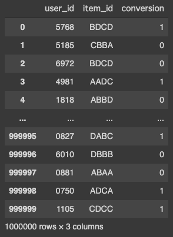
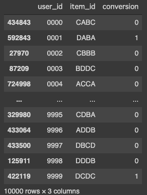
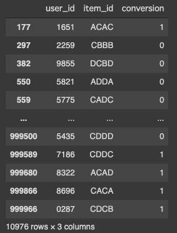

🐼Welcome back to the "Meet Pandas" series (a.k.a. my memorandum for learning Pandas)!🐼

[Last time](https://hippocampus-garden.com/pandas_query/), I discussed `DataFrame`'s easy-to-read selecting method called `query`. 

Today, I introduce how to sample groups, or group-wise split a dataset. This may help you when you want to avoid data leakage.

## Create Example Data
Suppose we are developing a user-to-item recommender model and have a dataset of 1,000,000 user-item interactions, which include 10,000 unique users, 256 items, and the corresponding conversion flag. Let's synthesize this dataset with `itertools`:

```python
from itertools import product
import numpy as np
import pandas as pd

str_numbers = "".join(map(str, range(10)))
# ['0000', '0001', ..., '9999']
user_ids = list(map("".join, product(str_numbers, repeat=4)))
# ['AAAA', 'AAAB', ..., 'DDDD']
item_ids = list(map("".join, product("ABCD", repeat=4)))

num_records = 10**6
df = pd.DataFrame({'user_id': np.random.choice(user_ids, num_records),
                   'item_id': np.random.choice(item_ids, num_records),
                   'conversion': np.random.choice([0, 1], num_records)})
df
```

The dataframe should look something like this:



## Random Sampling Leads to Data Leakage

This might be too bulky to handle, and you might feel like downsampling when you train a model as such:

```python
df.groupby('user_id').sample(frac=0.01)
```



But, in this case, random split leads to data leakage because this dataset includes multiple (100 on average) records for each user. To avoid this, we should use **group-wise splitting**. But how?


## Group-wise Sampling with `groupby` and `filter`
Again, this dataset contains 10,000 unique users.

```python
df["user_id"].nunique()
# >> 10000
```

Let's say we are sampling 100 users to obtain a set of approximately 10,000 records. This is achieved by chaining `groupby` and `filter`.

```python
df_sampled = df.groupby('user_id').filter(lambda _: np.random.rand() < 0.01)
df_sampled["user_id"].nunique()
# >> 107
```



This solution isn't bad, but it doesn't assure that the sampled set includes exactly 100 users. This can be a problem when the number of users is small. If you want to sample exactly 100 users, you should explicitly do that before filtering.

```python
sampled_users = np.random.choice(df["user_id"].unique(), 100)
df_sampled = df.groupby('user_id').filter(lambda x: x["user_id"].values[0] in sampled_users)
df_sampled["user_id"].nunique()
# >> 100
```

This solution always returns a sampled dataset of 100 users!

## References
[1] [Group by: split-apply-combine — pandas 1.1.3 documentation](https://pandas.pydata.org/pandas-docs/stable/user_guide/groupby.html#filtration)  
[2] [itertools — Functions creating iterators for efficient looping — Python 3.9.0 documentation](https://docs.python.org/3/library/itertools.html)