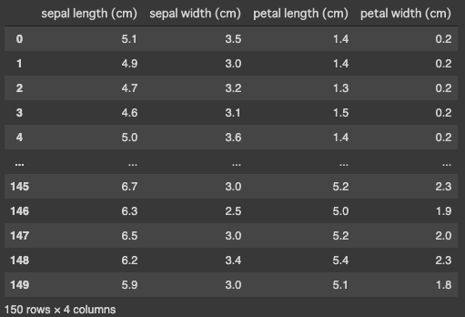

Have you ever confused [**Pandas**](https://pandas.pydata.org/pandas-docs/stable/index.html) methods `loc`, `iloc`, `at`, and `iat` with each other? Pandas is a great library for handling tabular data, but its API is too diverse and somewhat unintuitive. Understanding its design concepts might help it to some extent 🐼

So, this post aims to help understand differences between Pandas `loc`, `iloc`, `at`, and `iat` methods. In short, the differences are summarized in the table below:

|                        | Single | Multiple |
| :--------------------: | :----: | :------: |
|      label based       |   at   |   loc    |
| integer position based |  iat   |   iloc   |

\* If this table makes sense, you won't need this post any more.

Let's find the differences using a simple example!

## Load Example Data
In this post, I use the iris dataset in the scikit-learn. The snippets in this post are supposed to be executed on Jupyter Notebook, Colaboratory, and stuff.

```python
import pandas as pd
from sklearn.datasets import load_iris

iris = load_iris()
df = pd.DataFrame(iris.data, columns=iris.feature_names)
df
```

The dataframe should look something like this.



## at & iat Access a Scalar Value
If you just want to access a scalar value in the dataframe, it is fastest to use `at` and `iat` methods. They both take two arguments to specify the row and the column to access, and produce the same outputs. The difference between them are discussed afterwards.

```python
print(df.at[0, "sepal width (cm)"])
# 3.5
print(df.iat[0, 1])
# 3.5
```
<br/>

## loc & iloc Access Multiple Values
When you want to access a scalar value, `loc` and `iloc` methods are a bit slower but produce the same outputs as `at` and `iat` methods. 

```python
print(df.loc[0, "sepal width (cm)"])
# 3.5
print(df.iloc[0, 1])
# 3.5
```

However, `loc` and `iloc` methods can also access multiple values at a time. The following two statements give the same results: the values at the first row and the first two columns.

```python
print(df.loc[0, :"sepal width (cm)"])
print(df.iloc[0, :2])
# sepal length (cm)    5.1
# sepal width (cm)     3.5
# Name: 0, dtype: float64 
```

The sliced form of the second argument is invalid for `at` and `iat` methods.

```python
print(df.at[0, :"sepal width (cm)"])
print(df.iat[0, :2])
# TypeError: unhashable type: 'slice'
```

You can input boolean arrays to specify rows and columns to access.
 
```python
print(df.loc[0, [True, True, False, False]])
print(df.iloc[0, :2])
# sepal length (cm)    5.1
# sepal width (cm)     3.5
# Name: 0, dtype: float64
```

<br/>


## at & loc vs. iat & iloc
So, what exactly is the difference between `at` and `iat`, or `loc` and `iloc`? I first thought that it's the type of the second argument. Not accurate.

*`at` and `loc` methods access the values based on its labels, while `iat` and `iloc` methods access the values based on its integer positions.*

This difference is clear when you sort the dataframe.

```python
df_sorted = df.sort_values("sepal width (cm)")
df_sorted
```


Note that the indices are re-ordered according to the `sepal width (cm)` column.

Now, the label-based `df_sorted.at[0, "sepal width (cm)"]` finds the row labeled `0` but the position-based `df_sorted.iat[0, 1]` finds the row at the top. The relationship between `loc` and `iloc` methods is the same. Therefore:

```python
print(df_sorted.at[0, "sepal width (cm)"])
# 3.5
print(df_sorted.iat[0, 1])
# 2.0
print(df_sorted.loc[0, "sepal width (cm)"])
# 3.5
print(df_sorted.iloc[0, 1])
# 2.0
```
<br/>

## Conclusion
I hope this helps someone understand the differences between these confusing methods.

That's it for today. Stay safe!

## References
[1] [Indexing and selecting data — pandas 1.0.3 documentation](https://pandas.pydata.org/pandas-docs/stable/user_guide/indexing.html#different-choices-for-indexing)  
[2] [pandasで任意の位置の値を取得・変更するat, iat, loc, iloc | note.nkmk.me](https://note.nkmk.me/python-pandas-at-iat-loc-iloc/)
