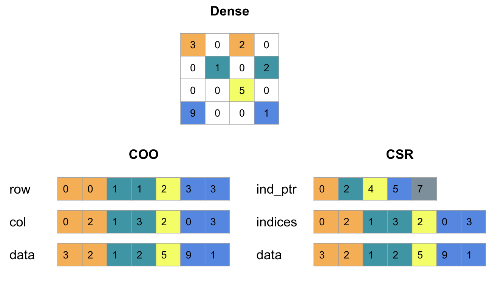

Welcome back to the 🐼Meet Pandas🐼 series (a.k.a. my memorandum for learning Pandas)!

When working with big data, we often encounter interactions between users and items. Examples of such data include:
- User ratings of movies, restaurants, or marchandise
- Number of times a song or video is played by each user

Representing these data as a dense matrix, where each row represents a user and each column represents an item, can lead to prohibitively large memory consumption. And, since interaction data are usually sparse, there must be more efficient ways to store the data. In such cases, representing the data as a sparse matrix is a good choice.

In this post, I will briefly show how to convert a `DataFrame` of user-item interactions to a **compressed sparse row** (**CSR**) matrix, the most common format for sparse matrices.

## Load Example Data
As an example, we use the [MovieLens](https://movielens.org/) dataset provided [here](http://grouplens.org/datasets/movielens/). This is a collection of rmovie ratings by users. Movies are rated by a small fraction of users, so this is a perfect use case for a sparse matrix. MovieLens can be loaded by the following code:

```python
from urllib.request import urlretrieve
import zipfile

import pandas as pd

urlretrieve("http://files.grouplens.org/datasets/movielens/ml-100k.zip", "movielens.zip")
zip_ref = zipfile.ZipFile('movielens.zip', "r")
zip_ref.extractall()

df = pd.read_csv(
    'ml-100k/u.data', sep='\t', names=['user_id', 'movie_id', 'rating', 'timestamp'], encoding='latin-1'
)
df
```

The dataframe should look something like this (a screenshot from Colaboratory):


## Converting to CSR Matrix
To convert a `DataFrame` to a CSR matrix, you first need to create indices for users and movies. Then, you can perform conversion with the `sparse.csr_matrix` function. It is a bit faster to convert via a **coordinate** (**COO**) matrix. 

```python
from pandas.api.types import CategoricalDtype
from scipy import sparse

users = df["user_id"].unique()
movies = df["movie_id"].unique()
shape = (len(users), len(movies))

# Create indices for users and movies
user_cat = CategoricalDtype(categories=sorted(users), ordered=True)
movie_cat = CategoricalDtype(categories=sorted(movies), ordered=True)
user_index = df["user_id"].astype(user_cat).cat.codes
movie_index = df["movie_id"].astype(movie_cat).cat.codes

# Conversion via COO matrix
coo = sparse.coo_matrix((df["rating"], (user_index, movie_index)), shape=shape)
csr = coo.tocsr()
```

For your information, I compare a dense matrix and its COO and CSR format in the figure below: 



CSR format consumes far less memory than its dense format for sparse matrices. Also, SciPy's CSR matrix is compatible with many other libraries such as [scikit-learn](https://scikit-learn.org/stable/index.html) and [XGBoost](https://xgboost.readthedocs.io/). For a more detailed explanation about sparse matrices, I refer readers to [this post](https://matteding.github.io/2019/04/25/sparse-matrices/).

CSR matrix can be converted back to COO matrix by `.tocoo()` method and to dense matrix by `todense()`.

## References
[1] [scipy.sparse.csr_matrix — SciPy v1.8.0 Manual](https://docs.scipy.org/doc/scipy/reference/generated/scipy.sparse.csr_matrix.html)  
[2] [Python, SciPy（scipy.sparse）で疎行列を生成・変換 | note.nkmk.me](https://note.nkmk.me/python-scipy-sparse-matrix-csr-csc-coo-lil/)  
[3] [scipy.sparseで疎行列入門 - Qiita](https://qiita.com/iwasaki620/items/603220d9102e82d4438e)  
