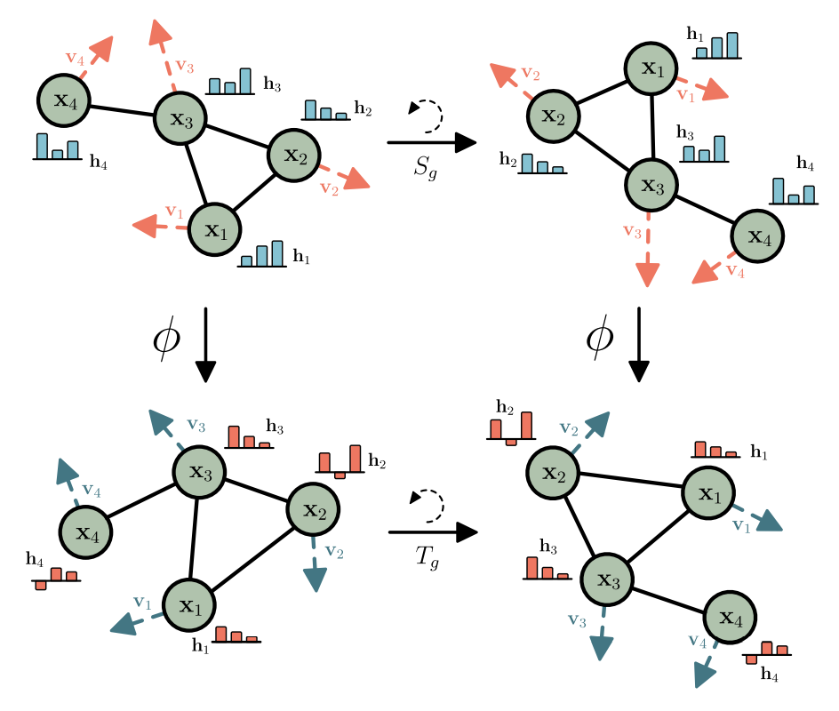
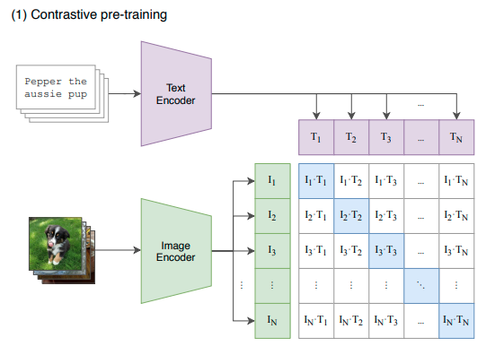
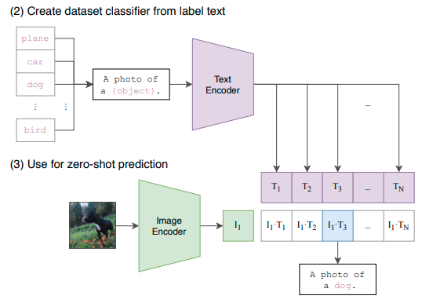
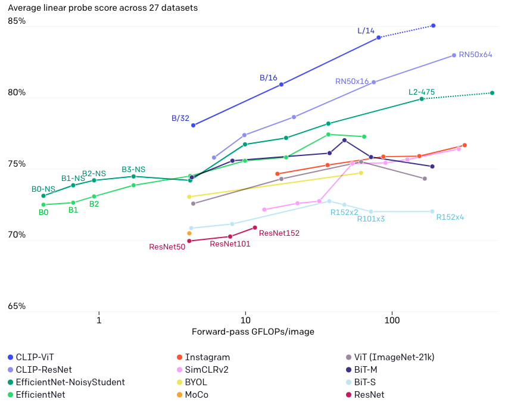
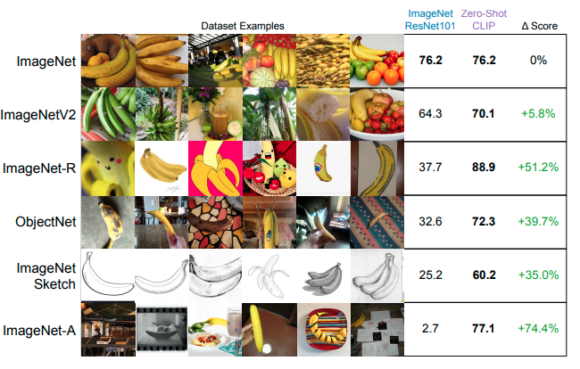
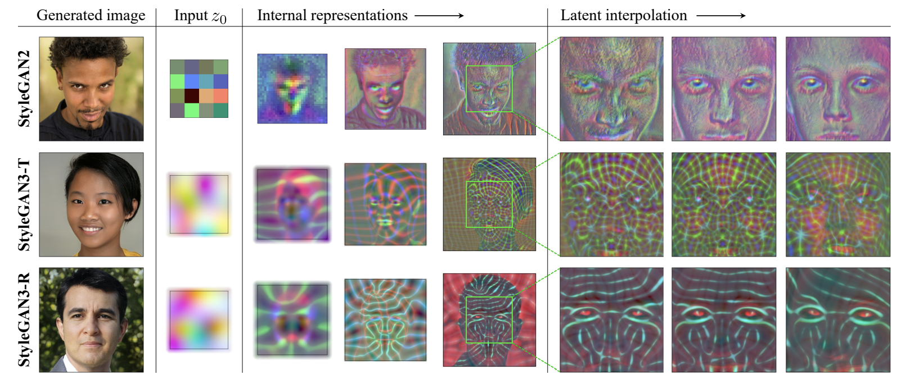
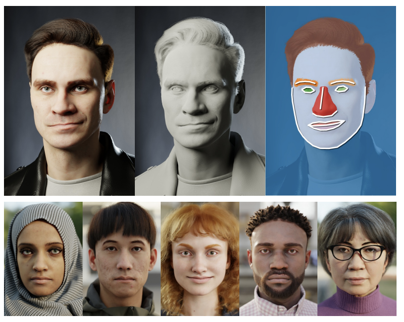

Happy New Year!🎉🐯

In 2021, the deep learning community made lots of great progress. It should be a good opportunity to look back at the updates, so I selected some of the most representative works to share with you. It's kind of a long list so I divided it into two parts: research papers and application projects. This post covers the research papers, and [the next post](https://hippocampus-garden.com/application_2021/) will cover the application projects.

## Research Papers
Here are the eight deep learning papers I selected (in chronological order).

  - [Exploring Simple Siamese Representation Learning](#exploring-simple-siamese-representation-learning)
  - [Extracting Training Data from Large Language Models](#extracting-training-data-from-large-language-models)
  - [E(n) Equivariant Graph Neural Networks](#en-equivariant-graph-neural-networks)
  - [Learning Transferable Visual Models From Natural Language Supervision](#learning-transferable-visual-models-from-natural-language-supervision)
  - [Unsupervised Speech Recognition](#unsupervised-speech-recognition)
  - [Alias-Free Generative Adversarial Networks](#alias-free-generative-adversarial-networks)
  - [Deep Reinforcement Learning at the Edge of the Statistical Precipice](#deep-reinforcement-learning-at-the-edge-of-the-statistical-precipice)
  - [Fake It Till You Make It: Face analysis in the wild using synthetic data alone](#fake-it-till-you-make-it-face-analysis-in-the-wild-using-synthetic-data-alone)

If I'm missing something important, please let me know in the comments![^1]

### Exploring Simple Siamese Representation Learning
- Authors: Xinlei Chen, Kaiming He
- Link: https://arxiv.org/abs/2011.10566
- Released in: November 2020
- Accepted to: CVPR 2021

In the last few years, quite a few papers on **self-supervised (unsupervised) representation learning** for images have appeared. Examples include **SimCLR** [1], **BYOL** ([one of my favorite papers in 2020](https://hippocampus-garden.com/best_papers_2020/)) [2], and **SwAV** [3], just to name a few. These papers take different approaches, but at the same time they perform more or less the same in downstream tasks. Then, what are the crucial ingredients for successful self-supervised representation learning?

This paper answers the above question by experimenting with a **simple Siamese network** (**SimSiam**). This network takes two images as input and outputs a similarity score between them. The two branches are weight-tied, except that one branch has a predictor module and the other has a **stop-gradient** operation. SimSiam can be interpreted as "SimCLR without negative pairs", "BYOL without momentum encoder", and "SwAV without online clustering". This comparison is well illustrated in the figure below.

On downstream tasks (linear evaluation), SimSiam performs comparably with other methods.

This result leads to an interesting insight: the key ingredient for self-supervised representation learning is not the large batch size, negative pairs, or momentum encoder. Instead, it is the stop-gradient operation and the predictor module.

The authors of this paper argue that SimSiam can be understood as an implementation of an **Expectation-Maximization** (**EM**) algorithm. For a more detailed discussion, please check out [the original paper](https://arxiv.org/abs/2011.10566).

### Extracting Training Data from Large Language Models
- Authors: Nicholas Carlini, Florian Tramer, Eric Wallace, Matthew Jagielski, Ariel Herbert-Voss, Katherine Lee, Adam Roberts, Tom Brown, Dawn Song, Ulfar Erlingsson, Alina Oprea, Colin Raffel
- Link: https://arxiv.org/abs/2012.07805
- Released in: December 2020
- Accepted to: USENIX Security Symposium 2021

This paper reveals a scary vulnerability of large language models: *it is possible to extract training data*. By repeatedly querying the **GPT-2**, a large public language model trained on the dataset sourced from the Web [4], and filtering the generated texts with a certain algorithm, the authors were able to extract sensitive data such as names, phone numbers, email addresses, 128-bit UUIDs, and IRC conversations. They even recovered Donald Trump's tweets😱.

Larger models memorize more. Indeed, according to [the blog by the authors](https://bair.berkeley.edu/blog/2020/12/20/lmmem/), **GPT-3** [5] correctly reproduces about one full page of *Harry Potter and the Philosopher’s Stone*.

This privacy and copyright issue is even worse considering the current trend towards larger and larger language models. To mitigate this problem, the authors suggest some possible remedies such as using differential privacy and sanitizing the training data more carefully. But more concrete countermeasures are needed.

### E(n) Equivariant Graph Neural Networks
- Authors: Victor Garcia Satorras, Emiel Hoogeboom, Max Welling
- Link: https://arxiv.org/abs/2102.09844
- Released in: Feburary 2021
- Accepted to: ICML 2021

**Equivariance** is one of the hot topics in today's machine learning. Is it an unfamiliar term? Given a function $\phi: X \rightarrow Y$, transformation $T_g: X \rightarrow X$, and its corresponding transformation $S_g: Y \rightarrow Y$, $\phi$ is **equivariant** to the abstract transformation $g$ if the following equation holds:

$$
\phi(T_g(x)) = S_g(\phi(x)) .
$$

Let us recall that $\phi$ is **invariant** to $g$ if the following equation holds:

$$
\phi(T_g(x)) = \phi(x) .
$$

In this paper, the authors consider the **E(n) transformations** as $g$. E(n) transformations are, namely, translation, rotation, reflection, and permutation in n-dimensional Euclidian space. **Graph neural networks** (**GNNs**) are equivariant to permutation by design, but not to other transformations. The concepts of equivariance and invariance are more important when it comes to 3D data because they have more degrees of freedom than 2D data.

So, the proposed **EGNN** (**E(n)-equivariant GNN**) is essentially a GNN that is equivariant to E(n) transformations. Unlike vanilla GNNs, each layer of EGNN takes as input a set of node embeddings, **coordinate embeddings**, and edge information and updates the two types of embeddings.

Thanks to its strong inductive bias, EGNN outperforms a vanilla GNN in modeling dynamical systems and predicting molecular properties in the QM9 dataset (with 3D coordinates of atoms), especially when the dataset is small. EGNN was later extended to a **normalizing flow** for molecules in [6]. 

### Learning Transferable Visual Models From Natural Language Supervision
- Authors: Alec Radford, Jong Wook Kim, Chris Hallacy, Aditya Ramesh, Gabriel Goh, Sandhini Agarwal, Girish Sastry, Amanda Askell, Pamela Mishkin, Jack Clark, Gretchen Krueger, Ilya Sutskever
- Link: https://arxiv.org/abs/2103.00020
- Released in: March 2021

This is probably the most impactful paper released in 2021. This paper proposes **contrastive language-image pre-training** (**CLIP**) to learn visual concepts from natural language supervision. The network consists of a text encoder and an image encoder, which are jointly trained to encode texts/images to the same space, where semantically similar pairs are close and dissimilar pairs are far. This is enabled by **contrastive learning** *using 400M pairs of images and texts* crawled from the internet. 

Once contrastive pre-training is done, *CLIP can be used for zero-shot image classification*. The procedure of the zero-shot classification is as follows:

1. Translate the class labels in the downstream task to text descriptions
2. Encode the given image
3. Encode the candidate text descriptions
4. Calculate the inner product between the image embedding and each text embedding
5. Select the class with the highest inner product

The performance of pre-trained CLIP is superb. The accuracy of CLIP's zero-shot classification is competitive with *fully-supervised* linear probes on pre-trained ResNet-50 in a variety of datasets. The linear probe on CLIP also outperforms strong ImageNet-pretrained baselines.

<small>Figure taken from <a href="https://openai.com/blog/clip/">CLIP: Connecting Text and Images</a>.</small>

Furthermore, as compared in the figure below, zero-shot CLIP is much more robust to distribution shift than ImageNet-pretrained models. This is partly because zero-shot CLIP is free from exploiting
spurious correlations while the baselines are not.

These results suggest CLIP's image embeddings are flexible, general, and robust because it learned a wide range of visual concepts from natural language supervision. CLIP is indeed changing the paradigm of pre-training on images from ImageNet's fixed-label classification to a web-scale image-text contrastive learning.

CLIP has already been used in cool applications such as text-to-image synthesis (DALL-E [7] and [VQGAN+CLIP](https://colab.research.google.com/drive/1ZAus_gn2RhTZWzOWUpPERNC0Q8OhZRTZ) went viral!) and visual question answering [8]. [DALL-E was also published from OpenAI at the same time with CLIP](https://openai.com/blog/dall-e/).

Lastly, although this paper is overwhelmingly long (48 pages!), it contains a lot of insightful analyses which are definitely worth reading. As many of them are even omitted from the [official blog post](https://openai.com/blog/clip/), here I would like to list some of the key takeaways:

- **CLIP objective is much more efficient than Transformer language modeling and bag-of-words training** in terms of the downstream accuracy of zero-shot image classification. Efficiency is crucial when it comes to web-scale training.
- **The batch size during training was 32,768**. Various techniques were applied to save memory usage.
- **Prompt engineering can boost performance**. For example, more descriptive "a photo of a boxer, a type of pet" is better than the raw class label "boxer" (confusing with an athlete boxer).
- **CLIP performs poorly on fine-grained classifications and systematic tasks**. The former includes the classification of the types of cars. The latter includes counting objects.
- **CLIP's representations of digitally rendered texts are useful, but those of handwritten texts are not**. On MNIST, zero-shot CLIP is beaten by logistic regression on raw pixels.

### Unsupervised Speech Recognition
- Authors: Alexei Baevski, Wei-Ning Hsu, Alexis Conneau, Michael Auli
- Link: https://arxiv.org/abs/2105.11084
- Released in: May 2021
- Accepted to: NeurIPS 2021

Recently, the accuracy of speech recognition has improved so much that many applications are making use of this technology. However, most methods require transcribed speech as training data, which is only available for a small fraction of the 7,000 languages spoken in the world.

To make speech recognition more inclusive, the authors developed **wav2vec-U** (**wev2vec Unsupervised**) that [requires no supervision at all](https://ai.facebook.com/blog/wav2vec-unsupervised-speech-recognition-without-supervision/). Wav2vec-U utilizes off-the-shelf tools such as **wav2vec 2.0** and phonemizer to train the phoneme sequence generator in an adversarial manner.

Here is how it works:

1. Get speech representations with wav2vec 2.0
2. Identify clusters (phonemic units) in the representations with k-means
3. Segment the audio data into phonemic units
4. Build segment representations by mean pooling the wav2vec 2.0 representations
5. Feed the segment representations into a generator to generate a phoneme sequence
6. Phonemize unlabeled text (real phoneme sequence)
7. Feed the generated and real phoneme sequences to the discriminator

As a result, wav2vec-U achieved **phoneme error rates** (**PER**) close to the previous SOTA methods supervised with thousands of hours of data. The experiments on low-resource languages such as Kyrgyz, Swahili, and Tatar also confirmed its efficacy.

### Alias-Free Generative Adversarial Networks
- Authors: Tero Karras, Miika Aittala, Samuli Laine, Erik Härkönen, Janne Hellsten, Jaakko Lehtinen, Timo Aila
- Link: https://arxiv.org/abs/2106.12423
- Released in: June 2021
- Accepted to: NeurIPS 2021

The evolution of **StyleGANs** [9,10] is not over. The Tero Karras team published **StyleGAN3** to address the undesirable **aliasing** effect that leads to some details glued to the absolute coordinates of the image. Take a look at [this official video](https://nvlabs-fi-cdn.nvidia.com/_web/stylegan3/videos/video_0_ffhq_cinemagraphs.mp4). In the StyleGAN2 panel, the hair and the beard are stuck to the screen despite the move of the head.

The authors inspected this issue and found that the root cause is that the generator abuses the positional information (that can be inferred from the aliasing artifact) to generate the texture. To prevent aliasing, they made some architectural changes to treat all signals as continuous and make the entire generator translation-equivariant in the sub-pixel level.

This allows StyleGAN3 to be trained on unaligned image datasets like FFHQ-U. The authors also found that the generator *invents* a coordinate system in the feature maps to synthesize textures on the surfaces. 

More videos are available at [the project page](https://nvlabs-fi-cdn.nvidia.com/_web/stylegan3/).

### Deep Reinforcement Learning at the Edge of the Statistical Precipice
- Rishabh Agarwal, Max Schwarzer, Pablo Samuel Castro, Aaron Courville, Marc G. Bellemare
- Link: https://arxiv.org/abs/2108.13264
- Released in: August 2021
- Accepted to: NeurIPS 2021

The **reinforcement learning** (**RL**) community evaluates algorithms by **point estimates** of aggregated scores, such as mean and median, over a suite of tasks. But in fact, this ignores the statistical uncertainty and the reported scores are often unfairly "lucky" ones.

This issue is becoming more serious because recent RL tasks are too computationally demanding to repeat hundreds of times (e.g., **StarCraft** [11]). To tackle statistical uncertainty with only a handful of runs, the authors made three recommendations for reliable evaluation:

1. Do the **interval estimates** of the score via bootstrap and report the **confidence intervals**
2. Show performance profiles (score distributions) like the figure below rather than the table with mean scores
3. Use **interquartile mean** (**IQM**) for aggregating scores (IQM is robust to outliers and more statistically efficient than median!)

Following their recommendations, it becomes clearer which algorithms are superior to others. In the figure below, the comparison is made with median on the left panel and IQM on the right. IQM tells us that DreamerV2 is not necessarily better than M-IQN.

The authors compiled this evaluation protocol in a library called **rliable**. Check it out [here](https://github.com/google-research/rliable).

### Fake It Till You Make It: Face analysis in the wild using synthetic data alone
- Authors: Erroll Wood, Tadas Baltrušaitis, Charlie Hewitt, Sebastian Dziadzio, Matthew Johnson, Virginia Estellers, Thomas J. Cashman, Jamie Shotton
- Link: https://arxiv.org/abs/2109.15102
- Released in: September 2021
- Accepted to: ICCV 2021

Computer vision tasks related to human faces are popular. For example, detection, identification, 3D reconstruction, generation, editing, and so on. However, collecting high-quality data from the real world is a huge challenge, so there are high hopes for the approach using synthetic data. Synthetic data has three upsides to real data:

1. No privacy concerns
2. Perfect labels are automatically obtained (some of them are otherwise impossible or very expensive to obtain)
3. Controlable diversity

Synthetic data of course has a downside, too: the domain gap problem. This paper solved this problem by creating a photo-realistic synthetic dataset named **Face Synthetics**. By sequentially adding components to the 3D template face (see the figure below), Face Synthetics achieved photo-realism and expressivity at the same time.

The Face Synthetics dataset is actually helpful for neural networks to learn to solve any face-related task such a landmark localization and face parsing. ResNets pretrained on this dataset and fine-tuned on the downstream tasks perform comparably with the state-of-the-art models.

The Face Synthetics dataset, a collection of 100,000 human face images at 512x512 resolution with landmark and semantic segmentation labels, is available [here](https://github.com/microsoft/FaceSynthetics) *for non-commercial research purposes*. Visit [the project page](https://microsoft.github.io/FaceSynthetics/) for more visualizations. 

## Concluding Remarks
Thank you for reading! For the application projects, please check out [the next post](https://hippocampus-garden.com/application_2021/).

Also, I would like to refer readers to [the great annual review at State of AI Guides (written in Japanese)](https://ja.stateofaiguides.com/20211230-ai-trends-2021/).

## References 
[1] Jonathan Frankle, Michael Carbin. "[A Simple Framework for Contrastive Learning of Visual Representations](https://arxiv.org/abs/2002.05709)". *ICML*. 2020.   
[2] Jean-Bastien Grill, Florian Strub, Florent Altché, Corentin Tallec, Pierre H. Richemond, Elena Buchatskaya, Carl Doersch, Bernardo Avila Pires, Zhaohan Daniel Guo, Mohammad Gheshlaghi Azar, Bilal Piot, Koray Kavukcuoglu, Rémi Munos, Michal Valko. "[Bootstrap your own latent: A new approach to self-supervised Learning](https://arxiv.org/abs/2006.07733)". *NeurIPS*. 2020.   
[3] Mathilde Caron, Ishan Misra, Julien Mairal, Priya Goyal, Piotr Bojanowski, Armand Joulin. "[Unsupervised Learning of Visual Features by Contrasting Cluster Assignments](https://arxiv.org/abs/2006.09882)". *NeurIPS*. 2020.  
[4] Alec Radford, Jeffrey Wu, Rewon Child, David Luan, Dario Amodei, Ilya Sutskever. "[Language Models are Unsupervised Multitask Learners](http://www.persagen.com/files/misc/radford2019language.pdf)". 2019.  
[5] Tom B. Brown, Benjamin Mann, Nick Ryder, Melanie Subbiah, Jared Kaplan, Prafulla Dhariwal, Arvind Neelakantan, Pranav Shyam, Girish Sastry, Amanda Askell, Sandhini Agarwal, Ariel Herbert-Voss, Gretchen Krueger, Tom Henighan, Rewon Child, Aditya Ramesh, Daniel M. Ziegler, Jeffrey Wu, Clemens Winter, Christopher Hesse, Mark Chen, Eric Sigler, Mateusz Litwin, Scott Gray, Benjamin Chess, Jack Clark, Christopher Berner, Sam McCandlish, Alec Radford, Ilya Sutskever, Dario Amodei. "[Language Models are Few-Shot Learners](https://arxiv.org/abs/2005.14165)". *NeurIPS*. 2020.  
[6] Victor Garcia Satorras, Emiel Hoogeboom, Fabian B. Fuchs, Ingmar Posner, Max Welling. "[E(n) Equivariant Normalizing Flows](https://arxiv.org/abs/2105.09016)". *NeurIPS*. 2021.  
[7] Aditya Ramesh, Mikhail Pavlov, Gabriel Goh, Scott Gray, Chelsea Voss, Alec Radford, Mark Chen, Ilya Sutskever. "[Zero-Shot Text-to-Image Generation](https://arxiv.org/abs/2102.12092)". 2021.  
[8] Sheng Shen, Liunian Harold Li, Hao Tan, Mohit Bansal, Anna Rohrbach, Kai-Wei Chang, Zhewei Yao, Kurt Keutzer. "[How Much Can CLIP Benefit Vision-and-Language Tasks?](https://arxiv.org/abs/2107.06383)". 2021.  
[9] Tero Karras, Samuli Laine, Timo Aila. "[A Style-Based Generator Architecture for Generative Adversarial Networks](https://arxiv.org/abs/1812.04948)". *CVPR*. 2019.  
[10] Tero Karras, Samuli Laine, Miika Aittala, Janne Hellsten, Jaakko Lehtinen, Timo Aila. "[Analyzing and Improving the Image Quality of StyleGAN](https://arxiv.org/abs/1912.04958)". *CVPR*. 2020.   
[11] Oriol Vinyals, Igor Babuschkin, Wojciech M. Czarnecki, Michaël Mathieu, Andrew Dudzik, Junyoung Chung, David H. Choi, Richard Powell, Timo Ewalds, Petko Georgiev, Junhyuk Oh, Dan Horgan, Manuel Kroiss, Ivo Danihelka, Aja Huang, Laurent Sifre, Trevor Cai, John P. Agapiou, Max Jaderberg, Alexander S. Vezhnevets, Rémi Leblond, Tobias Pohlen, Valentin Dalibard, David Budden, Yury Sulsky, James Molloy, Tom L. Paine, Caglar Gulcehre, Ziyu Wang, Tobias Pfaff, Yuhuai Wu, Roman Ring, Dani Yogatama, Dario Wünsch, Katrina McKinney, Oliver Smith, Tom Schaul, Timothy Lillicrap, Koray Kavukcuoglu, Demis Hassabis, Chris Apps, David Silver. "[Grandmaster level in starcraft
ii using multi-agent reinforcement learning](https://www.nature.com/articles/s41586-019-1724-z)". *Nature*. 2019.  

[^1]: I intentionally keep away from the war of network architecture: Transformer vs. CNN vs. MLP. Please wake me up when it's over😉.