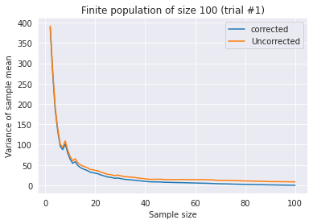
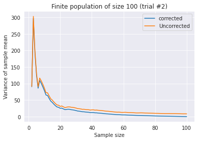
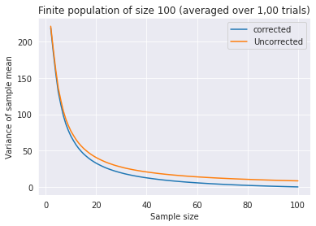

It is a common mistake to assume independency between samples from a finite population without replacement. This can lead to mis-estimation of, for example, the variance of the sample mean.

Consider you have $n$ samples $X_1,\ldots,X_n$, which are *sampled without replacement from a finite population* $\{Y_i|i=1,\ldots N \}$ with mean $\mu$ and variance $\sigma^2$, and you want to estimate the mean and variance of the sample mean $\bar{X}$. As in [the previous post](https://hippocampus-garden.com/stats_unbiased_variance/), the **sample mean** is defined as:

$$
\bar{X} = \frac{1}{n}\sum_{i=1}^nX_i .
$$

It must be noted that the samples are identically distributed but *not independent of each other*. For example, if $X_1=Y_1$, $X_2$ is sampled from $\{Y_i|i=2,\ldots N \}$. In this case, the mean of the sample mean is the same as for the sampling *with replacement*.

$$
E[\bar{X}] =\mu.
$$

However, the variance of sample mean is not $\sigma^2/n$:

$$
V[\bar{X}] = \frac{N-n}{N-1}\frac{\sigma^2}{n}.
$$

The factor $(N-n)/(N-1)$ is called **finite population correction**. When $N\gg n$, this factor approaches $1$ and can be ignored. But when $n$ is sufficiently large compared to $N$. In this post, I'll visualize the effect of finite population correction and then give a brief proof for the above formulae.

## Visualizing Finite Population Correction
Consider a finite population $\{ Y|Y=1,\ldots,100 \}$ and $n$ samples without replacement from this population. In the following two figures, I plot the corrected variance of sample mean and uncorrected version against different sample sizes $n=\{2,\ldots,N \}$, with different random seeds.






In both figures, we see that as the sample size grows, the variance of sample mean approches $0$, as argued in the **law of large numbers**. Specifically, when $n=100$, the corrected variance is exactly equal to $0$. This is natural considering that the mean of $n=100$ samples is always $(1+\ldots+100)/100=50.5$. Uncorrected variance does not satisfy this condition, so now it's clear that you should use finite population correction when the population is finite and samples are without replacement. 

Using the following code, I repeated this experiment 1,000 times and plotted the average values in the following figure. The difference of corrected and uncorrected variance is clearer here.

```python
N = 100
corrected_vars = []
uncorrected_vars = []
for _ in range(1000):
  rands = np.random.choice(N, N, replace=False)
  corrected = []
  uncorrected = []
  for n in range(2, N+1):
    var_of_mean = np.var(rands[:n])/n
    corrected.append(var_of_mean*(N-n)/(N-1))
    uncorrected.append(var_of_mean)
  corrected_vars.append(corrected)
  uncorrected_vars.append(uncorrected)

x = np.arange(2, N+1)
plt.plot(x, np.mean(corrected_vars, axis=0), label="corrected")
plt.plot(x, np.mean(uncorrected_vars, axis=0), label="Uncorrected")
plt.xlabel("Sample size")
plt.ylabel("Variance of sample mean")
plt.legend()
plt.title("Finite population of size 100 (averaged over 1,00 trials)");
```



## Proof
The mean of the sample mean is the same as in the case of sampling *with replacement*.

$$
\begin{aligned}
E[\bar{X}] &= E\Biggl[\frac{1}{n}\sum_{i=1}^nX_i\Biggr]\\
&= \frac{1}{n}\sum_{i=1}^nE[X_i]\\
&= \frac{1}{n}\sum_{i=1}^n\mu\\
&=\mu.
\end{aligned}
$$

The variance of sample has an additional term $\frac{n-1}{n}Cov[X_i,X_j]$.

$$
\begin{aligned}
V[\bar{X}] &= V\Biggl[\frac{1}{n}\sum_{i=1}^nX_i\Biggr]\\
&= \frac{1}{n^2}V\Biggl[\sum_{i=1}^nX_i\Biggr]\\
&= \frac{1}{n^2}\sum_{i=1}^nV[X_i] + \frac{2}{n^2}\sum_{i=1}^n\sum_{j=1}^{i-1} Cov[X_i,X_j]\\
&= \frac{n\sigma^2}{n^2} + \frac{2}{n^2}\frac{n(n-1)}{2}Cov[X_i,X_j]\\
&= \frac{\sigma^2}{n} + \frac{n-1}{n}Cov[X_i,X_j].
\end{aligned}
$$

Here, 

$$
\begin{aligned}
Cov[X_i,X_j]
&= E[X_iX_j]-E[X_i]E[X_j]\\
&=\frac{2}{N(N-1)}\sum_{i=1}^N\sum_{j=1}^{i-1}Y_iY_j - \mu^2\\
&=\frac{1}{N(N-1)}\Biggl( \biggl(\sum_{i=1}^NY_i\biggr)^2 - \sum_{i=1}^NY_i^2 \Biggr)- \mu^2\\
&= \frac{N^2\mu^2}{N(N-1)} - \mu^2 - \frac{1}{N(N-1)}\sum_{i=1}^NY_i^2\\
&= \frac{N\mu^2}{N(N-1)} - \frac{1}{N(N-1)}\sum_{i=1}^NY_i^2\\
&= - \frac{1}{N(N-1)}\Biggl(\sum_{i=1}^NY_i^2 -2\sum_{i=1}^N\mu Y_i + \sum_{i=1}^N\mu^2 \Biggr)\\
&= - \frac{1}{N(N-1)}\sum_{i=1}^N(Y_i-\mu)^2\\
&= -\frac{1}{N-1}\sigma^2.
\end{aligned}
$$

Thus, 

$$
\begin{aligned}
V[\bar{X}]
&= \frac{\sigma^2}{n} - \frac{n-1}{n}\frac{1}{N-1}\sigma^2\\
&= \frac{N-n}{N-1}\frac{\sigma^2}{n}.
\end{aligned}
$$

## Intuition
The uncorrected version does not take the covariance term $Cov[X_i,X_j]$, which is negative, into account. This leads to the overestimation of the variance.

## References
[1] 東京大学教養学部統計学教室 編. "[統計学入門](http://www.utp.or.jp/book/b300857.html)"（第9章）. 東京大学出版会. 1991.  
[2] Fernando Tusell. "[Finite Population Sampling](http://www.et.bs.ehu.es/~etptupaf/nuevo/ficheros/stat4econ/muestreo.pdf)". 2012.