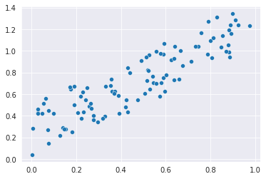
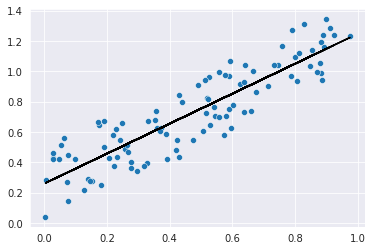

We've seen several aspects of correlation coefficient in the [previous posts](https://hippocampus-garden.com/stats_correlation_bias/). The correlation coefficient treats two variables equally; they are symmetrical. When two variables are not symmetrical, that is, when you want to explain $y$ by $x$, correlation analysis alone is not sufficient. Instead, you might want to conduct **regression analysis**.

The simplest approach, **simple linear regression**, considers a single **explanatory variable** (**independent variable**) $x$ for explaining the **objective variable** (**dependent variable**) $y$.

$$
y = \beta_0+\beta_1x
$$

## Least Square Estimates

How to determin the coefficients $\beta_0$ and $\beta_1$ in the above equation? Given the paired data $\{(x_i,y_i)\}_{i=1}^n$, they are determined by the **method of least squares**. That is, they are chosen to minimize the sum of the squared error between the predicted $\hat{y}_i = b_0+b_1x_i$ and the actual $y_i$:

$$
\mathcal{L}(b_0,b_1) \coloneqq \sum_{i=1}^n \{ y_i - (b_0+b_1x_i) \}^2.
$$

Therefore, the **least squares estimates** are:

$$
\begin{gathered}
  \hat{\beta}_1 = \frac{S_{xy}}{S_{x}^2},\\
  \hat{\beta}_0 = \bar{y}-\beta_1\bar{x}.
\end{gathered}
$$

, where
$$
\begin{gathered}
  S_{xy} \coloneqq \frac{1}{n}\sum_{i = 1}^n (x_i - \overline{x})
(y_i - \overline{y}),\\
  S_{x}^2 \coloneqq \frac{1}{n}\sum_{i = 1}^n (x_i - \overline{x})^2,\\
  S_{y}^2 \coloneqq \frac{1}{n}\sum_{i = 1}^n (y_i - \overline{y})^2.
\end{gathered}
$$

### Proof
$$
\mathcal{L}(b_0,b_1) = \sum_{i=1}^n \{ (y_i-\bar{y}) + (\bar{y}-b_0-b_1\bar{x}) -b_1(x_i-\bar{x})\}^2
$$

Considering $\sum_{i=1}^n(x_i-\bar{x})=0$ and $\sum_{i=1}^n(y_i-\bar{y})=0$,

$$
\begin{aligned}
  \mathcal{L}(b_0,b_1) &=  \sum_{i=1}^n(y_i-\bar{y})^2 + n(\bar{y}-b_0-b_1\bar{x})^2 \\
  & \quad + b_1^2\sum_{i=1}^n(x_i-\bar{x})^2 - 2b_1\sum_{i=1}^n(x_i-\bar{x})(y_i-\bar{y})\\
  &= nS_{y}^2 + n(\bar{y}-b_0-b_1\bar{x})^2 + nb_1^2S_{x}^2 - 2nb_1S_{xy}\\
  &= nS_x^2\Bigl(b_1 - \frac{S_{xy}}{S_x^2}\Bigr)^2 + n(\bar{y}-b_0-b_1\bar{x})^2 + n\Bigl(S_y^2 - \frac{S_{xy}^2}{S_x^2}\Bigr)
\end{aligned}
$$

From the above calculation, $\mathcal{L}(b_0,b_1)$ takes its minimum value when $b_1=S_{xy}/S_x^2$ and $b_0 = \bar{y}-b_1\bar{x}$.

## Coefficient of Determination
Now we have the predicted values $\{\hat{y}_i\}_{i=1}^n$. How good are these predictions? To evaluate the goodness, **coefficient of determination** $R^2$ is frequently used.

$$
R^2 \coloneqq \frac{ESS}{TSS} = \frac{ \sum_{i=1}^n (\hat{y_i}-\bar{y})^2}{\sum_{i=1}^n (y_i-\bar{y})^2}.
$$

The coefficient of determination is the ratio of ESS (explained sum of squares) to TSS (total sum of squares). As you may imagin from its notation, *the coefficient of determination $R^2$ is the square of the Pearson correlation coefficient $r$*.

### Proof
Using the equation: $\hat{y}_i - \bar{y} = \beta_1(x_i - \bar{x})$,


$$
\begin{aligned}
  R^2 &= \frac{ \sum_{i=1}^n (\beta_1(x_i - \bar{x}))^2}{\sum_{i=1}^n (y_i-\bar{y})^2}\\
  &= \frac{n\beta_1^2 S_x^2}{nS_y^2}\\
  &= \frac{S_{xy}^2}{S_{x}^4}\frac{S_x^2}{S_y^2}\\
  &= \Bigl( \frac{S_{xy}}{S_xS_y} \Bigr)^2\\
  &= r^2.
\end{aligned}
$$

## Experiment
Lastly, let's confirm that $R^2=r^2$, introducing how to use linear regression with Python. As done in [the previous post](https://hippocampus-garden.com/stats_rank_correlation/), I generated 100 pairs of correlated random samples (x and y).

```python
import numpy as np
import matplotlib.pyplot as plt
import seaborn as sns

sns.set_style("darkgrid")

n = 100
x = np.random.rand(n)
y = x + 0.5*np.random.rand(n)
```



Scikit-learn implements linear regression as `LinearRegression` and coefficient of determination as `r2_score`. After fitting the model, we can plot the regression line like below:

```python
from sklearn.linear_model import LinearRegression
from sklearn.metrics import r2_score

model = LinearRegression()
model.fit(x.reshape(-1, 1), y.reshape(-1, 1))

sns.scatterplot(x, y)
plt.plot(x, model.predict(x.reshape(-1, 1)), color="k")
```



As expected, $R^2=r^2$ is confirmed.

```python
r2_score(y, model.predict(x.reshape(-1, 1)))
# >> 0.7922606713476185

np.corrcoef(x, y)[0,1]**2
# >> 0.7922606713476184
```

<br/>

## References
[1] 倉田 博史, 星野 崇宏. "[入門統計解析](https://www.saiensu.co.jp/search/?isbn=978-4-88384-140-0&y=2009)"（第3章）. 新世社. 2009.  