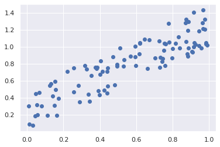

The correlation coefficient is a familiar statistic that we see everywhere from news articles to scientific papers, but there are several variations whose differences should be noted. This post aims to recap the definitions of those common correlation coefficients, with the derivation of the equation and experiment regarding Spearman rank correlation coefficient. 

## Pearson Correlation Coefficient
For measuring the *linear correlation* between two sets of data, it is common to use **Pearson product-moment correlation coefficient**. **Pearson correlation coefficient** is the most well-known measure for correlation.  When the term "correlation coefficient" is used without further information, it usually refers to this type of definition. Given paired data $\{(x_i,y_i)\}_{i=1}^n$, **Pearson's r** is defined as:

$$
r = \frac{{\displaystyle \sum_{i = 1}^n (x_i - \overline{x})
(y_i - \overline{y})}}{\sqrt{{\displaystyle \sum_{i = 1}^n 
(x_i - \overline{x})^2}} \sqrt{{\displaystyle \sum_{i = 1}^n 
(y_i - \overline{y})^2}}} ,
$$

where $\bar{x}$ and $\bar{y}$ are the sample means. The numerator is the covariance between $x_i$ and $y_i$ and the denominator is the product of their standard deviations.

The correlation coefficient ranges from $−1$ to $1$. $r=\plusmn1$ is observed if and only if all the data points lie on a line (**perfect correlation**).

## Spearman Rank Correlation Coefficient
When the data is *ordinal variable*, you should consider rank correlation. One of the common measures for rank correlation is **Spearman rank correlation coefficient**, which is simply the Pearson correlation coefficient between the two rank variables. For the $n$ paired ranks $\{(a_i,b_i)\}_{i=1}^n$ for the raw scores $\{(x_i,y_i)\}_{i=1}^n$, the **Spearman's ρ** is defined as:

$$
\rho = \frac{{\displaystyle \sum_{i = 1}^n (a_i - \overline{a})
(b_i - \overline{b})}}{\sqrt{{\displaystyle \sum_{i = 1}^n 
(a_i - \overline{a})^2}} \sqrt{{\displaystyle \sum_{i = 1}^n 
(b_i - \overline{b})^2}}} ,
$$

where $\bar{a}$ and $\bar{b}$ are the sample means. This definition can be simplfied to:

$$
\rho = 1 - \frac{6}{n(n^2 - 1)}\sum_{i = 1}^n (a_i-b_i)^2.
$$

It takes the value 1 if the order of the raw scores all match, and the value -1 if the order is completely reversed.

### Proof for the Simplified Form
Since $a_i$ and $b_i$ are ranks of $n$ scores, following equations hold.

$$
\begin{gathered}
\sum_{i = 1}^n a_i = \sum_{i = 1}^n b_i=\sum_{i = 1}^n i = \frac{n(n+1)}{2}\\
\sum_{i = 1}^n a_i^2 = \sum_{i = 1}^n b_i^2 = \sum_{i = 1}^n i^2= \frac{n(n+1)(2n+1)}{6}\\
\overline{a} = \overline{b} = \frac{1}{n} \sum_{i = 1}^n i=  \frac{n+1}{2}
\end{gathered}
$$


Using the above equations, we have:

$$
\begin{aligned}
  \rho &= \frac{{\displaystyle \sum_{i = 1}^n (a_i - \overline{a})
(b_i - \overline{b})}}{\sqrt{{\displaystyle \sum_{i = 1}^n 
(a_i - \overline{a})^2}} \sqrt{{\displaystyle \sum_{i = 1}^n 
(b_i - \overline{b})^2}}} \\
&= \frac{{\displaystyle \sum_{i = 1}^n \Bigl(a_i - \frac{n+1}{2}\Bigr)
\Bigl(b_i - \frac{n+1}{2}\Bigr)}}{\sqrt{{\displaystyle \sum_{i = 1}^n 
\Bigl(a_i - \frac{n+1}{2}\Bigr)^2}} \sqrt{{\displaystyle \sum_{i = 1}^n 
\Bigl(b_i - \frac{n+1}{2}\Bigr)^2}}} \\
&= \frac{
  {\displaystyle \sum_{i = 1}^n \Bigl(a_ib_i - \frac{n+1}{2}(a_i+b_i) +  \frac{(n+1)^2}{4}\Bigr)}}
  {
    \sqrt{{\displaystyle \sum_{i = 1}^n \Bigl(a_i^2 - (n+1)a_i + \frac{(n+1)^2}{4}\Bigr)}} 
    \sqrt{{\displaystyle \sum_{i = 1}^n \Bigl(b_i^2 - (n+1)b_i + \frac{(n+1)^2}{4}\Bigr)}}
  } \\
&= \frac{
  {\displaystyle \sum_{i = 1}^n a_ib_i - \frac{n(n+1)^2}{2} + \frac{n(n+1)^2}{4}}
}{
  {\displaystyle \frac{n(n+1)(2n+1)}{6} - \frac{n(n+1)^2}{2} + \frac{n(n+1)^2}{4}}
}\\
&= \frac{
  12{\displaystyle \sum_{i = 1}^n a_ib_i - 3n(n+1)^2}
}{
  (n-1)n(n+1)
}.
\end{aligned}
$$

Here, let's consider the sum of the squared difference between $a_i$ and $b_i$:

$$
\sum_{i = 1}^n (a_i-b_i)^2 = -2\sum_{i = 1}^na_ib_i +\frac{n(n+1)(2n+1)}{3}.
$$

Therefore,

$$
\begin{aligned}
  \rho &= \frac{
  -6{\displaystyle \sum_{i = 1}^n (a_i-b_i)^2 +2n(n+1)(2n+1)- 3n(n+1)^2}
}{
  (n-1)n(n+1)
}\\
&= 1 - \frac{6}{n(n^2 - 1)}\sum_{i = 1}^n (a_i-b_i)^2 ~~~\blacksquare
\end{aligned}
$$

### Experiment
Here, I conducted a quick experiment to confirm that the Pearson's r of the ranks is equivalent to Spearman's ρ. I generated 100 pairs of random samples (`x` and `y`) and calculated several types of correlation coefficients.

```python
import numpy as np
import matplotlib.pyplot as plt
import seaborn as sns

sns.set_style("darkgrid")

n = 100
x = np.random.rand(n)
y = x + 0.5*np.random.rand(n)
```



```python
from scipy import stats
print(stats.pearsonr(x, y))
# >> (0.8863388430290433, 1.5374433582768292e-34)

print(stats.spearmanr(x, y))
# >> SpearmanrResult(correlation=0.8835643564356436, pvalue=4.677602781530847e-34)

print(stats.kendalltau(x, y))
# >> KendalltauResult(correlation=0.6981818181818182, pvalue=7.62741751146521e-25)
```

By converting `x` and `y` to ranks, it is confirmed that `stats.spearmanr(x, y)` is equal to `stats.pearsonr(a, b)`.

```python
a = len(x) - stats.rankdata(x) + 1
b = len(y) - stats.rankdata(y) + 1
print(stats.pearsonr(a, b))
# >> (0.8835643564356437, 4.677602781530673e-34)
```
<br/>

## Kendall Rank Correlation Coefficient
**Kendall rank correlation coefficient** is another common type of rank correlation efficients. Among $N$ pairs of indices $\{(i,j)\}_{i<j}$, it considers the number of *concordant pairs* $P$, the number of *discordant pairs* $Q$, and ties $T_x$ and $T_y$.

$$
\begin{gathered}
P = |\{ (i,j)~|~ 0\leq i <j<n, ~ (x_j-x_i)(y_j-y_i)>0 ) \}|\\
Q = |\{ (i,j)~|~ 0\leq i <j<n, ~ (x_j-x_i)(y_j-y_i)<0 ) \}|\\
T_x= |\{ (i,j)~|~ 0\leq i <j<n, ~ x_i=x_j ) \}|\\
T_y= |\{ (i,j)~|~ 0\leq i <j<n, ~ y_i=y_j ) \}|\\
N = \frac{n(n-1)}{2}
\end{gathered}
$$

Given these quantities, **Kendall's τ (a)** is defined as:

$$
\tau_a = \frac{P - Q}{N} .
$$

As well as Spearman's ρ, Kendall's τ (a) takes the value 1 if the order of the raw scores all match, and the value -1 if the order is completely reversed.

**Kendall's τ (b)** cares about the case where ties are around.

$$
\tau_b = \frac{P - Q}{\sqrt{N - T_x}\sqrt{N - T_y}}
$$

## Goodman and Kruskal's Gamma
Simlarly, **Goodman and Kruskal's γ** is defined as:

$$
\gamma = \frac{P - Q}{P + Q}.
$$

When there are no ties (i.e. $T_x=T_y=0$), Kendall's $\tau_a$ and $\tau_b$ are equal to Goodman and Kruskal's $\gamma$:
$$
\tau_a=\tau_b=\gamma.
$$

## References
[1] 東京大学教養学部統計学教室 編. "[統計学入門](http://www.utp.or.jp/book/b300857.html)"（第3章）. 東京大学出版会. 1991.  
[2] [統計WEB － 統計学、調べる、学べる、BellCurve（ベルカーブ）](https://bellcurve.jp/statistics/)  
\* This "statistics dictionary" covers a range of concepts with LaTeX codes.  
[3] [相関（と回帰）](https://oku.edu.mie-u.ac.jp/~okumura/stat/correlation.html)  
[4] [Correlation coefficient - Wikipedia](https://en.wikipedia.org/wiki/Correlation_coefficient)