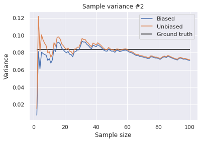
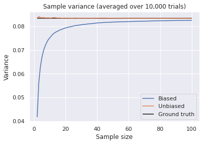

Are you wondering what unbiased sample variance is? Or, why it is devided by n-1? If so, this post answers them with a simple simulation and a more solid proof.

Consider you have $n$ i.i.d. samples: $X_1,...,X_n$, and you want to estimate the **population mean** $\mu$ and the **population variance** $\sigma ^2$ from these samples. The **sample mean** is defined as:

$$
\bar{X} = \frac{1}{n}\sum_{i=1}^nX_i .
$$

This looks quite natural. But what about the **sample variance**? This is defined as:

$$
s^2 = \frac{1}{n-1}\sum_{i=1}^n (X_i-\bar{X})^2 .
$$

When I first saw this, it looked wierd. Where does $n-1$ come from? The professor said "this term makes the estimation unbiased", which I didn't quite understand. But now, thanks to Python, it's much clearer than it was then. So, in this post, I'll make a concise and clear explanations of unbiased variance.

## Visualizing How Unbiased Variance is Great
Consider a "biased" version of variance estimator:

$$
S^2 = \frac{1}{n}\sum_{i=1}^n (X_i-\bar{X})^2.
$$

In fact, as well as unbiased variance, this estimator converges to the population variance as the sample size approches infinity. However, the "biased variance" estimates the variance slightly smaller.

Let's see how these esitmators are different. Suppose you are drawing samples, one by one up to 100, from a **continuous uniform distribution** $\mathcal{U}(0,1)$. The population mean is $0.5$ and the population variance is

$$
\int_0^1 (x-0.5)^2~\mathrm{d}x = \frac{1}{12} = 0.0833\ldots .
$$

I simulated estimating the population variance using the above two estimators in the following code.

```python
import numpy as np
import matplotlib.pyplot as plt
import seaborn as sns
sns.set_style("darkgrid")

n = 100
rands = np.random.rand(n)
biased = []
unbiased = []
for i in range(2, n+1):
  biased.append(np.var(rands[:i], ddof=0))
  unbiased.append(np.var(rands[:i], ddof=1))

x = np.arange(2, n+1)
plt.plot(x, biased, label="Biased")
plt.plot(x, unbiased, label="Unbiased")
plt.hlines(1/12, x[0], x[-1], label="Ground truth")
plt.xlabel("Sample size")
plt.ylabel("Variance")
plt.legend()
plt.title("Sample variance #1");
```


This code gives different results every time you execute it.



Indeed, both of these estimators seem to converge to the population variance $1/12$ and the biased variance is slightly smaller than the unbiased estimator. However, from these results, it's hard to see which is more "unbiased" to the ground truth. So, I repeated this experiment 10,000 times and plotted the average performance in the figure below.

```python
n = 100
k = 10000
rands = np.random.rand(n, k)
biased = []
unbiased = []
for i in range(2, n+1):
  biased.append(np.var(rands[:i], axis=0, ddof=0).mean())
  unbiased.append(np.var(rands[:i],  axis=0, ddof=1).mean())

x = np.arange(2, n+1)
plt.plot(x, biased, label="Biased")
plt.plot(x, unbiased, label="Unbiased")
plt.hlines(1/12, x[0], x[-1], label="Ground truth")
plt.xlabel("Sample size")
plt.ylabel("Variance")
plt.legend()
plt.title("Sample variance (averaged over 10,000 trials)");
```



Now it's clear how the biased variance is biased. Even when there are 100 samples, its estimate is expected to be 1% smaller than the ground truth. In contrast, the unbiased variance is actually "unbiased" to the ground truth.

## Proof
Though it is a little complicated, here is a formal explanation about the above experiment. Recall that the variance of sample mean follows this equation:

$$
\begin{aligned}
V[\bar{X}] &= V\Biggl[\frac{1}{n}\sum_{i=1}^nX_i\Biggr]\\
&= \frac{1}{n^2}V\Biggl[\sum_{i=1}^nX_i\Biggr]\\
&= \frac{1}{n^2}\sum_{i=1}^nV[X_i]\\
&= \frac{1}{n^2}nV[X]\\
&= \frac{1}{n}V[X].
\end{aligned}
$$

Thus, 

$$
\begin{aligned}
E[S^2]
&= E\Biggl[\frac{1}{n}\sum_{i=1}^n (X_i-\bar{X})^2 \Biggr]\\
&= E\Biggl[ \frac{1}{n}\sum_{i=1}^n \Bigl((X_i-\mu) -(\bar{X}-\mu) \Bigr)^2 \Biggr] \\
&= E\Biggl[ \frac{1}{n}\sum_{i=1}^n \Bigl((X_i-\mu)^2 -2(X_i-\mu)(\bar{X}-\mu) +(\bar{X}-\mu)^2 \Bigr) \Biggr] \\
&= E\Biggl[ \frac{1}{n}\sum_{i=1}^n (X_i-\mu)^2\Biggr] \\
  & \quad- E\Biggl[\frac{2}{n}\sum_{i=1}^n (X_i-\mu)(\bar{X}-\mu) \Biggr] \\
  & \quad+ E\Biggl[\frac{1}{n}\sum_{i=1}^n (\bar{X}-\mu)^2 \Biggr] \\    

&=  \frac{1}{n}\sum_{i=1}^n E[(X_i-\mu)^2] \\
 & \quad- E\Biggl[\frac{2}{n}(\bar{X}-\mu)\sum_{i=1}^n (X_i-\mu) \Biggr] \\
 & \quad + E\Biggl[\frac{1}{n}n (\bar{X}-\mu)^2 \Biggr]\\
&= \frac{1}{n}nV[X] - E\Biggl[\frac{2}{n}(\bar{X}-\mu)n (\bar{X}-\mu) \Biggr] + E\Biggl[ (\bar{X}-\mu)^2 \Biggr]\\
&= V[X] -  E\Biggl[(\bar{X}-\mu)^2 \Biggr]\\
&= V[X] - V[\bar{X}]\\
&= V[X] -  \frac{1}{n}V[X]\\
&= \frac{n-1}{n}\sigma^2,
\end{aligned}
$$

which means that the biased variance estimates the true variance $(n-1)/n$ times smaller. To correct this bias, you need to estimate it by the unbiased variance:

$$
s^2 = \frac{1}{n-1}\sum_{i=1}^n (X_i-\bar{X})^2 ,
$$

then,

$$
E[s^2] = \sigma^2.
$$


Here, $n-1$ is a quantity called **degree of freedom**. In the above example, the samples are subject to the equation:

$$
X_1+X_2+\ldots+X_n = n\bar{X}.
$$

So, given the sample mean $\bar{X}$, the $n$ samples have only $n-1$ degrees of freedom.

## Intuition
The bias of the biased variance can be explained in a more intuitive way. By definition, the sample mean is always closer to the samples than the population mean, which leads to the smaller variance estimation if devided by the sample size $n$. For more explanations, I'd recommend this video:

<iframe width="560" height="315" src="https://www.youtube.com/embed/sHRBg6BhKjI?start=214" frameborder="0" allow="accelerometer; autoplay; clipboard-write; encrypted-media; gyroscope; picture-in-picture" allowfullscreen></iframe>

<br/>

## References
[1] 東京大学教養学部統計学教室 編. "[統計学入門](http://www.utp.or.jp/book/b300857.html)"（第9章）. 東京大学出版会. 1991.