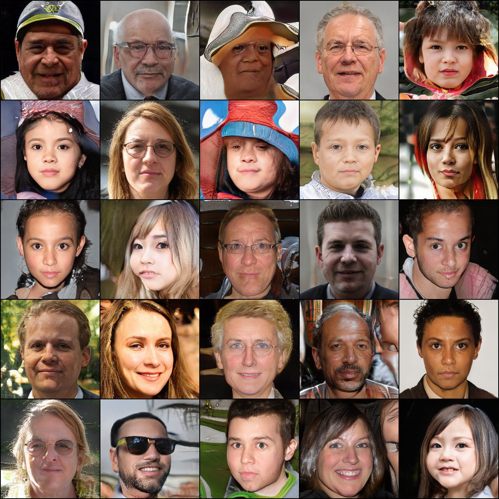

**StyleGAN2** [1] is famous for its success in generating high-resolution human face images that we can't tell apart from real images. For example, can you believe this image was generated by AI?


\* You can get face images generated by StyleGAN2 [here](https://thispersondoesnotexist.com/).  

Have you ever thought of training StyleGAN2 yourself to generate other kinds of pictures, and probably gave it up due to the limited machine resources? Actually, the authors trained it on **NVIDIA DGX-1** with 8 Tesla V100 GPUs for **9 days**. That's too expensive for individual researchers and practitioners! But don't worry. In this post, I demonstrate how to downsize StyleGAN2 to train from scratch **on a single GPU**, modifying [this PyTorch implementation](https://github.com/rosinality/stylegan2-pytorch).

Before reading this post, please make sure you really have to train it from scratch. If you want to generate 1024x1024 anime face images, you can fine-tune StyleGAN2 pre-trained on FFHQ. There are some pre-trained models for cars, cats, and so on, which are available in [the official repository](https://github.com/NVlabs/stylegan2).

## Dataset
Due to the limitation of the machine resources (I assume a single GPU with 8 GB RAM), I use the FFHQ dataset downsized to 256x256.  

First, download the original images using [the download script](https://github.com/NVlabs/ffhq-dataset). It will take several hours depending on your network capacity and result in about 80 GB.

```bash
python download_ffhq.py --images
```

Then, resize the images to 256x256 (e.g., with Pillow). 

## Training Tips
Based on [the great PyTorch implementation](https://github.com/rosinality/stylegan2-pytorch) by [Kim Seonghyeon](https://github.com/rosinality), I downsize it to train on a single GPU. For basic usage of this repository, please refer to README. Here I focus on implicit tips.

### Requirements
You need [LMDB](https://lmdb.readthedocs.io/en/release/) installed to create a database for the collection of images. Also, as mentioned in the [issue](https://github.com/rosinality/stylegan2-pytorch/issues/5), the versions of CUDA and PyTorch (10.2 and 1.3.1, respectively) are critical.

### Reduce the Model Size
To reduce the memory consumption, I decrease 1) the number of channels in the generator and discriminator, 2) resolution of the images, 3) latent size, and 4) the number of samples generated at a time.  

You can change the number of channels in `model.py`.

```python:title=model.py
...

class Generator(nn.Module):
    def __init__(
        self,
        size,
        style_dim,
        n_mlp,
        channel_multiplier=2,
        blur_kernel=[1, 3, 3, 1],
        lr_mlp=0.01,
    ):
        super().__init__()

        self.size = size

        self.style_dim = style_dim

        layers = [PixelNorm()]

        for i in range(n_mlp):
            layers.append(
                EqualLinear(
                    style_dim, style_dim, lr_mul=lr_mlp, activation='fused_lrelu'
                )
            )

        self.style = nn.Sequential(*layers)

        self.channels = {
            4: 256, # originally 512
            8: 256, # originally 512
            16: 256, # originally 512
            32: 256, # originally 512
            64: 256 * channel_multiplier,
            128: 128 * channel_multiplier,
            256: 64 * channel_multiplier,
            512: 32 * channel_multiplier,
            1024: 16 * channel_multiplier,
        }
...

class Discriminator(nn.Module):
    def __init__(self, size, channel_multiplier=2, blur_kernel=[1, 3, 3, 1]):
        super().__init__()

        channels = {
            4: 256, # originally 512
            8: 256, # originally 512
            16: 256, # originally 512
            32: 256, # originally 512
            64: 256 * channel_multiplier,
            128: 128 * channel_multiplier,
            256: 64 * channel_multiplier,
            512: 32 * channel_multiplier,
            1024: 16 * channel_multiplier,
        }

...
```

In `train.py`, you can change the resolution, latent size, and the number of samples generated at a time. The resolution is set to 256x256 by default. `args.n_samples` means the batch size during inference.

```python:title=train.py
if __name__ == '__main__':
    device = 'cuda'

    parser = argparse.ArgumentParser()

    parser.add_argument('path', type=str)
    parser.add_argument('--iter', type=int, default=800000)
    parser.add_argument('--batch', type=int, default=16)
    parser.add_argument('--n_sample', type=int, default=25) # originally 64
    parser.add_argument('--size', type=int, default=256)

...

    args.latent = 32 # originally 512
    args.n_mlp = 8

...
```  

### Log
Since the training steps are as many as 800k, sampling every 100 steps results in 8,000 images! I recommend you also change the sampling interval in `train.py`

```python:title=train.py
def train(args, loader, generator, discriminator, g_optim, d_optim, g_ema, device):
    
...

            if i % 1000 == 0: # originally 100
                with torch.no_grad():
                    g_ema.eval()
                    sample, _ = g_ema([sample_z])
                    utils.save_image(
                        sample,
                        f'sample/{str(i).zfill(6)}.png',
                        nrow=int(args.n_sample ** 0.5),
                        normalize=True,
                        range=(-1, 1),
                    )

```

The metrics such as loss and perceptual path length (PPL) can be logged by Weights & Biases!

> train.py supports Weights & Biases logging. If you want to use it, add `--wandb` arguments to the script.

Finally, run the command like the following:

```bash
train.py --batch BATCH_SIZE LMDB_PATH --wandb
```

It took almost 2 weeks in my environment, but halving the number of training steps won't really harm the quality of generated images.

## Results
After training for 800k steps, StyleGAN2 generates nice images! They sometimes have strange parts, but more than half of them look great to me.



This is how StyleGAN2 learns to generate human face images. Note that the time scale is not linear.
<iframe width="560" height="315" src="https://www.youtube.com/embed/dR3-184rff4" frameborder="0" allow="accelerometer; autoplay; encrypted-media; gyroscope; picture-in-picture" allowfullscreen></iframe>

## References
[1] Karras, Tero, et al. "[Analyzing and improving the image quality of stylegan](https://arxiv.org/abs/1912.04958)." *arXiv preprint arXiv:1912.04958* (2019).