Since its debut in 2018, **StyleGAN** attracted lots of attention with its capacity to generate super realistic high resolution images of human face, not only from AI researchers but also from artists or even lawyers. At the time of this writing, the original paper [1] has 2,548 citations and its successor, **StyleGAN2** [2], has 1,065. This means there are increasing number of application works. To prevent myself from getting overwhelmed, I'm writing this post and trying to overlook this research field in an organized way. Of course it's impossible to read thousands of papers, so hereafter I'll focus on the papers that relate to image manipulation including GAN inversion and 3D control.

## StyleGANs: A Quick Recap
First of all, let's briefly recall what was StyleGAN and the key updates of its subsequent versions.

### StyleGAN
The architecture of the original StyleGAN generator was novel in three ways:
- Generates images in a two-stage fashion; first map the latent code to an itermediate latent space with the **mapping network** and then feed them to each layer of the **synthesis network**, rather than directly inputs the latent code to the first layer only. 
- Applies **AdaIN** [3] layers iteratively to take in the intermediate latent code as "style".
- Injects explicit noise inputs to deal with stochastic variations such as hair and freckles.

These are best described in the figure below.

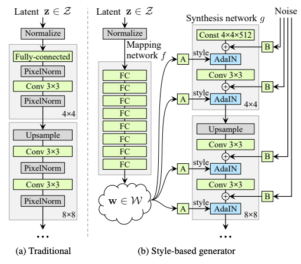

<small>Image taken from [1].</small>

With these features combined, StyleGAN can generate images that are almost impossible to dicriminate for humans.

<small>Image taken from [1].</small>

This quality was so surprising that many people rushed to train StyleGAN with their own datasets to generate cats, *ukiyoe*, and pokémons (see [Awesome Pretrained StyleGAN](https://github.com/justinpinkney/awesome-pretrained-stylegan) for details).

StyleGAN has another interesting feature called "**style mix**". With two latent codes $\mathbb{z}_A$ and $\mathbb{z}_B$ (and corresponding $\mathbb{w}_A$ and $\mathbb{w}_B$), one can switch the inputs from $\mathbb{w}_B$ to $\mathbb{w}_A$ in the middle of the synthesis network and get a mixed image that has the coarse styles from B and the fine styles from A.

<small>Image taken from [1].</small>

### StyleGAN2
The human face images generated by StyleGAN look convincing enough, but if you have a careful look, you may notice some unnatural artifacts. StyleGAN2 [2] made some architectual optimizations to StyleGAN to generate even more realistic images, though I don't go further in the technical details here.

One of the most important updates of StyleGAN2 is that by regularizing the **perceptual path length**, it became easier to invert; Now it is possible to encode a given image (generated or real) to the intermediate style space $\mathcal{W}$.

<small>Image taken from [2].</small>

This paved the way for **GAN inversion** -- projecting an image to the GAN's latent space where features are semantically disentangled as is done by VAE. As we'll see in the next section, StyleGAN2 is currently the most popular variant in terms of the number of application works.

### StyleGAN3 (Alias-Free GAN)
In June 2021, the Tero Karras team published **Alias-Free GAN** (later called **StyleGAN3**) to address the undesirable aliasing effect that leads to some details glued to the image's absolute coordinates [4]. 

A video is worth a thousand words. [The official video](https://nvlabs-fi-cdn.nvidia.com/_web/stylegan3/videos/video_0_ffhq_cinemagraphs.mp4) clearly demonstrates the “texture sticking” issue and that StyleGAN3 solves it perfectly. Now it can be trained on unaligned images like FFHQ-U. For StyleGAN3 applications, there are only a few yet. 

## StyleGAN Inversion
GAN Inversion is a technique to invert a given image back to the latent space, where semantic editing is easily done. For example, when you get a latent code $\mathbb{z}$ of your portrait $\mathbb{x}$, you can generate a youger version by adding the "decrease age" vector $\mathbb{n}$ and feeding it to the generator.

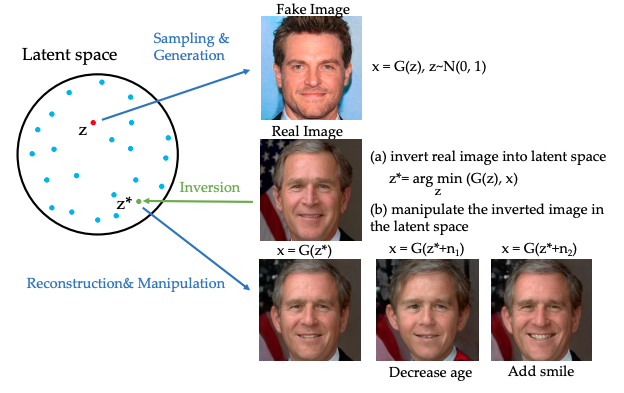

<small>Image taken from [5].</small>

There are three approaches to GAN inversion:

- **Optimization-based** methods search for the latent code that minimizes the reconstruction loss using gradient descent or other iterative algorithms. They generally lead to the better reconstruction results but take much longer time due to the iterative process. 
- **Learning-based** methods train an encoder that inverts images to the latent space. They are generally faster and less accurate than optimization-based counterparts.
- **Hybrid** methods of these two. Typically, they first invert a given image to the latent code with a learning-based encoder and then optimize it further. This is expected to reduce the time for optimization and the quality of inversion.

Let's have a look at some examples.

### Image2StyleGAN
**Image2StyleGAN** [6] is a simple but effective implementation of the optimization-based approach. It minimizes the sum of the perceptual loss and L2 loss to get the embedded latent code.

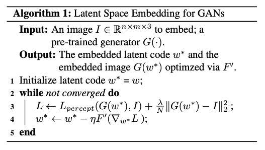

<small>Image taken from [6].</small>

The authors noticed that the 512-dimensional intermediate latent space $\mathcal{W}$ is not informative enough to restore the input image. So, they extended the latent space to $\mathcal{W}+$, which is a concatenation of 18 different $\mathbb{w} \in \mathcal{W}$ vectors, one for each input to the StyleGAN's AdaIN layers. The resulting $\mathcal{W}+$ space is well disentangled and allows multiple face image editing applications including style transfer and expression transfer. This feature was further explored in **Image2StyleGAN++** [7].

### pSp
The learning based approach **pSp** (**pixel2style2pixel**) is a general image-to-image translation framework [8]. The encoder is trained to minimize the reconstruction loss (the sum of L2, LPIPS, identity, and latent code regularization loss) and directly translates the input image to the extended latent code ($\in \mathcal{W}+$).

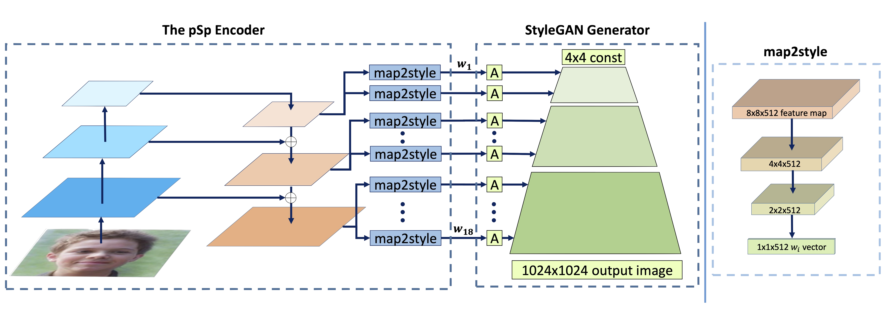

<small>Image taken from [8].</small>

The pSp encoder can be trained on images not represented in the StyleGAN domain. In that way, pSp can generate images conditioned on inputs like sketches and segmentation masks.

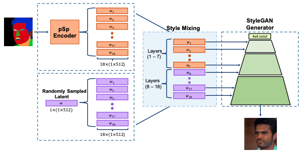

<small>Image taken from [8].</small>

### e4e
**e4e** (**Encoder for Editing**) is a learning-based encoder specifically designed for semantic editing after inversion [9]. 

First, the authors summarized the variations of the intermediate latent space $\mathcal{W}$ and the extended $\mathcal{W}+$. They use $\cdot^k$ notation for layer extention and explicitly denote $\mathcal{W}_*$ when it is not the equal distribution to $\mathcal{W}$. Now, four variations in the table below should be considered. The former $\mathcal{W}+$ space is now $\mathcal{W}^k$ or $\mathcal{W}^k_*$ depending on its distribution.

|                   | Individual style codes are limited to $\mathcal{W}$ | Same style code in all layers |
| :---------------: | :-------------------------------------------------: | :---------------------------: |
|   $\mathcal{W}$   |                          ✅                          |               ✅               |
|  $\mathcal{W}^k$  |                          ✅                          |                               |
|  $\mathcal{W}_*$  |                                                     |               ✅               |
| $\mathcal{W}^k_*$ |                                                     |                               |

Based on the above definition, the authors shed light on **distortion-editability tradeoff** and  **distortion-perception tradeoff**. That is, inverting to $\mathcal{W}^k_*$ space leads to the less distorted (less reconstruction loss) but less realistic and harder to edit results than inverting to $\mathcal{W}$. The figure below depicts the distortion-perception tradeoff.

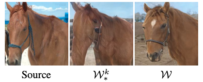

<small>Image taken from [9].</small>

e4e employs the pSp's architecure but is trained with a control of these tradeoffs by putting $\mathcal{W}^k_*$ closer to $\mathcal{W}^k$ and $\mathcal{W}_*$. The editability-aware encoder realizes good reconstruction and semantic editing at the same time.

<small>Image taken from [9].</small>

### ReStyle
To improve the reconstruction accuracy of pSp and e4e, **ReStyle** is tasked with predicting a residual of the current estimate to the target [10]. It works with a negligible increase in inference time.

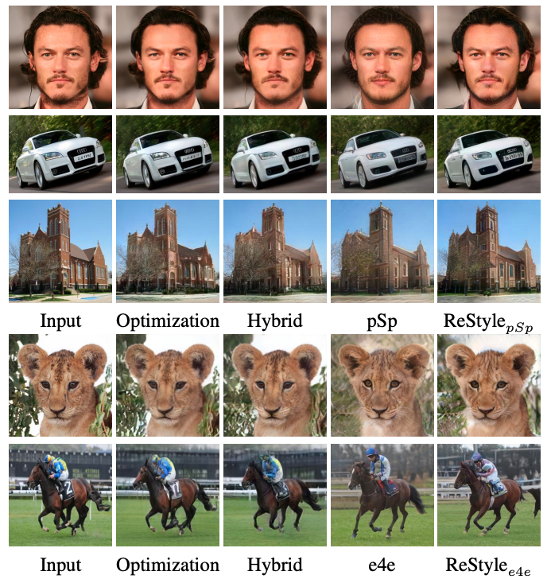

<small>Image taken from [10].</small>

## Semantic Editing
One we get a latent code, we can semantically edit the original image by moving to a certain direction in the latent space. There are mainly two types of inputs:
- Two images (source and reference), possibly with additional instruction including mask or attribute index.
- An image and an attirbute index. 

To put it simply, the former is more like a copy-pasting and the latter attempts control the output proactively. Plus, the latter assumes that the edits are made multiple times in an interactive fashion.

In this area, it is usually assumed that StyleGAN inversion algorithms are given.

### Image2StyleGAN++
**Image2StyleGAN++** extended Image2StyleGAN to take spatial masks as input to enable **local editing** [7]. For example, it can do image crossover:

<small>Image taken from [7].</small>

### Editing in Style
Thanks to the well-disentangled latent space, **k-means clustering** of the hidden layer activations of the StyleGAN generator provides an interesting insight: the clusters are semantically meaningful even they were decomposed in an unsupervised way [11].

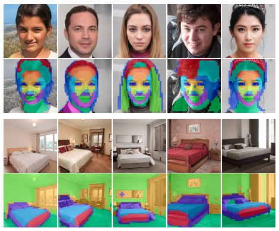

<small>Image taken from [11].</small>

Then, the contribution matrix (each element is the contribution of channel $c$ to cluster $k$) can be used to determine the style mixing coefficients. This enables to make a local edit (e.g., swapping eyes).

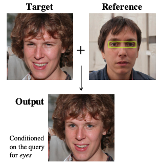

<small>Image taken from [11].</small>

### StyleFlow
To facilitate more fine-grained and editable encoding, **StyleFlow** replaces the fully connected layers in the mapping network with attribute-aware **continuous normalizing flow** (**CNF**) blocks [12].

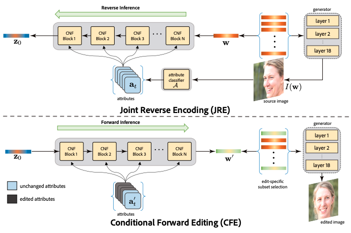

<small>Image taken from [12].</small>

The results are impressive. The two source images are *real* images (i.e., not generated by StyleGAN), and StyleFlow successfully translates these a little extreme samples.

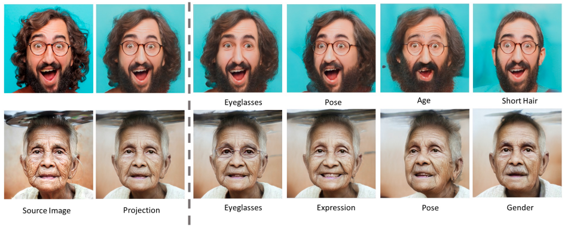

<small>Image taken from [12].</small>

### StyleSpace Analysis
Wu *et al.* quantitatively analyzed how disentangled StyleGAN's latent spaces are. Although the extended intermediate latent space $\mathcal{W}+$ is the de-facto choice, they discovered that the **style space** $\mathcal{S}$ is actually more disentangled than $\mathcal{W}+$ [13]. As depicted in the figure below, the style space $\mathcal{S}$ is spanned by a concatenation of affined intermideate latent codes.

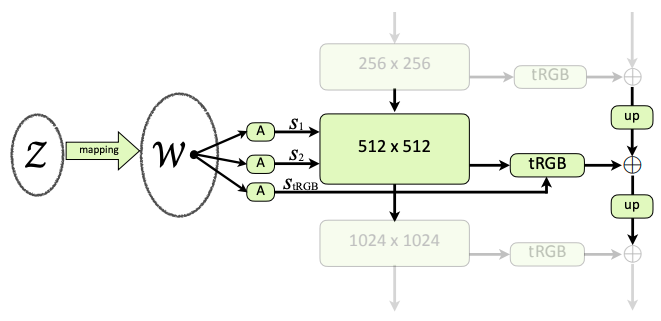

<small>Image taken from [13].</small>

The images below demonstrates how well the the style space $\mathcal{S}$ is disentangled. Each pair is the result of decreasing (-) and increasing (+) a single element of the style code. The numbers in the bottom left corner indicate the layer index and thee channel index. Note that the base image is a fake one generated by StyleGAN2.

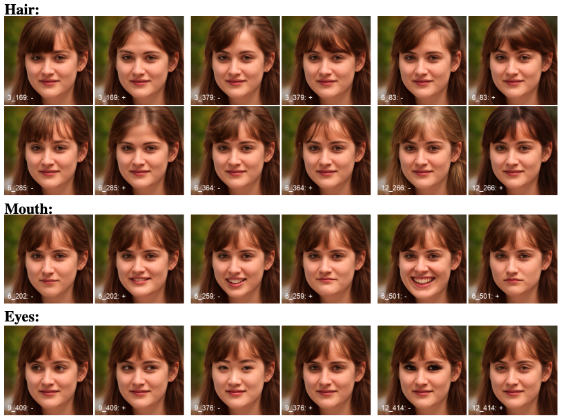

<small>Image taken from [13].</small>

### Retrieve in Style
**Retrieve in Style** extended Editing in Style to edit more global features such as pose and hairstyle [14].

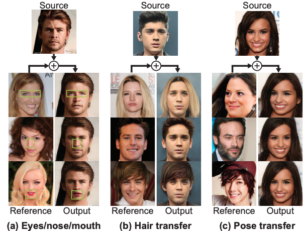

<small>Image taken from [14].</small>

As the title suggests, the authors also provide an algorithm for attribute-guided image retrieval.

## 3D Control
Among several types of semantic edits, reposing is the most difficult task as it often requires drastic and global changes. Thus, some works explicitly estimate 3D information and use it to perform visually natural reposing.

### StyleRig
**StyleRig** can control human face images generated by StyleGAN like a face rig, by translating the semantic editing on 3D meshes by **RigNet** [16] to the latent code of StyleGAN [15]. Here, StyleGAN is supposed to be pre-trained and RigNet can be trained in an self-supervised manner.

<small>Image taken from [16].</small>

### Pose with Style
**Pose with Style** exploits StyleGAN2 to perfome human reposing [17]. The target pose information is used as input, and the original image and coordinate information are injected as style. The invisible parts of the surface are inpainted for symmetry. It can also be applied to the virtual try-on task.

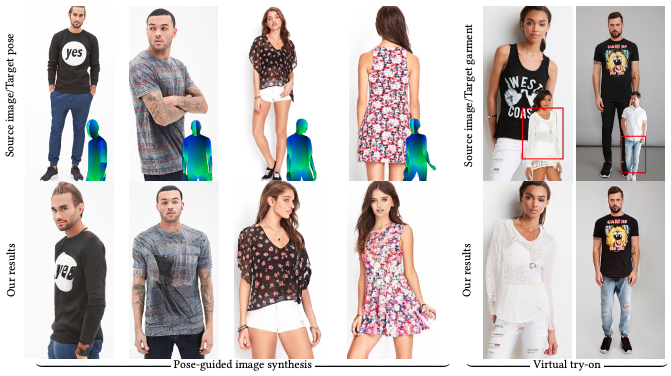

<small>Image taken from [17].</small>

### StyleNeRF
**StyleNeRF** integrates StyleGAN2 and **NeRF** (**neural radiance field**) [19] to generate 3D-consistent high-resolution images [18]. The inputs to the synthesis network are the intermediate latent code $\mathbb{w}$ and the low-resolution feature map generated by NeRF from the camera pose $\mathbb{p}$.

<small>Image taken from [18]. Left: original NeRF. Right: StyleNeRF.</small>

The figure below shows how StyleNeRF enjoys the benefits from both NeRF's 3D consistency and StyleGAN2's perception quality.

<small>Image taken from [18]. The leftmost is the low-resolution feature map generated by NeRF.</small>

## Text-guided Manipulation
Last but not least, text-guided manipulation is an intersting application of StyleGAN.

### StyleCLIP
Based upon **CLIP** (**contrastive language-image pretraining**) [21], the state-of-the-art text-to-image generator, **StyleCLIP** finds the optimal direction to move forward in the latent space so that the input image will be edited according to the instruction [20].

The text instructions could be diverse. Since CLIP has knowledge about certain proper nouns, it is possible to edit a face to be like "Emma Stone".

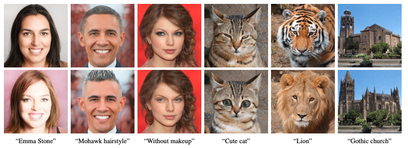

<small>Image taken from [20].</small>

## Concluding Remarks
The StyleGAN was so impactful that its applications are growing fast. I'm glad if this post help you have kind of perspective on them.

## References
[1] Tero Karras, Samuli Laine, Timo Aila. "[A Style-Based Generator Architecture for Generative Adversarial Networks](https://arxiv.org/abs/1812.04948)". *CVPR*. 2019.  
[2] Tero Karras, Samuli Laine, Miika Aittala, Janne Hellsten, Jaakko Lehtinen, Timo Aila. "[Analyzing and Improving the Image Quality of StyleGAN](https://arxiv.org/abs/1912.04958)
". *CVPR*. 2020.   
[3] Xun Huang, Serge Belongie. "[Arbitrary Style Transfer in Real-time with Adaptive Instance Normalization](https://arxiv.org/abs/1703.06868)". *ICCV*. 2017.  
[4] Tero Karras, Miika Aittala, Samuli Laine, Erik Härkönen, Janne Hellsten, Jaakko Lehtinen, Timo Aila. "[Alias-Free Generative Adversarial Networks](https://arxiv.org/abs/2106.12423)". *NeurIPS*. 2021.  
[5] Weihao Xia, Yulun Zhang, Yujiu Yang, Jing-Hao Xue, Bolei Zhou, Ming-Hsuan Yang. "[GAN Inversion: A Survey](https://arxiv.org/abs/2101.05278)". 2021.  
[6] Rameen Abdal, Yipeng Qin, Peter Wonka. "[Image2StyleGAN: How to Embed Images Into the StyleGAN Latent Space?](https://arxiv.org/abs/1904.03189)". *ICCV*. 2019.  
[7] Rameen Abdal, Yipeng Qin, Peter Wonka. "[Image2StyleGAN++: How to Edit the Embedded Images?](https://arxiv.org/abs/1911.11544)". *CVPR*. 2020.  
[8] Elad Richardson, Yuval Alaluf, Or Patashnik, Yotam Nitzan, Yaniv Azar, Stav Shapiro, Daniel Cohen-Or. "[Encoding in Style: A StyleGAN Encoder for Image-to-Image Translation](https://arxiv.org/abs/2008.00951)". *CVPR*. 2021.  
[9] Omer Tov, Yuval Alaluf, Yotam Nitzan, Or Patashnik, Daniel Cohen-Or. "[Designing an Encoder for StyleGAN Image Manipulation](https://arxiv.org/abs/2102.02766)". *SIGGRAPH*. 2021.  
[10] Yuval Alaluf, Or Patashnik, Daniel Cohen-Or. "[ReStyle: A Residual-Based StyleGAN Encoder via Iterative Refinement](https://arxiv.org/abs/2104.02699)". *ICCV*. 2021.  
[11] Edo Collins, Raja Bala, Bob Price, Sabine Süsstrunk. "[Editing in Style: Uncovering the Local Semantics of GANs](https://arxiv.org/abs/2004.14367)". *CVPR*. 2020.  
[12] Rameen Abdal, Peihao Zhu, Niloy Mitra, Peter Wonka. "[StyleFlow: Attribute-conditioned Exploration of StyleGAN-Generated Images using Conditional Continuous Normalizing Flows](https://arxiv.org/abs/2008.02401)". *SIGGRAPH*. 2021.  
[13] Zongze Wu, Dani Lischinski, Eli Shechtman. "[StyleSpace Analysis: Disentangled Controls for StyleGAN Image Generation](https://arxiv.org/abs/2011.12799)". *CVPR*. 2021.  
[14] Min Jin Chong, Wen-Sheng Chu, Abhishek Kumar, David Forsyth. "[Retrieve in Style: Unsupervised Facial Feature Transfer and Retrieval](https://arxiv.org/abs/2107.06256)". 2021.  
[15] Ayush Tewari, Mohamed Elgharib, Gaurav Bharaj, Florian Bernard, Hans-Peter Seidel, Patrick Pérez, Michael Zollhöfer, Christian Theobalt. "[StyleRig: Rigging StyleGAN for 3D Control over Portrait Images](https://arxiv.org/abs/2004.00121)". *CVPR*. 2020.  
[16] Zhan Xu , Yang Zhou , Evangelos Kalogerakis , Chris Landreth , Karan Singh. "[RigNet: Neural Rigging for Articulated Characters](https://arxiv.org/abs/2005.00559)". *SIGGRAPH*. 2020.  
[17] Badour AlBahar, Jingwan Lu, Jimei Yang, Zhixin Shu, Eli Shechtman, Jia-Bin Huang. "[Pose with Style: Detail-Preserving Pose-Guided Image Synthesis with Conditional StyleGAN](https://arxiv.org/abs/2109.06166)". *SIGGRAPH Asia*. 2021.  
[18] Jiatao Gu, Lingjie Liu, Peng Wang, Christian Theobalt. "[StyleNeRF: A Style-based 3D-Aware Generator for High-resolution Image Synthesis](https://arxiv.org/abs/2110.08985)". 2021.  
[19] Ben Mildenhall, Pratul P. Srinivasan, Matthew Tancik, Jonathan T. Barron, Ravi Ramamoorthi, Ren Ng. "[NeRF: Representing Scenes as Neural Radiance Fields for View Synthesis](https://arxiv.org/abs/2003.08934)". *ECCV*. 2020.
[20] Or Patashnik, Zongze Wu, Eli Shechtman, Daniel Cohen-Or, Dani Lischinski. "[StyleCLIP: Text-Driven Manipulation of StyleGAN Imagery](https://arxiv.org/abs/2103.17249)". *ICCV*. 2021.  
[21] Federico Bianchi, Giuseppe Attanasio, Raphael Pisoni, Silvia Terragni, Gabriele Sarti, Sri Lakshmi. "[Contrastive Language-Image Pre-training for the Italian Language](https://arxiv.org/abs/2108.08688)". 2021.