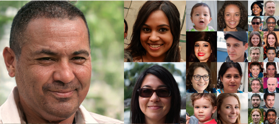
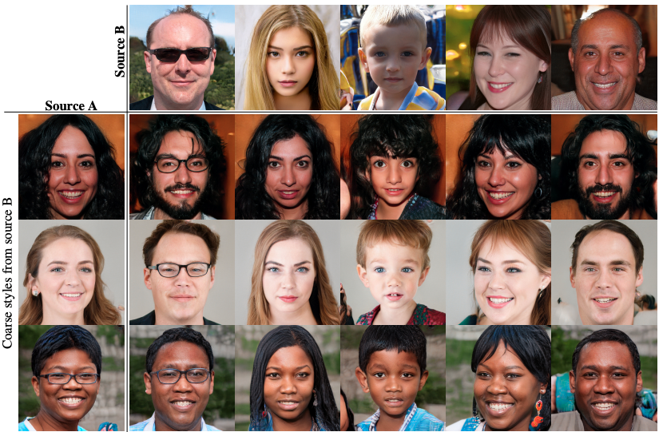

Since its debut in 2018, **StyleGAN** attracted lots of attention with its capacity to generate super realistic high resolution images of human face, not only from AI researchers but also from artists or even lawyers. At the time of this writing, the original paper [1] has 2,548 citations and its successor, **StyleGAN2** [2], has 1,065. This means there are increasing number of application works. To prevent myself from getting overwhelmed, I'm writing this post and trying to overlook this research field in an organized way. Of course it's impossible to read thousands of papers, so hereafter I'll focus on the papers that relate to image manipulation including GAN inversion and 3D control.

## StyleGANs: A Quick Recap
First of all, let's briefly recall what was StyleGAN and the key updates of its subsequent versions.

### StyleGAN
The architecture of the original StyleGAN generator was novel in three ways:
- Generates images in a two-stage fashion; first map the latent code to an itermediate latent space with the **mapping network** and then feed them to each layer of the **synthesis network**, rather than directly inputs the latent code to the first layer only. 
- Applies **AdaIN** [3] layers iteratively to take in the intermediate latent code as "style".
- Injects explicit noise inputs to deal with stochastic variations such as hair and freckles.

These are best described in the figure below.

<small>Image taken from [1].</small>

With these features combined, StyleGAN can generate images that are almost impossible to dicriminate for humans.

<small>Image taken from [1].</small>

This quality was so surprising that many people rushed to train StyleGAN with their own datasets to generate cats, *ukiyoe*, and pokémons (see [Awesome Pretrained StyleGAN](https://github.com/justinpinkney/awesome-pretrained-stylegan) for details).

StyleGAN has another interesting feature called "**style mix**". With two latent codes $\mathbb{z}_A$ and $\mathbb{z}_B$ (and corresponding $\mathbb{w}_A$ and $\mathbb{w}_B$), one can switch the inputs from $\mathbb{w}_B$ to $\mathbb{w}_A$ in the middle of the synthesis network and get a mixed image that has the coarse styles from B and the fine styles from A.

<small>Image taken from [1].</small>

### StyleGAN2
The human face images generated by StyleGAN look convincing enough, but if you have a careful look, you may notice some unnatural artifacts. StyleGAN2 [2] made some architectual optimizations to StyleGAN to generate even more realistic images, though I don't go further in the technical details here.

One of the most important updates of StyleGAN2 is that by regularizing the **perceptual path length**, it became easier to invert; Now it is possible to encode a given image (generated or real) to the intermediate style space $\mathcal{W}$.

<small>Image taken from [2].</small>

This paved the way for **GAN inversion** -- projecting an image to the GAN's latent space where features are semantically disentangled as is done by VAE. As we'll see in the next section, there are many works to tackle inversion of StyleGAN2.

### StyleGAN3 (Alias-Free GAN)
In June 2021, the Tero Karras team published **Alias-Free GAN** (later called **StyleGAN3**) to address the undesirable aliasing effect that leads to some details glued to the image's absolute coordinates [4]. 

A video is worth a thousand words. [The official video](https://nvlabs-fi-cdn.nvidia.com/_web/stylegan3/videos/video_0_ffhq_cinemagraphs.mp4) clearly demonstrates the “texture sticking” issue and that StyleGAN3 solves it perfectly. Now it can be trained on unaligned images like FFHQ-U. For StyleGAN3 applications, there are only a few yet. 

## StyleGAN Inversion

- Optimization
- Learning-based
- Hybrid

### Image2Style
### pSp
### e4e
### ReStyle
## Semantic Editing
### StyleSpace Analysis
### StyleFlow
### Editing in Style
### Retrieve in Style
### Pose With Style
## 3D Control
### StyleRig
### StyleNeRF
## Multimodal
### StyleClip
Last but not least,...

## References
[1] Tero Karras, Samuli Laine, Timo Aila. "[A Style-Based Generator Architecture for Generative Adversarial Networks](https://arxiv.org/abs/1812.04948)". *CVPR*. 2019.  
[2] Tero Karras, Samuli Laine, Miika Aittala, Janne Hellsten, Jaakko Lehtinen, Timo Aila. "[Analyzing and Improving the Image Quality of StyleGAN](https://arxiv.org/abs/1912.04958)
". **. 2020.   
[3] Xun Huang, Serge Belongie. "[Arbitrary Style Transfer in Real-time with Adaptive Instance Normalization](https://arxiv.org/abs/1703.06868)". *ICCV*. 2017.  
[4] Tero Karras, Miika Aittala, Samuli Laine, Erik Härkönen, Janne Hellsten, Jaakko Lehtinen, Timo Aila. "[Alias-Free Generative Adversarial Networks](https://arxiv.org/abs/2106.12423)". *NeurIPS*. 2021.  
[5] Weihao Xia, Yulun Zhang, Yujiu Yang, Jing-Hao Xue, Bolei Zhou, Ming-Hsuan Yang. "[GAN Inversion: A Survey](https://arxiv.org/abs/2101.05278)". 2021.