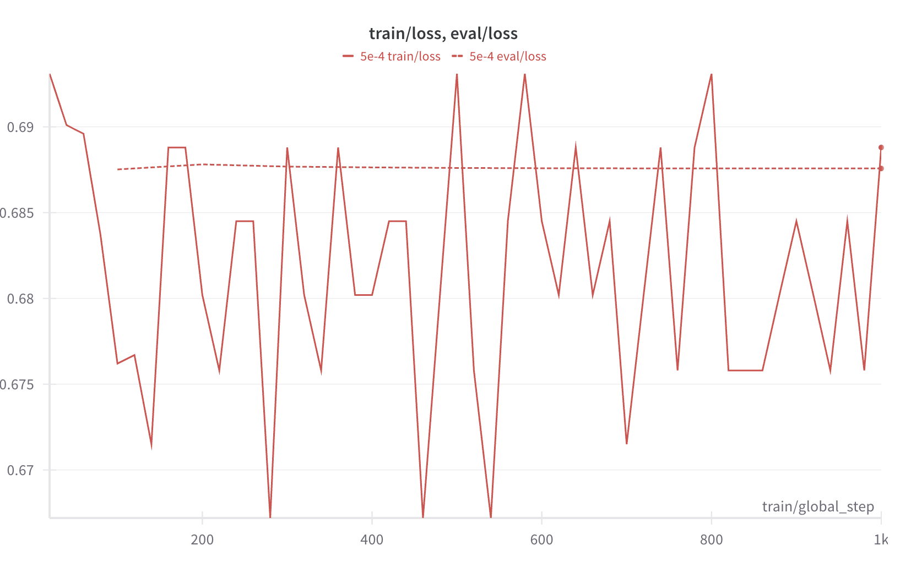
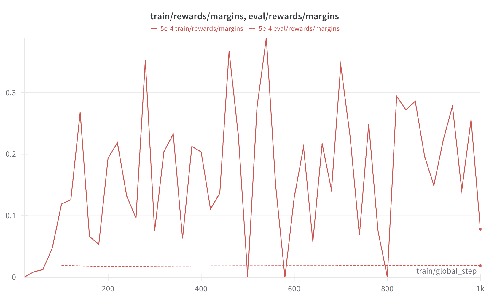

About a year ago, I [discussed **reinforcement learning from human feedback** (**RLHF**) on this blog](https://hippocampus-garden.com/trlx_opt_lora/), showcasing its practical applications. However, the tech landscape evolves rapidly, and a few months later, we witnessed the emergence of [a groundbreaking method known as **direct preference optimization** (**DPO**)](https://hippocampus-garden.com/deep_learning_2023/#direct-preference-optimization-your-language-model-is-secretly-a-reward-model). DPO simplifies the process of aligning large language models (LLMs) by eliminating the need for reinforcement learning, which is often complex. Thus, many developers such as Mistral AI [^1] and Meta [^2] have already adopted DPO to train their LLMs.

In this article, I will explain how to use DPO to create your very own LLM, like the one I created: the Reviewer #2 Bot from TinyLlama. This bot gives a bitter review fn any paper you submit.[^3] Curious to see it in action? Check it out on [Hugging Face Spaces](https://huggingface.co/spaces/shionhonda/reviewer2-bot).

For your reference, all resources used in this project are publicly accessible:

- [Dataset shionhonda/reviewer2-1k](https://huggingface.co/datasets/shionhonda/reviewer2-1k)
- [Model shionhonda/tiny-llama-reviewer2-1.1B-dpo-lora](https://huggingface.co/shionhonda/tiny-llama-reviewer2-1.1B-dpo-lora)
- [Training script](https://colab.research.google.com/drive/1jKRuC70skQx0HQrhVb5pHEOooCZkqU-6?usp=sharing)
- [Training log](https://wandb.ai/shion_honda/reviewer-2-bot-dpo-tiny-llama)

## Setup

In this experiment, I used the following resources:

- Hardware: Colab L4 instance (22.5GB VRAM)
- Pretrained model: [TinyLlama-1.1B-Chat](https://huggingface.co/TinyLlama/TinyLlama-1.1B-Chat-v1.0)
- Dataset: [shionhonda/reviewer2-1k](https://huggingface.co/datasets/shionhonda/reviewer2-1k)
- DPO trainer: [TRL](https://huggingface.co/docs/trl/en/index) v0.8.5
- LoRA: [PEFT](https://huggingface.co/docs/peft/en/index) v0.10.0

## Preference Dataset

The [DPO trainer requires a preference dataset](https://huggingface.co/docs/trl/main/en/dpo_trainer#expected-dataset-format) that contains 3 columns:

- prompt: input text
- chosen: preferred output text
- rejected: non-preferred output text

To quickly build a dataset of this format ([reviewer2-1k](https://huggingface.co/datasets/shionhonda/reviewer2-1k)), I took a creative route:

1. Collect 1,100 titles from [NeurIPS 2023 accepted papers](https://neurips.cc/virtual/2023/papers.html)
2. Ask TinyLlama to generate negative reviews about the papers by literally asking "generate negative reviews" with examples
3. Ask TinyLlama to generate positive reviews about the papers by literally asking "generate positive reviews" with examples
4. Combine the two sets of outputs to create a preference dataset. Label negative reviews as "chosen" and positive reviews as "rejected", and remove "positive" and "negative" from the prompts and interleave the positive and negative examples
5. Set 1,000 pairs for training and 100 pairs for validation

Let me explain more about the trick used in the prompt. For example, we can generate a negative review by this prompt:

```txt
Generate a negative review about the paper <Title>.
Example 1: This paper is not well-written.
Example 2: The paper lacks novelty.
Your review:
```

And a positive review by this prompt:

```txt
Generate a positive review about the paper <Title>.
Example 1: This paper is well-written.
Example 2: The paper is novel.
Your review:
```

In the preference dataset, we can synthesize a prompt by combining them:

```txt
Generate a review about the paper <Title>.
Example 1: This paper is not well-written.
Example 2: The paper is novel.
Your review:
```

This way, we can avoid the tedious work of manually evaluating 1,100 pairs to see which is positive or negative. In theory, it breaks the assumption of DPO because the values in the "prompt" column are supposed to be the same ones as the ones used to generate the outputs in the "chosen" and "rejected" columns. However, as we will see in the following part of this article, I found that the model can still learn to generate negative reviews from this synthetic dataset.

## DPO Training

Next, I ran the DPO trainer with the following configuration:

```python
class Config:
    beta = 0.1 # the beta parameter for DPO loss
    learning_rate = 5e-4
    lr_scheduler_type = "cosine"
    optimizer_type = "paged_adamw_32bit"
    batch_size = 10
    lora_alpha = 16
    lora_dropout =0.05
    lora_r =8
    max_prompt_length = 256
    max_length = 128
    max_steps = 2000
```

The entire script is [here](https://colab.research.google.com/drive/1jKRuC70skQx0HQrhVb5pHEOooCZkqU-6?usp=sharing) and the training logs are [here](https://wandb.ai/shion_honda/reviewer-2-bot-dpo-tiny-llama).

## Results

Here are the learning curves:





Well, it doesn't seem to work well. The training loss keeps fluctuating and the validation loss is not decreasing at all. We observe the similar behavior for the reward as well. I tried different hyperparameters but the results were similar. I suspect that this is because I faked the prompts in the preference dataset. However, when we look at the generated outputs, they are not bad! Here is an example:


Yes, this is a harsh review that I would expect from Reviewer #2!

## Conclusion

DPO is a novel approach to align LLMs without reinforcement learning and already adopted by many successful LLMs. In this example, I showed how to train Reviewer #2 Bot with DPO. The results were not great, but the generated outputs show signs of success.

If you are interested in training larger models, I also recommend [this article](https://huggingface.co/blog/dpo-trl). The authors trained a 7B-parameter model with DPO here. Also, if your dataset is not paired, you can use a method called [**Kahneman-Tversky Optimization**](https://arxiv.org/abs/2402.01306) (**KTO**). [TRL already supports KTO](https://huggingface.co/docs/trl/main/en/kto_trainer) so you can try it out.

I hope this article helps you create your own DPO-trained LLMs!

[^1]: https://arxiv.org/abs/2401.04088
[^2]: https://ai.meta.com/blog/meta-llama-3/
[^3]: https://researcher.life/blog/article/peer-review-basics-who-is-reviewer-2/#Reviewer_2_Stereotypes_and_Perceptions
