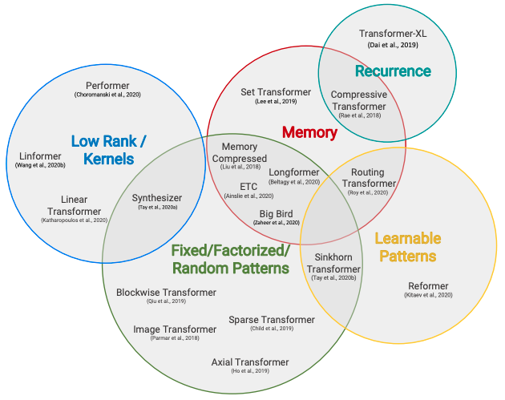
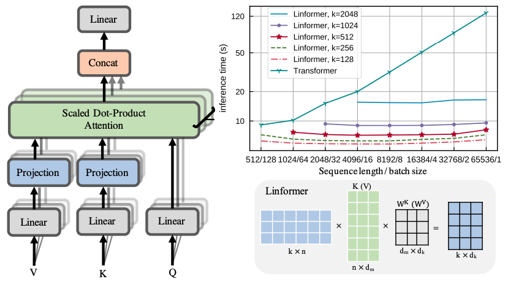
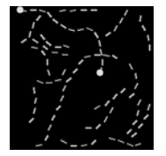

## Efficiency & Long-term Context
There are plenty of efficient Transformers, often named in the form of X-former: Reformer, Linformer, Performer, ... just to name a few. Recently, a team from Google published an excellent survey on this topic [1]. Here is the representative figure and table.

<small>Images taken from [1]. It is not clear from the paper whether the "Complexity" column of the table refers to computational or memory complexity.</small>

They propose the following taxonomy for X-formers: 

- **Fixed Patterns**: This earliest approaches sparsify the attention matrix by limiting the number of token pairs with pre-defined patterns such as blocks and strides.
- **Combination of Patterns**: This simply combines two or more of the fixed patterns to improve the coverage.
- **Learnable Patterns**: The patterns are parametrized and learned through training just as other weights.
- **Memory**: The core idea of this approach is to create some "global tokens" that can access multiple tokens at once. These tokens are supposed to serve as a memory module.
- **Low Rank**: Low-rank methods reduce the length dimensions of keys and values to $k~(<n)$, which results in the complexity reduction from $\mathcal{O}(n^2d)$ to $\mathcal{O}(nkd)$.
- **Kernel**: This utilizes kernelization to approximate the attention matrix with smaller complexity.
- **Recurrence**: Blockwise attentions are connected with reccurent mechanism.

Let's take a closer look at individual models.

### Sparse Transformer \[Child+, 2019]
[**Sparse Transformer** [Child+, 2019]](https://arxiv.org/abs/1904.10509) sparsifies the attention matrix by adopting local attention (lightblue) and strided attention (lightgreen), as described in the figure below.

<small>Image taken from [1].</small>

This modification reduces the memory complexity of the attention
layer from $\mathcal{O}(n^2)$ to $\mathcal{O}(n\log{n})$. However, it requires a custom GPU kernels to implement a block-sparse *matmul* (i.e., matrix-matrix multiplication) operation.

The paper by a team from OpenAI presents impressive results. The autoregressive generative model generates texts, 64x64-sized images, and even raw audio waveforms (you can listen to them in [the official blog post](https://openai.com/blog/sparse-transformer/)). Sparse Transformer is important because subsequent models such as [**Longformer**](https://arxiv.org/abs/2004.05150) and [**Big Bird**](https://arxiv.org/abs/2007.14062) are based on it.

Sparse Transformer is inherited to another research work called [Jukebox](https://arxiv.org/abs/2005.00341), which successfully generates music waveforms in a variety of genres. Jukebox can generate minutes-length music conditioned by genres, lyrics, and artists (from Ella Fitzgerald to Kanye West). All 7,131 generated samples are available [here](https://jukebox.openai.com/). They do make sense!

### Routing Transformer \[Roy+, 2020]
[**Routing Transformer** [Roy+, 2020]](https://arxiv.org/abs/2003.05997) uses learnable patterns to sparsify the attention matrix. It clusters the input tokens with **k-means** algorithm in an online fashion so that each token only attend to the tokens beloging to the same cluster.

### Reformer \[Kitaev+, 2020]
[**Reformer** [Kitaev+, 2020]](https://arxiv.org/abs/2001.04451) uses **locality sensitive hashing (LSH)** to learn attention patterns. LSH projects nearby vectors to similar hashes, which can be used to classify tokens into some buckets. 

Reformer also introduces reversible layers, where activations of the $L$-th layer can be restored from those of the $(L+1)$-th layer. This mechanism allows the model to discard activations of all but one layer to enable further memory savings.

### Linformer \[Wang+, 2020]
[**Linformer** [Wang+, 2020]](https://arxiv.org/abs/2006.04768) dares to reduce length dimension of key and value matrices with additional projection layers. As a result,  $N\times d$ dimensional matrices are projected to $k\times d$ dimensional matrices, where $k<<N$. The size of the attention matrix $\mathrm{softmax}(Q'K')$ is now $N \times k$ instead of $N \times N$. This low-rank approximation reduces computational and memory complexity to $\mathcal{O}(n)$, but Linformer cannot decode tokens as causal masking is broken.

<small>Image taken from <a href="https://arxiv.org/abs/2006.04768">Linformer: Self-Attention with Linear Complexity</a>. The projection matrix (lightblue) is multiplied from the left.</small>

 

### Performer \[Choromanski+, 2020]
[**Performer** [Choromanski+, 2020]](https://arxiv.org/abs/2009.14794) leverages orthogonal random features to approximate the attention matrix with provable accuracy. The proposed **FAVOR+** algorithm allows Performer to scale linearly with the number of tokens. I refer interested readers to [the original paper](https://arxiv.org/abs/2009.14794).

### Synthesizer \[Tay+, 2020]
Unlike other X-formers, [**Synthesizer** [Tay+, 2020]](https://arxiv.org/abs/2005.00743) doesn't aim at creating more efficient Transformers. The main argument of the paper is that the self-attention is, surprisingly, not so important because replacing the attention maps with randomly-initialized (trainable) matrices does not really hurt the model performance. This result itself is very intriguing, but there is an additional benefit of saving memory. 

One version of Synthesizers called Random Synthesizer uses a randomly-initialized trainable matrix $R$ to compute an attention map by $\mathrm{softmax}(R)$. This eliminates the need of computing the attention matrix by $\mathrm{softmax}(QK)$. Factorized Random Synthesizer reduces the number of parameters as well by factorizing the attention matrix as $\mathrm{softmax}(R_1R_2^{\mathrm{T}})$.

<small>Image taken from <a href="https://arxiv.org/abs/2005.00743">Synthesizer: Rethinking Self-Attention in Transformer Models</a>.</small>

 

### Transformer-XL \[Dai+, 2019]
[**Transformer-XL** [Dai+, 2019]](https://arxiv.org/abs/1901.02860) takes a unique approach to the long-term context problem. It processes a long text in a segment-by-segment fashion, but the representations of the previous segment are reused when processing the next segment as an external context. It is worth mentioning that this recurrence mechanism also resolves the context fragmentation issue.

<small>Image taken from <a href="https://ai.googleblog.com/2019/01/transformer-xl-unleashing-potential-of.html">Google AI Blog: Transformer-XL: Unleashing the Potential of Attention Models</a>.</small>

 

There are some applications of Transformer-XL (e.g., [language model pre-training](https://arxiv.org/abs/1906.08237) and [reinforcement learning](https://arxiv.org/abs/1910.06764)).

### Long Range Arena: Benchmarking X-formers
There are many X-formers claiming their superiority over the vanilla Transformer, but unfortunately, the evaluation protocols differ from paper to paper. Long Range Arena (LRA) [3] tackles this problem by proposing a unified benchmark that focuses on evaluating model quality under long-context scenarios. LRA score is defined as the average score of the following six tasks:

- Long ListOps: Calculating nested set functions (e.g., MEAN(2, 3, MAX(2, 7)) = 4)
- Byte-level Text Classification
- Byte-level Document Retrieval
- Image Classification on Sequence of Pixels
- Pathfinder: Determining whether the two white circles in a 32x32-sized image are connected or not (c.f. the image below)
- Pathfinder-X: More difficult version of Pathfinder with 128x128-sized images.

<small>Image taken from [3]. The answer of this Pathfinder sample is "connected".</small>

 

The authors locates X-formers in the following plot. The area of the circles represents the memory complexity. It tells us that Big Bird achieves the highest score, while Performer Linformer, and Linear Transformer are making a good trade-off in terms of performance, speed, and memory consumption.

<small>Image taken from [3].</small>

 

## Image
### Image Transformer
### Training on Pixels
### ViT
### Video

[(Self-attention Network)](https://arxiv.org/abs/2004.13621)

## Theory of Computation

## Pre-trained Language Models & BERTology
Out of scope, but uses transformer or similar attention-based architecture.
### XLNet
### mT5
### SOTA

<small>Image from [How Language-Neutral is Multilingual BERT?](https://arxiv.org/abs/1911.03310).</small>

## References
[1] Yi Tay, Mostafa Dehghani, Dara Bahri, Donald Metzler. "[Efficient Transformers: A Survey](https://arxiv.org/abs/2009.06732)". 2020.  
[2] Madison May. "[A Survey of Long-Term Context in Transformers](https://www.pragmatic.ml/a-survey-of-methods-for-incorporating-long-term-context/)
". 2020.   
[3] Anonymous Authors. "[Long Range Arena : A Benchmark for Efficient Transformers](https://openreview.net/forum?id=qVyeW-grC2k)". 2020.  
[4] Lilian Weng. "[The Transformer Family](https://lilianweng.github.io/lil-log/2020/04/07/the-transformer-family.html)". Lil'Log. 2020.

[A Primer in BERTology: What we know about how BERT works](https://arxiv.org/abs/2002.12327)

## Appendix
Layer normalization

https://paperswithcode.com/method/layer-normalization