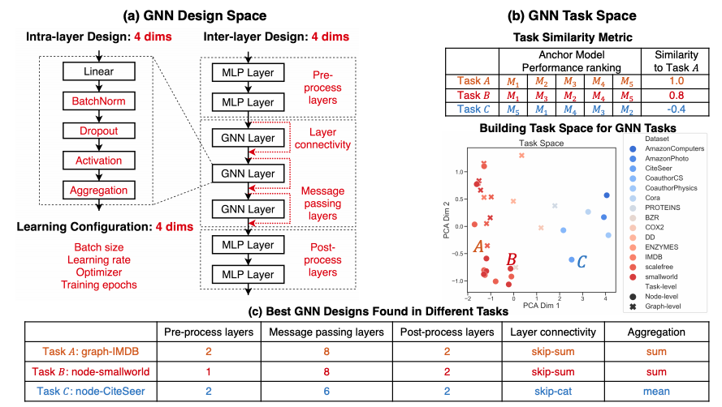

## Orals & Spotlights
### GPT-3
https://www.flowrite.com/blog/how-we-got-access-to-gpt-3-in-5-days

### Investigating Gender Bias in Language Models Using Causal Mediation Analysis
Causal mediation analysis is a method to gauge how a treatment effect is mediated by mediator (intermediated variables). This paper proposes to use causal mediation analysis to investigate which part of the model is responsible for the output. This paper uses gender bias as an example.
- Direct effect: Change a word in the input sentence while keeping some component unchanged, and then see how the output changes
- Indirect effect: Change some component while keeping the input the same, and then see how the output changes

The analysis reveals that gender biases are concentrated in particular components (head, layer) of the model.

Read [the paper](https://proceedings.neurips.cc//paper_files/paper/2020/hash/92650b2e92217715fe312e6fa7b90d82-Abstract.html) for more details.

### Design Space for Graph Neural Networks
GNNs have many configurations such as aggregation function, activation function, batch normalization, and so on. The best configuration depends on the task. To find a general rule on which configuration is good for a given task, this paper systematically examines *315,000 different designs over 32 different predictive tasks*. 

As well as this study tells us the general guidelines for designing well-performing GNNs, it provides a quantitative measure of task similarity, defined as a rank correlation of the scores of each GNN. Transfer learning works between similar tasks.

Read [the paper](https://proceedings.neurips.cc//paper_files/paper/2020/hash/c5c3d4fe6b2cc463c7d7ecba17cc9de7-Abstract.html) for more details.

### Implicit Neural Representations with Periodic Activation Functions

Read [the paper](https://proceedings.neurips.cc//paper_files/paper/2020/hash/53c04118df112c13a8c34b38343b9c10-Abstract.html) for more details.

## Posters
### GANSpace: Discovering Interpretable GAN Controls
This paper discovers interpretable controls of GANs by principal component analysis on latent space or feature space. The principal components represent zooming, angle, color etc. With the proposed method, BigGAN can be controlled with layer-wise inputs in a StyleGAN-like way.

Read [the paper](https://proceedings.neurips.cc/paper/2020/hash/6fe43269967adbb64ec6149852b5cc3e-Abstract.html) for more details.

## Invited Talks
## Expo